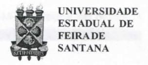
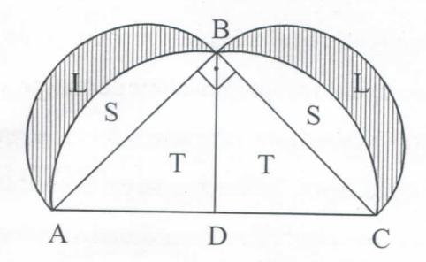

# FOLHETIM DE EDUCAÇÃO MATEMÁTICA

Folhetim Educ. Mat., Ano 14, n. 143, mar. / abr. 2008

ISSN 1415-8779

#### **OBJETIVO**

Este Folhetim é um veículo de divulgação, circulação de idéias e de estímulo ao estudo e à curiosidade intelectual. Dirige-se a todos os interessados pelos aspectos pedagógicos, filosóficos e históricos da Matemática. Pretende construir uma ponte para unir os que estão próximos e os que estão distantes.

#### **EDITORIAL**

Nos últimos Folhetins, apresentou-se ao leitor uma abordagem sobre temas como Caos, Fractais, Sistemas Dinâmicos e suas interconexões. A partir deste, a coluna Pergunte que o Nemoc Responde volta a dedicar-se mais de perto à questão do ensino da matemática, tão discutida mas ainda tão emergente. Partindo de um tópico conhecido por grande parte dos estudantes (pelo menos para aqueles cursando ou que já tenham cursado os últimos anos do ensino fundamental), que é o Teorema de Pitágoras, é feita uma conexão entre o ensino, a filosofia e a história da matemática. O exemplo metodológico aqui apontado é apenas um dos tantos outros que podem ser ricamente usados pelo(a) professor(a) em sua prática em sala.

Para referência sobre os tópicos correlatos, consultem os Folhetins nº 59, 84, 89 e 108.

# COMITÉ EDITORIAL

Carloman Carlos Borges (UEFS) Inácio de Sousa Fadigas (UEFS) Trazíbulo Henrique Pardo Casas (UEFS)

#### PERGUNTE QUE O NEMOC RESPONDE

Conversas sobre o ensino da matemática

por Carloman Carlos Borges

Desejamos - com este folhetim - conversar com nossos leitores acerca do ensino da matemática. Destacamos, assim, alguns tópicos para nós relevantes e nos quais é possível enxergar o que é importante e o desprezível nesse ensino. Inicialmente um truismo: a matemática é um conjunto de idéias que podem ser manifestadas através de uma linguagem própria; confundir a idéia com o símbolo que a representa tem sido um desastre - em sala de aula. Trata-se de um pedantismo formal intolerável. Insistir sobre as idéias. Distinguir, em cada questão estudada, o essencial do superficial. Por exemplo: ensina-se o Teorema de Pitágoras: dado o triângulo retângulo ABC, a área do quadrado construído sobre a hipotenusa é igual à soma das áreas dos quadrados construídos sobre os catetos. Aqui, tem-se uma bela oportunidade para o professor apresentar algumas divagações: a) e, se, em lugar de quadrados, construírmos sobre ABC, triângulos equiláteros; semi-círculos? b) se construírmos figuras que sejam limitadas não por segmentos de retas, porém, por "segmentos curvilíneos", ainda, assim, funciona o Teorema de Pitágoras? c)qual a idéia profunda que "sustenta" esse célebre Teorema? d) enfim, ainda, qual a razão da preferência pela figura do quadrado? Esclarecendo tais questionamentos - o faremos no decorrer deste artigo - o professor mergulhará o ensino de matemática em outras dimensões, como a dimensão histórica, a dimensão filosófica, a dimensão científica e, finalmente, a dimensão pedagógica.

Esse procedimento o livrará daquele outro procedimento tão danoso quanto persistente, qual seja, o de mostrar uma fórmula (de que sacola o professor tirou a fórmula...?) e, em seguida, aplicá-la nas mais esquisitas situações. É preciso destacar: o aluno vem revelando, com suficiente clareza, que não aguenta mais tal tipo de magia; não se rebela desafiadoramente, em virtude do vestibular, em função do qual, todo o ensino fundamental e médio é dirigido.

Pensemos que estas questões devem ser refletidas profundamente: a) relacionamento entre o _concreto_ e o _abstrato_; b) relacionamento entre o _familiar_ e o _concreto_; c) como reconhecer que se aprendeu uma determinada informação transformando-a em conhecimento?

É claro que o conhecimento parte do _concreto_, porém, de qual concreto? Aqui, em nosso entendimento, deve-se distinguir entre esse ponto de partida - o qual chamaríamos de _concreto sensorial_, até mesmo de familiar-do _concreto conceitual_, quando são formalizados os conceitos pertinentes à investigação em apreço. Evitase, é nosso entendimento - a confusão tão persistente entre o concreto e o abstrato, culminando com a tolice de que sempre é mais fácil raciocinar no concreto (qual concreto?) do que no abstrato... A análise do mecanismo psicológico da pesquisa, mostra que a compreensão

parte da não compreensão.

Como saber que verdadeiramente se compreendeu aquilo que foi "ensinado"? Pensamos que consiste no seguinte: Sabemos que compreendemos algo quando o aplicamos as mais diversas situações diferentes daquela donde partiu a nossa compreensão. Quando somos criativos em relação a esse novo conhecimento.

A título de esclarecimento, retornemos às questões levantadas atrás em torno do Teorema de Pitágoras (TP).

Apresentem o TP generalizado: sendo dados três figuras semelhantes construidas sobre os três lados de um triângulo retângulo, a área daquela construída sobre a hipotenusa é igual à soma daquelas construídas sobre os catetos.

O que tem de comum os quadrados, os triângulos equiláteros, os semi-círculos? Todas essas figuras são semelhantes entre si. Chega-se, portanto, à idéia profunda do TP: a idéia de semelhança. E quando descobrimos o "porquê" de algo, fazemos filosofia... A preferência dos Gregos pelo quadrado, deve-se ao aspecto místico dos quadrados. Lembremos: A Escola Pitagórica era como uma seita secreta, cercada de misticismo. Esta figura, o quadrado, esteve sempre atrás de algum tipo de misticismo. Basta lembrar os quadrados mágicos, amuletos contra os azares da vida...

A demonstração dessa generalidade do TP baseia-se em conhecimentos adquiridos pelos nossos alunos nos níveis fundamental e médio.

# NEMOC - NÚCLEO DE EDUCAÇÃO MATEMÁTICA OMAR CATUNDA

Folhetim Educ. Mat., Ano 14, n. 143, mar./abr. 2008 - Editores: Carloman, Inácio e Trazíbulo - Digitação: Josenildes Oliveira Venas Almeida e Manoel Aquino dos Santos - Editoração: Evandro Vaz - Impressão: Imprensa Gráfica Universitária - Periodicidade: bimestral - Tiragem: 1.200 exemplares - Distribuição gratuita - Endereço: Av. Universitária, s/n - km 03 - BR 116 - Campus Universitário - Telefone: (75)3224-8115 - Fax: (75)3224-8086 - CEP: 44031-460 - Feira de Santana - Ba - BRASIL - E-mail: nemoc@uefs.br

Vejamos, agora, um teste para saber se o aluno realmente compreendeu o TP. Para isso, apresentemos as _lúnulas de Hipócrates_:

ABC é um triângulo retângulo isósceles inscrito em um semi-círculo com diâmetro AC. Tracemos outros semi-círculos com diâmetros AB eBC. A figura resultante Ldetudo isso chama-se lúnulas de Hipócrates (hachuriadas).

De acordo com o TP:

Área construída sobre a hipotenusa: T+T+S+S

Área construída sobre o cateto AB: S+L

Área construída sobre o cateto BC: S+L

Como a área construída sobre a hipotenusa = área construída sobre o cateto AB mais a área construída sobre o cateto BC, vem:

T+T+S+S = S+L+S+L : L = T, isto é, a área da lúnula L é igual a área T do triângulo. Esse exemplo é um bom teste à compreensão do TP - ele mostra a _quadratura_ de uma área limitada por "segmentos curvilíneos", isto é, mostra que dada uma figura limitada por "segmentos curvilíneos" (alúnula de Hipócrates) é possível a construção de outras figuras limitadas por "segmentos retilíneos" (o triângulo de área T) cuja área é a mesma da figura dada (lúnula de Hipócrates). Já escutei de alguns professores de Cálculo o seguinte: na primeira aula sobre Cálculo Integral tenho por hábito dizer aos meus alunos que o Cálculo

Integral surgiu da necessidade de calcular áreas "limitadas por curvas", pois tal cálculo é impossível com a matemática do ensino fundamental emédio... Alguns historiadores consideram o exemplo mencionado como o primeiro exemplo de quadratura de uma figura limitada por "segmentos curvilíneos".

O exemplo dado acima sobre a quadratura da lúnula de Hipócrates desmente esses professores em suas generalizações. Também - pelo que já se viu - não é certo afirmar: no cálculo de áreas de "figuras limitadas por curvas" sempre deve aparecer o famoso número $\pi$ .

Mais alguns questionamentos sobre o TP:

- a) A antiga matemática indiana apresentava ele em termos das áreas de semi-círculos construídos sobre os lados do triângulo retângulo;
- b) Se estivermos trabalhando numa superfície não plana como fica o TP? Resposta: sobre uma superfície não plana, não tem sentido. Veja o exemplo da esfera: sobre ela, a soma dos ângulos de um triângulo determina a sua área.

Por falar em semelhança, temos mais um motivo para criticar nossos manuais escolares. Basta abrir um deles: há um estudo detalhado de semelhança entre triângulos. Define-se semelhança de triângulo com base em ângulos iguais e lados homólogos. A definição é generalizada para polígonos. Tratase de uma definição muito restritiva por fundamentar-se em ângulos e lados. Dentro dessa definição como afirmar que dois círculos são semelhantes, já que eles não possuem nem ângulos, nem lados? Com bastante propriedade pode ser dada a seguinte definição:

Sejam F e F' figuras do plano ou do espaço, e r um número real positivo.

Diz-se que F e F' são _semelhantes_, com razão de _semelhança r_, quando existe uma correspondência biunívoca $\sigma$ : F $\rightarrow$ F', entre os pontos de F e os pontos de F', com a seguinte propriedade:

Se X, Y são pontos quaisquer de F e X' = $\sigma$ (X), Y'= $\sigma$ (Y) são seus correspondentes em F', então $\overline{X'Y'}=r.\overline{XY}$ . (Para maiores detalhes, veja Medida e Forma em Geometria, Elon Lages Lima, Coleção do Professor de Matemática, Sociedade Brasileira de Matemática).

### **NOTÍCIAS**

Várias Faces da Matemática - Tópicos Para a Licenciatura e Leitura Geral - Editora Blucher - Autor: Geraldo Ávila.

Recebemos o lançamento acima, o qual reune vários artigos já publicados pelo consagrado autor Geraldo Ávila, na Revista do Professor de Matemática (RPM), além de outros inéditos.

Para o leitor firmar uma idéia do conteúdo dessa bela obra, anote alguns de seus tópicos: Por que a Matemática? Geometria e Imaginação; Eratóstenes e o tamanho da Terra; Fazendo Contas sem a Calculadora; Euclides eos Elementos; Conjuntos e Números Transfinitos; A Teoria dos Conjuntos; Os Fundamentos da Matemática; Os Números Primos; Séries Infinitas; Limites e Derivadas no ensino médio; Derivadas e Cinemática.

O Prof. Geraldo Ávila é um matemático que, há anos, vem se consagrando com seus bem elaborados livros sobre o ensino da Matemática. Na divulgação dessa ciência, ele faz par com o consagrado matemático Elon Lages. Ambos, sem maiores danos ao rigor matemático, escrevem seus artigos dentre de uma clareza meridiana, o

que facilita sua compreensão por parte dos alunos. Na obra _Várias Faces da Matemática_, Geraldo Ávila, levanta temas importantíssimos tanto para o aluno quanto para o professor. Pedimos a atenção do leitor aos seus dois últimos capítulos: Limites e Derivadas no ensino médio; Derivadas e Cinemática. Esses dois tópicos deveriam merecer, por parte daqueles que elaboram nossas políticas educacionais, uma atenção bem particular, pela sua atualidade e relevância. Quando, então, eles retornarão ao ensino médio? Em nome de qual princípio foram retirados desse ensino? Por serem demasiadamente abstratos? De passagem, lembramos serem eles estudados, no nível citato, nos chamados países desenvolvidos a par com Teoria da Relatividade Especial.

# PRÓXIMO NÚMERO

Conversas sobre o ensino da matemática (continuação).

Aguardem!

# **NÚMEROS ATRASADOS**

Envie para cada folhetim um selo de postagem nacional de 1º porte. Dentro de no máximo quatro semanas, contadas a partir da data de recebimento do seu pedido, você receberá os folhetins solicitados.

OBS.: É permitida a reprodução total ou parcial deste folhetim, desde que citada a fonte.
