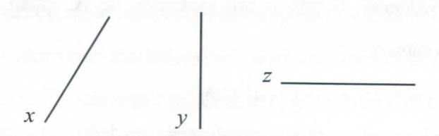

# **FOLHETIM DE EDUCAÇÃO MATEMÁTICA**

**Folhetim Educ. Mat., Ano 14, n. 144, maio / jun. 2008**

**ISSN 1415-8779**

#### **OBJETIVO**

Este _Folhetim é_ um veículo de divulgação, circulação de ideias e de estímulo ao estudo e à curiosidade intelectual. Dirige-se a todos os interessados pelos aspectos pedagógicos, filosóficos e históricos da Matemática. Pretende construir uma ponte para uniros que estão próximos e os que estão distantes.

### **EDITORIAL**

Conceitos básicos da Matemática - como _semelhança, classe de equivalência, forma e fórmula, etc. -_ começam a ser discutidos neste _Folhetim_ em continuação ao anterior. Assim, com relação ao célebre Teorema de Pitágoras, procurase investigar sua profunda razão de ser, o "porquê" de sua existência, a qual repousa no conceito de semelhança, uma das categorias dominantes em nossa vida diária e central na Geometria Euclidiana.

Como somos capazes de, olhando uma simples fotografia 3/4 reconhecer a figura familiar de nosso pai? Como classificarmos as coisas? Perguntas como estas e outras tantas começam a ser investigadas a partir deste _Folhetim._

## **COMITÊ EDITORIAL**

Carloman Carlos Borges (UEFS) Inácio de Sousa Fadigas (UEFS) Trazíbulo Henrique Pardo Casas (UEFS)

#### **PERGUNTE QUE O NEMOC RESPONDE**

_Conversas so£re o ensino cfa maiemáíica_

_por Carloman Gorlas OSoryes_

_(Continuação)_

Falso, verdadeiro, decidível, indecidível. Em um primeiro curso de Lógica, costuma-se afirmar que uma dada proposição pode ser falsa ou verdadeira. Tudo bem. Mas quando se trata deum curso dessa disciplina numa graduação de Matemática, acreditamos ser oportuno - embora em mvel informativo - a introdução de*proposições decidíveis* e de _proposições indecidíveis._ Quando podemos afirmar que uma dada proposição P é _decidível?_ Os lógicos respondem: Quando elas podem responder a duas questões: "

- a) P pode ser demonstrada?
- \* ' b) A negação de P pode ser demonstrada?

Para ilustrar essas **ideias,** consideremos o exemplo da proposição P: 3 + 3 = 6. Pergunta-se: P é decidível? Antes de responder a essa questão, coloquemos outra: P é demonstrável? Em um curso elementar de Aritmética, P é demonstrável partindo-se de seus postulados bem conhecidos. Logo, podemos afirmar que P (3 + 3 = 6) é decidível. Consideremos, agora a _negação de_ P: _3 + 3^6-_ Pergunta-se: ~P (a negação de P) é decidível? Ora, com base nos mesmos postulados mencionados anteriormente, ~P também é demonstrável e, consequentemente, pode-se afirmar que

~P(3 + 3 _^6) è_ uma proposição decidível. Agora, a pergunta: Quando P é indecidível? Resposta: P éindecidível se não puder ser demonstrável e também a sua negação. Quando falamos em proposições decidíveis, foi muito fácil dar exemplos simples de tais proposições. Quando se tratadeproposições indecidíveis as coisas se complicam bastante. Inicialmente não havia, por parte dos lógicos e matemáticos a percepção de proposições indecidíveis. Quando foi que surgiu essa percepção? Foi a partir do século XIX. De que maneira surgiu essa percepção na cabeça dos lógicos ematemáticos? Quando da invenção das Geometrias não Euclidianas - um dos mais importantes pontos de inflexão na curva demonstrativa da evolução do saber matemático. Uma verdadeira mudança epistemológica foi produzida com o surgimento dessas geometrias: assim, foram grandemente enriquecidos os conceitos de falso e verdadeiro, os conceitos de verdades eternas e verdades absolutas, etc. E as Geometrias não Euclidianas o que tem que ver com as proposições indicidíveis? Neste ponto mencionamos o Dicionário das Ciências, Editora Vozes, sob adireção deLionel Salem: "A existência _deModelos_ verificando os quatro postulados primeiros de Euclides e a negação do 5° (em um plano, por um ponto fora de uma reta, passa uma e somente uma reta paralela a essa reta) mostra que de fato, este último não é demonstrável a partir dos quatro primeiros. Mas, sua negação, não é, evidentemente, tampouco demonstrável; se ela fosse, isto significaria que não sepodeencontrarmodelo verificando simultaneamente os cinco portulados de Euclides, o que éprecisamente desmentido pela existênciada geometria euclidiana. Portanto, o quinto postulado de Euclides é indecidível no sistema constituído pelo conjunto dos outros quatro".

Definições por Abstração. A palavra abstração possui diversos significados. Para ilustrar em qual significado ela será empregadaneste contexto, consideramos a conhecida relação de igualdade "=". Ela possui as seguintes propriedades:

- a) **X= X** (Propriedade Reflexiva)
- _h)x=y=>y = x_ (Propriedade Simétrica)
- _c)x = y, y = z^x = z_ (Propriedade Transitiva) _x,yez_ são números reais.

Dado um conjunto A, uma _relação de equivalência_ em A é uma relação binária em A com as três propriedades mencionadas acima; a relação de igualdade entre elementos de um conjunto A estabelece em A uma relação de equivalência. O símbolo"~" é comumente empregado para designar tal relação; assim, x~>' _{x_ equivale _ay)_ mostra que os elementos _x ey_ do conjunto A possuem, entre si, arelação

#### **NEMOC - NÚCLEO DE EDUCAÇÃO MATEMÁTICA OMAR CATUNDA**

Folhetim Educ. Mat., Ano 14, n. 144, maio/jun. 2008 - **Editores:** Carloman, Inácio e Trazíbulo **-Digitação:** Josenildes Oliveira Venas Almeida e Manoel Aquino dos Santos - **Editoração:** Evandro Vaz e Nivaldo Assis - **Impressão:** Imprensa Gráfica Universitária - **Periodicidade:** bimestral - **Tiragem:** 1.200 exemplares - _Distribuição gratuita -_ **Endereço:** Av. Universitária, s/n - km 03 - BR 116 - Campus Universitário - **Telefone:** (75)3224-8115 - **Fax:** (75)3224-8086 - CEP: 44031-460 - Feira de Santana - Ba - BRASIL - **E-mail:** nemoc@uefs.br definida. Um outro exemplo de relação de equivalência é dada pela relação de paralelelismo no conjunto das retas R do plano euclidiano P, pois, sendo, a, b e c elementos de R, tem-se:

- i) a // a (a é paralela a si mesma)
- ii) $a // b \Rightarrow b // a$
- iii) a//b, $b//c \Rightarrow a//c$

Um conceito importante e intimamente ligado ao de relação de equivalência é o de _partição_. Considere o conjunto A dos automóveis fabricados no Brasil, das marcas Fiat, Chevrolet e Volkswagen, representados, respectivamente por F, C e V; em A estabelecemos a relação "o carro a tem a mesma marca que o carro b"; esta relação é de equivalência no conjunto A, pois desfruta das três propriedades acima. Inicialmente, temos o conjunto A:

Em um novo quadro, após dividí-lo em compartimentos, coloquemos, em cada um deles os carros da mesma marca:

#### A/R

| V    | FFF F | CCCCC |
| ---- | ----- | ----- |
| VVVV | FFFFF | CCCCC |
| VVVV | FFFFF | CCCCC |
|      |       |       |

Ao conjunto A/R dá-se o nome de _conjunto-quociente_ e ele representa uma partição do conjunto A, isto é, uma decomposição unívoca de A em subconjuntos com as propriedades:

- i) são disjuntos dois a dois;
- ii) sua reunião é o próprio A;
- iii) nenhum desses subconjuntos é vazio.

Cada um desses subconjuntos se chama _classe de_ equivalência. Sendo a um elemento de A, então, ao subconjunto:

$$\overline{a} = \{a' \in A \mid a' \sim a\} \subset A$$

de todos os elementos equivalentes a um dado a, chama-se classe de equivalência, que contém a.

Outro exemplo importante de relação de equivalência é sugerido pela relação de equipolência entre segmentos orientados do plano Peuclidiano. Dizemos que dois segmentos orientados a e b pertencentes ao plano P, são equipolentes quando possuem a mesma "direção", o mesmo sentido e o mesmo comprimento (por enquanto, "direção" aqui significa que os dois segmentos a e b estão situados em uma mesma reta ou em retas paralelas; ademais, a e b podem ser nulos). Evidentemente saber o significado de um termo não implica que ele foi definido; na linguagem comum, o significado de um termo já assegura o seu uso; aliás, a maioria das palavras que usamos nós as aprendemos baseados apenas nos seus significados. Em Matemática, todavia, exige-se a definição daqueles termos que não são primitivos dentro de uma mesma axiomática. A definição de direção é o primeiro exemplo de uma definição por abstração. Seja a relação de paralelismo mencionada anteriormente: trata-se de uma relação de equivalência no conjunto das retas do plano euclidiano P e, então, o seu conjunto quociente é uma partição em R. Sabemos que, numa relação de equivalência, dois elementos são equivalentes se, e somente se, eles determinam a mesma classe de equivalência, definindo-se a _direção de reta x_ como sendo sua classe de equivalência $\bar{x}$ em R. Assim, sejam as retas:

Em uma classe coloquemos todas as retas paralelas à reta x; teremos, então a primeira classe de equivalência em R; em outra classe, coloquemos todas as retas paralelas à reta dada y: teremos a segunda classe de equivalência.

Assim procedendo, teremos as diversas classes de equivalência da partição associada à relação de paralelismo. Veja a "visualização" de algumas dessas classes:

$$\bar{x} = \left\{ \left/ \right/ \right| \dots \right\} \bar{y} = \left\{ \left| \left| \right| \right| \dots \right\} \bar{z} = \left\{ \underline{\qquad} \dots \right\}$$

Observemos que a direção de uma reta é um conjunto, o qual é a sua correspondente classe de equivalência. Outro exemplo de definição por abstração é sugerido pela relação de equipolência. Assim, um vetor determinado por um segmento orientado a é o conjunto de todos os segmentos orientados do plano P que são equipolentes ao segmento orientado a; isto é a classe de equivalência determinada pelo segmento orientado a.

Como qualquer uma das classes de equivalência determinada por um segmento orientado a é formada de infinitos elementos, concluimos: um vetor é um conjunto infinito de segmentos orientados. Nas diversas aplicações práticas, porém, empregamos um segmento orientado a para representar o vetor a, isto é, representamos um vetor a-que é um conjunto infinito de segmentos orientados, por apenas um segmento orientado a-que é conjunto infinito de pontos.

Os exemplos acima mostram como cada relação de equivalência permite definir por abstração um novo conceito.

#### PRÓXIMO NÚMERO

Conversas sobre o ensino da matemática (continuação).

Aguardem!

### **NÚMEROS ATRASADOS**

Envie para cada folhetim um selo de postagem nacional de 1º porte. Dentro de no máximo quatro semanas, contadas a partir da data de recebimento do seu pedido, você receberá os folhetins solicitados.

OBS.: É permitida a reprodução total ou parcial deste folhetim, desde que citada a fonte.
