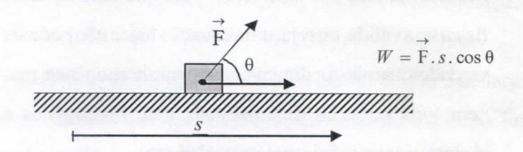

# **FOLHETIM DE EDUCAÇÃO MATEMÁTICA**

**Folhetim Educ. Mat., Ano 14, n. 145, jul. / ago. 2008**

**ISS N 1415-877 9**

### **OBJETIVO**

Este _Folhetim é_ um veículo de divulgação, circulação de ideias e de estímulo ao estudo e à curiosidade intelectual. Dirige-se a todos os interessados pelos aspectos pedagógicos, filosóficos e históricos da Matemática. Pretende construir uma ponte para unir os que estão próximos e os que estão distantes.

## **EDITORIAL**

Neste número definimos dois conceitos. _Forma_ e _Fórmula -_ os quais permeiam o discurso matemático.

O principal foco deste _Folhetim,_ no entanto, é a Análise Dimensional, poderoso instrumento metodológico no ensino da Física, principalmente. No ensino de Matemática ele poderá, também, ser empregado com bastante proveito. Desta forma, por intermédio desse instrumento, pode-se contextualizar melhor o seu ensino e então, uma das recomendações centrais dos PCNEM que é a contextualização merecerá um estudo mais aprofundado. Além disso, o professor de matemática, ainda tendo em vista essa mesma recomendação, poderá explorar - como tema de interdisciplinaridade - a Física - de cuj os problemas, historicamente, surgiram muitas inspirações na criação de teorias matemáticas.

# **COMITÉ EDITORIAL**

Carloman Carlos Borges (UEFS) hiácio de Sousa Fadigas (UEFS) Trazíbulo Henrique Pardo Casas (UEFS)

## **PERGUNTE QUE O NEMOC RESPONDE**

## _Conversas soSre o ensino <fa maíemáíica_

_por Garloman Carlos CBoryes (Continuação)_

Definição _deforma._ A definição por abstração é de largo emprego não só na matemática, como em nossa vida diária. Assim, quem vê uma fotografia e uma de suas ampliações, costuma afirmar com total convicção que se trata de uma mesma representação de um mesmo objeto, apenas em outra escala, porém com o mesmo negativo. As duas figuras possuem em comum _"algo ao qual atingimos com o auxílio da abstração(eliminação) que fazemos do seu tamanho, de sua cor, etc "._ Mas, que algo é esse? Esse algo é a _forma:_ uma fotografia e suas diversas ampliações possuem a mesma _forma._ Mas, tudo isso ainda é um pouco vago. Vamos, agora, com auxílio dos conceitos introduzidos anteriormente, fomializar o que está escrito logo acima. O conceito chave é o de semelhança, já definido anteriormente. Esta classifica as figuras em classes de equivalência formadas por figuras semelhantes entre si. Agora, fica fácil compreender a definição: _Forma_ de uma figura é sua classe de equivalência com relação à semelhança.

Logo, duas figuras têm a _mesma forma_ se pertencem à mesma classe de equivalência, isto é, se são semelhantes.

Vamos, agora, nos aproximar do conceito de _fórmula._ A combinatória coerente de símbolos - através de representações convencionais - de relações, processos, etc, damos o nome de fórmula. Exemplos de fórmulas:

$$x = \frac{-b \pm \sqrt{b^2 - 4ac}}{2a}$$

instrumental para a resolução da equação do 2º grau

$$ax^{2} + bx + c = 0 \ (a \neq 0);$$

$\overrightarrow{F} = ma = m \frac{dv}{dt} \ (2^{a} \text{ lei de Newton})$

Descrever eventos físicos através de fórmulas, de um modo compacto e generalizado, é um dos objetos da Física. Desejamos, em seguida, introduzir noções básicas, conhecidas pelo nome de Análise Dimensional, para logo depois empregar esse poderoso e fecundo método de previsão de equações físicas. Heuristicamente, o empregaremos, também, em Matemática, apresentando outra bela e compacta demonstração do Teorema de Pitágoras.

Análise Dimensional. Este método é muito empregado pelos físicos no estabelecimento de fórmulas físicas e está relacionado com a medida de uma _grandeza física_. Que é uma _grandeza física_? Resposta: é um objeto suscetível de definição quantitativa. Assim, dada a grandeza G, dizer que m(G) é a sua _medida_ com a unidade U(G), significa que podemos escrever que G=m(G).U(G). As seguintes informações são importantes quando se trata de Análise Dimensional:

Informação I. Sejam duas grandezas $G_1$ e $G_2$ da mesma espécie. Elas estão entre si como suas medidas em relação a uma mesma unidade, isto é:

$$G_1 = m(G_1) \cdot U(G)$$

$$G_2 = m(G_2) \cdot U(G)$$

donde, dividindo-se membro a membro:

$$\frac{G_1}{G_2} = \frac{m(G_1)}{m(G_2)}$$

Informação II. A razão entre as medidas de uma mesma grandeza com unidades diferentes é igual ao inverso da razão entre essas unidades.

Realmente:

$$G = m_{1}(G) \cdot U_{1}(G) G = m_{2}(G) \cdot U_{2}(G)$$
$\iff \frac{m_{2}(G)}{m_{1}(G)} = \frac{U_{1}(G)}{U_{2}(G)}$

Damos abaixo o seguinte quadro:

| Grandezas fundamentais (ou base) do Sistema Internacional (SI) | Unidade               | Símbolo |
| -------------------------------------------------------------------- | --------------------- | ------- |
| Comprimento                                                          | metro                 | m       |
| Massa Tempo                                                       | quilograma segundo | kg s |

Obs.: Deixamos de mencionar as grandezas básicas: intensidade de corrente elétrica; temperatura termodinâmica, intensidade luminosa, quantidade de matéria. Não as usaremos neste trabalho.

Damos, agora, os _símbolos dimensionais_ das grandezas fundamentais do SI, mostrados acima:

[comprimento]=L

[massa] = M

[tempo] = T

#### NEMOC - NÚCLEO DE EDUCAÇÃO MATEMÁTICA OMAR CATUNDA

Folhetim Educ. Mat., Ano 14, n. 145, jul./ago. 2008 - Editores: Carloman, Inácio e Trazíbulo - Digitação: Josenildes Oliveira Venas Almeida e Manoel Aquino dos Santos - Editoração: Evandro Vaz e Nivaldo Assis - Impressão: Imprensa Gráfica Universitária - Periodicidade: bimestral - Tiragem: 1.200 exemplares - Distribuição gratuita - Endereço: Av. Universitária, s/n - km 03 - BR 116 - Campus Universitário - Telefone: (75)3224-8115 - Fax: (75)3224-8086 - CEP: 44031-460 - Feira de Santana - Ba - BRASIL - E-mail: nemoc@uefs.br

Teorema deBridgman (TB). Umaqualquer grandeza física pode sempre ser posta, a menos de um fator puramente numérico, sob forma de produto de potências de grandezas das quais a considerada dependa, isto é, se a grandeza G depende das grandezas X, Y, Z,... pode-se sempre escrever que

G = A: X" Y\* Z^.. , onde _k,a,b,c,_ são constantes puramente numéricas.

Informação III. O símbolo dimensional de um fator puramente numérico é igual a 1 (um).

#### Algumas aplicações do que foi escrito até agora.

1. Considerando as grandezas flindamentais do SI, determinar as dimensões das seguintes grandezas: (i) velocidade, (ii) aceleração, (iii) força, (iv) trabalho realizado por uma força e (v) equação do pêndulo simples.

#### Resolução:

(i) A velocidade escalar média v de uma partícula num intervalo de tempo _At_, no qual percorreu um comprimento As é:

Aí **V =** _At_ . Sua fómula dimensional correspondente é: [v] = [ As ] [ A/ ]-' , ou seja, [v] = LT"'. Podemos, então, dizer que a velocidade tem dimensão 1 (um) em relação ao comprimento e dimensão -1 (menos um) com relação ao tempo.

(ii) Quanto à aceleração escalar média _a_ de uma partícula num intervalo de tempo Aí ,noqualverifícou-se uma variação Av em sua velocidade escalar, tem-se:

$$a = \frac{\Delta v}{\Delta t}$$
, cuja fórmula dimensional é:

[a] = [ Av ] [ _At_ isto é, _[a] =_ LT"' T ' = _UY\o explanado, podemos dizer que a aceleração tem dimensão 1 (um) em relação ao comprimento e -2 em relação ao tempo. -_

- _(iii) Força. A lei de Newton estabelece que a força_ **->** F aplicada a uma partícula, de massa invariável no tempo _t é F= ma._ Sua fórmula dimensional _é[F\ [m\] = MLT"^._
- _(iv) Trabalho realizado por uma força. Consideremos o trabalho realizado por uma força de intensidade constante F,_ sobre uma partícula, num deslocamento 5, tal que a força _F,_ em cada instante, faça um ângulo invariável 6 com a direção do deslocamento.

Ante essa situação, temos a fórmula dimensional:

$$[W] = [F] [s] [\cos \theta]$$
$$[W] = (MLT^{-2})(L)[\cos \theta]$$

$$[W] = (ML^{2}T^{-2})[\cos \theta]$$

$$como \cos \theta = \frac{\text{comprimento do cateto adjacente}}{\text{comprimento da hipotenusa}} = \frac{b}{a}$$
(veja figura abaixo)

$$c = \frac{a}{\theta}$$
, temos: $[\cos \theta] = \frac{L}{L} = 1$ ,

donde concluímos: [ *W]=\*ML^T-^. Assim, podemos dizer que o trabalho tem dimensão 1 (um) emrelação amassa, dimensão 2 (dois) em relação ao comprimento e ~ 2 relativamente ao tempo.

(v) Equação do Pêndulo Simples, ou seja, dedução de uma fórmula que permita calcular o período _P,_ das oscilações de pequena amplitude de um pêndulo simples de comprimento

_X,_ situado num local onde a aceleração da gravidade sej a _g._ Sabe-se experimentalmente quePdepende apenas de _Xeg._

Resolução. Lembremos, agora, o enunciado do Princípio da Homogeneidade Dimensional (PHD). Uma equação física não pode ser verdadeira se não for dimensionahnente homogénea.

Observar que o PHD fornece uma condição necessária, mas não sufíciente, para que uma equação física seja válida, ou seja, uma equação física não pode ser verdadeira se não for dimensionahnente homogénea, mas nem toda equação dimensionalmente homogénea é obrigatoriamente físicamente verdadeira.

Agora, vamos resolver o problema logo acima.

Segundo os dados fornecidos, podemos escrever:

= /( A,, g)- Segundo o TB enunciado nas linhas acima temos:

$$P = k \lambda^x g^y$$

onde _k é_ um fator puramente numérico _e x e y_ são expoentes a serem calculados.

Pelo PHD, podemos escrever a equação logo acima da seguinte maneira:

$$[P] = [\lambda]^x [g]^y$$

sabe-se que

$$[P] = T$$

$$[\chi] = L$$

$$[g] = LT^{-2},$$

dondeT = L'^ ^ _J-^y,_

_x+y = 0 \* 1 1 _\ogox = 2^_ Como _-2y=\ P=X'g\: P = kx''^g^^'^ = k]l\*

Esse exemplo nos ensina, pelo menos, o seguinte: há dois tipos de constantes: as adimensionais, como _k,_ e as dimensionais, como _g,_ que tem dimensão igual a 1 (um) em relação a L e dimensão igual a - 2 (menos 2) em relação a T.

Agora surge a seguinte pergunta: como calcular a constante _k,_ adimensional? O fator _k é_ calculado experimentalmente: cronometra-se, no laboratório, o período _P_ do pêndulo simples de comprimento^ conhecido e substituindo-se os valores na equação

$$P = k\sqrt{\frac{\lambda}{g}} ,$$

acha-se para A:um valor igual 2 _n_ (o valor desconhecido).

U,go:

$$P = 2 \pi \sqrt{\frac{\lambda}{g}}$$

Esse último exemplo mostra a fecundidade da anáhsedimensional.

# **PRÓXIMO NÚMERO**

_Conversas sobre o ensino da matemática (continuação)._

_Aguardem!_

# **NÚMEROS ATRASADOS**

Envie para cada folhetim um selo de postagem nacional de 1° porte. Dentro de no máximo quatro semanas, contadas a partir da data de recebimento do seu pedido, você receberá os folhetins soHcitados.

OBS.: E permitida a reprodução total ou parcial deste folhetim, desde que citada a fonte.
