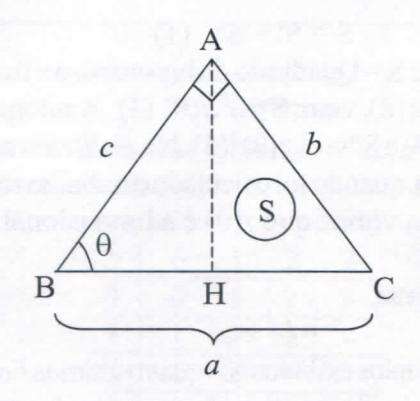
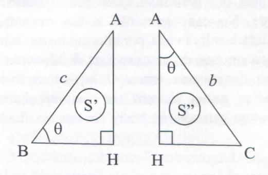

# **FOLHETIM DE EDUCAÇÃO MATEMÁTICA**

**Folhetim Educ. Mat., Ano 14, n. 146, set. / out. 2008**

**ISSN 1415-8779**

#### **OBJETIVO**

Este _Folhetim_ é um veículo de divulgação, circulação de ideias e de estímulo ao estudo e à curiosidade intelectual. Dirige-se a todos os interessados pelos aspectos pedagógicos, filosóficos ehistóricos da Matemática. Pretende construir umaponteparaunir os que estão próximos e os que estão distantes.

#### **EDITORIAL**

Neste número são tratadas questões introdutórias - como definições de Estruturas Matemáticas, Grupos, etc - à compreensão de uma primeira e elementar aproximação à Teoria de Galois. Ainda como questão preliminar, discutiremos o conceito de Simetria.

Logo nas primeiras linhas deste _Folhetim,_ demonstramos o Teorema de Pitágoras, com os poderosos recursos da Análise Dimensional.

Esperamos que nossos leitores possam usar a Análise Dimensional em outras demonstrações.

# **COMITÉ EDITORIAL**

Carloman Carlos Borges (UEFS) Inácio de Sousa Fadigas (UEFS) Marcos Grilo Rosa (UEFS) Trazíbulo Henrique Pardo Casas (UEFS)

### **PERGUNTE QUE O NEMOC RESPONDE**

_Conversas soSre o ensino <fa maiemáíica por Garíoman Garfos OSoryes (Continuação)_

Agora, voltemos à demonstração do célebre Teorema de Pitágoras (TP). Sejam as figuras abaixo, que servirão na "visualização" dessa simples demonstração.

Triângulo ABC de área S

S, S' e S" representam, respectivamente, as áreas dos triângulos ABC,ABHeAHC

Um triângulo retângulo, quanto à sua forma, é determinado, como nesse caso, por dois dados: ahipotenusa e o ângulo 9. Logo, podemos escrever:

área do triângulo retângulo = fiançãodahipotenusa e do ângulo 6, isto é, S = _f{a,Q)._ Mas, como vimos no _folhetim_ anterior, "uma grandeza física pode sempre ser posta, a menos de um fator puramente numérico, sob forma de produto de potências de grandeza das quais a considerada dependa, isto é, se a grandeza G depende das grandezas X, Y, Z,... pode-se sempre escrever

_G = k_ X^Y^Z^..., onde _k, a, b, c,_ são constantes puramente numéricas". Esse é o espírito do teorema de Bridgman (TB). Logo, como S=/(a, 9), podemos escrever _S = a.m_

Tendo em vista a dimensionalidade em relação a S, que é igual a 2 e, também, o PHD, Princípio da Homogeneidade Dimensional: uma equação física não pode ser verdadeira se não for dimensionalmente homogénea. A equação S = o./(9) pode ser escrita

$$S = a^2.f(\theta)$$

Dos triângulos ABC, ABH e AHC, podemos escrever:

$$S = S' + S''$$
(1)

Área de S = Quadrado da hipotenusa x fiinção do ângulo(2).De(2),vem:S=a2./(9) (3). Analogamente, S'=ò^./(9) (4)eS"=c2./(9) _{SyNoFolhetim anteúor,_ exercício (IV), quando foi calculado o trabalho realizado por uma força vimos que /(9) é adimensional, isto é, igual a 1.

Finalmente,

$$a^2 = b^2 + c^2$$

Os exemplos exibidos nos quatro _uiúmosFolhetins,_ poderão servir de motivação aos professores de matemática quanto à busca de novos instrumentais metodológicos. Além disso, poderão servir pararelembrar a importância das recomendações dos parâmetros curriculares. No caso presente, a tão decantada transversalidade salta à vista, por intermédio da Física, pois, historicamente, diversas teorias da Matemática foram inspiradas por essa ciência. Os laços entre Física e Matemática nunca devem ser menosprezados, principalmente quando se trata do ensino dessas disciplinas.

#### Simetria

Queremos, agora, discutir com nossos colegas, alunos eprofessores de matemática, um tema fascinante, chamado _Simetria._ Esse tema recebe, na matemática, um tratamento privilegiado: a _Teoria de Galois,_ a qual, em nosso entendimento, poderia, também, chamar-se Teoria da Simetria, da mesma forma como a Teoria dos Conjuntos criadapelograndematemático Cantor, poderia chamar-se Teoria do Infinito. Tanto lá (Teoria de Galois) como cá (Teoria dos Conjuntos), esses novos nomes ora sugeridos seriam aproximações mais finas ao objeto das duas teorias.

> Primeiramente relembraremos algumas ideias básicas. Leis decomposições Internas:

Consideremos o conjunto N = {0,1,2,3,4,5,6,...}, e sobre este conjunto uma _regra_ ou _correspondência_ que, a cada par de elementos pertencentes a N x N, associa ou faz corresponder um terceiro elemento _c,_ de N, definido univocamente. Se convencionarmos esta regra ou correspondência pelo símbolo "\*" teremos:

$$a * b = c$$

Um exemplo familiar que se enquadra como regra ou correspondência no sentido dado anteriormente, é a regra simbolizada pelo sinal"+".

Para esta regra, teremos a associação:

$$(a, b) \rightarrow a + b$$

Como _(a, b) é_ considerado um par ordenado, se estivermos trabalhando no conjunto A, podemos dizer que _(a, b)_ pertence a A x A.

Outra correspondência usual é aquela designada pelo sinal" -", que faz corresponder a cada par de elementos pertencente a um conjunto E x E um terceiro elemento:

$$(a, b) \rightarrow a - b$$

Observemos mais de perto as duas regras acima. A primeira, damos o nome de _adição;_ ao par ordenado (a, _b),_ o nome de _parcelas_ e ao resultado chamamos de _soma._ (Alguns autores não fazem qualquer diferença entre adição e soma). A segunda regra damos o _nomeáesubtração._ Para melhor fixar ideias, consideremos que estamos trabalhando no conjunto N = {O, 1, 2, 3, 4, 5, ...}que chamaremos de conjunto dos números naturais. A adição

## **NEMOC - NÚCLEO DE EDUCAÇÃO MATEMÁTICA OMAR CATUNDA**

Folhetim Educ. Mat., Ano 14, n. 146, set./out. 2008 - **Editores:** Carloman, Inácio, Grilo e Trazíbulo - **Digitação:** Josenildes Oliveira Venas Almeida e Manoel Aquino dos Santos - **Editoração:** Evandro Vaz e Nivaldo Assis - **Impressão:** Imprensa Gráfica Universitária - **Periodicidade:** bimestral - **Tiragem:** 1.300 exemplares - _Distribuição gratuita -_ **Endereço:** Av. Universitária, s/n - km 03 - BR 116 - Campus Universitário - **Telefone:** (75)3224-8115 - **Fax:** (75)3224-8086 - CEP: 44031 -460 - Feira de Santana - Ba - BRASIL - **E-maU:** nemoc@uefs.br usual neste conjunto, _ésemprepossivel,_ isto é, o resultado _a+bé_ sempre um número natural. Jánão podemos afirmar o mesmo com relação à regra de subtração pois, por exemplo, ao par (3, 5) não podemos associar nenhum número natural (3 - 5).

A conclusão a tirar-se das observações acima é a seguinte: a regra denominada de _adição,_ conforme expusemos acima, é _perfeitamente definida_ no conjunto dos números naturais, isto é, ao par ordenado (a, £>) e N **X** N é sempre possível fazer corresponder um terceiro número _c=a + b._ Quanto a correspondência que chamamos de subtração, esta possibilidade é menos ampla, isto é, nem sempre é possível associar ao par (a, ò) **e** N **X** N um terceiro número _c = a - b_ **e** N. Somente teremos tal possibilidade quando _a > b._ Em virtude dessa restrição, costuma-se afirmar que a subtração é uma regra _parcialmente definida_ no conjunto dos números naturais.

Leis de Composições Internas: as duas regras mencionadas acima, a adição e a subtração, são chamadas de _leis de composições internas,_ com uma diferença básica: a adição é uma lei de composição interna perfeitamente definida e, por isso, é chamada de _operação interna_ ou simplesmente operação, enquanto que, a subtração, sendo uma lei de composição interna parcialmente definida em N, não é chamada de operação sobre este conjunto. Temos, assim, o esquema:

leis de composições internas

completamente definidas ou operações internas

parcialmente definidas (não são operações internas)

Portanto, toda operação é uma lei de composição interna; a recíproca é que _nem sempre_ é verdadeira, isto é, uma lei de composição interna somente é chamada de operação interna, quando é _completamente definida_ para um conjunto dado; quando é*parcialmente definida,* é chamada simplesmente de composição intema.

Seja o conjunto A e S um subconjunto de A x A. À toda apHcação" \* "

$$f: S \subset A \times A \rightarrow A$$

damos o nome de _lei de composição interna._ Quando S = A **X** A, a lei de composição intema é completamente definida e, então, é chamada de _operação interna._

Considere o conjunto Z = {... -3, -2, -1 , O, 1, 2, 3,...}, chamado conjunto dos números inteiros relativos. A subtração usual, neste conjunto, éumalei de composição _completamente_ definida pois, para qualquer par ordenado _{a, b)_ pertencente a Z, é possível encontrar um terceiro elemento _c,_ pertencente a Z, tal que _c = a-b._ Aqui, não há mais a restrição imposta quando o conjunto era o dos números naturais, isto é, não émais necessário que _a_ sej a igual ou maior do que _b._ Como se trata de uma lei de composição _definida completamente,_ dizemos que a subtração em Z é uma operação.

A correspondência, em N, que leva cada _{a, b),b^O_ em a\*

é uma lei de composição completamente definida pois, o número _c = a''é_ sempre um número natural. (É claro que consideramos _a, b,_ números naturais). Esta regra define, portanto, uma operação de N x N - {O} em N. Esta operação é chamada de _potenciação._

Chamamos de _tabuada_ ou _tábua_ de uma lei de composição intema" \*" a um dispositivo como o abaixo:

_X X\* y_

Consideremos a tabuada abaixo e seja a nossa lei"\*"ausualadição:

| +   | 0   | 1   | 2   | 3   |     |
| --- | --- | --- | --- | --- | --- |
| 0   | 0   | I   | 2   | 3   |     |
| 1   | 1   | 2   | 3   | -   |     |
| 2   | 2   | 3   | -   | -   |     |
| 3   | 3   | -   | -   | -   |     |

Evidentemente, a adição, no conjunto {O, 1, 2, 3} não é uma operação e sim, apenas uma lei de composição, pois, por exemplo, 1+3 = 4 não pertence ao conjunto em questão.

A propriedade de que, a composição de dois elementos de um conjunto E x E, seja sempre um elemento de E, damos o nome de*fechamento.* Dizemos, então, que o conjunto E é _fechado_ em relação a lei de composição considerada.

#### Definição de Estmtura Al gébrica

Seja dado o conjunto E, sobre o qual se define _umaou mais_ leis de composição intema, gozando esta(s) lei(s) de determinadas propriedades. Ao sistema formado pelo conjunto E e a lei de composição intema, damos o nome de _estrutura algébrica._

Anotação: Simbolizando por \* a operação associada ao conjunto E, denotaremos por

(E,\*)

o conjunto E associado à operação \*.

Com a anotação (R, +), queremos simbolizar o conjunto dos números reais munido da operação usual de adição.

E conveniente observar que uma _estrutura algébrica não é_ um conjunto, porém, _é_ um conjunto munido de uma ou mais operações algébricas nela definidas; isto, aliás, ficoubem claro na definição.

#### Principais Estruturas Algébricas

Faremos, agora, o estudo elementar das principais estruturas algébricas, alertando ao principiantepara que não desanime ante o formalismo empregado pois, este, uma vez perfeitamente assimilado, servirápara conduzirnos rapidamente e com segurança por todas as etapas do nosso estudo.

a) _semi-grupo:_ um conjunto E tem estrutura de semi-grupo em relação a uma operação \* se vale a propriedadeassociativa,istoé,paraquaisquerjc,j^,z sE, tem-se:

$$x * (y * z) = (x * y) * z$$

Exemplos:

- (N, +), (Q, +) são exemplos de semi-grupos, que chamaremos de semi-grupos _aditivos;_
- (N,.), (R,.) são exemplos de semi-grupos, que chamaremos de semi-grupos**/nM**//zp/íca**//vo5.**

Por semi-grupo aditivo entendemos o sistema (E, +) e por semi-grupo multiplicativo, entendemos o sistema (E,.), quando ambas as operações" +" e"." são associativas.

#### Contra-Exemplos:

- A subtração usual emN não é associativa; por isso, podemos afirmar que a subtração não define em N, uma estrutura de semi-grupo;
- A divisão em N não é associativa; por isso, podemos afirmar que a divisão não define em N uma estrutura de semi-grupo;
  - A operação de _média aritmética,_ definida por:

$$x \cdot y = \frac{1}{2}(x+y)$$

não é associativa; por isso, podemos afirmar que esta operação não define em Ruma estrutura de semi-grupo.

b) _monóide:_ se (E, \*) é um semi-grupo e, ainda, a operação \* possui elemento neutro, então diremos que (E, \*) é um _monóide._

Portanto, uma operação \* define em E uma estrutura de _monóide,_ quando:

- é associativa:
  $$x * (y * z) = (x * y) * z, \forall x, y, z \in E$$

- possui elemento neutro: 3 e **e** E tal que V x **e** E, _X\* e = e\* x = x_

Exemplos:

- (N, +), (Z, +), (Q, +), (R, +), são exemplos de monóides aditivos;
- (N, .), (Z, (Q, (Rj •)•> são exemplos de monóidesmultipUcativos;
- as operações de _intersecção_ e _reunião_ sobre o conjunto das partes P(E) definem em P(E) estruturas de monóides.
- c) _grupo:_ seja E um conjunto munido de uma operação \*. Diz-se que esta operação \* define sobre E uma estrutura de _grupo_ (ou que o conj unto E é um grupo em relação à referida operação) se, e somente se, se verificam os seguintes axiomas:
- I) Para quaisquer elementos _x, y, z_ em E, tem-se _{x \*y) \*z = x\*{y\*z)_ (Propriedade associativa)
  - II) Existência em E do elemento _e,_ tal que:

$$e * x = x * e = e$$
.

para qualquerx em E (Existência do elemento neutro).

- III) Para qualquer _x_ pertencente a E, existe, um elementox',talque:
- _x'\*x = x\*x' = e_ (Existência do elemento simétrico).

## **PRÓXIMO NÚMERO**

_Conversas sobre o ensino da matemática (continuação)._

_Aguardem!_

## **NÚMEROS ATRASADOS**

Envie para cada folhetim um selo de postagem nacional de 1° porte. Dentro de no máximo quatro semanas, contadas a partir da data de recebimento do seu pedido, você receberá os folhetins solicitados.

OBS.: É permitida a reprodução total ou parcial deste folhetim, desde que citada a fonte.
