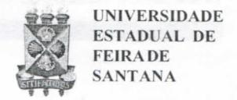
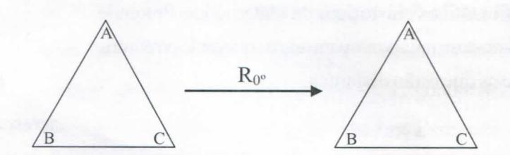
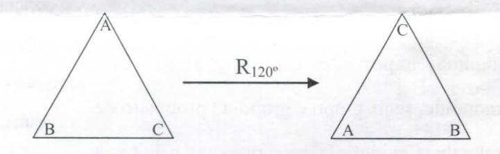
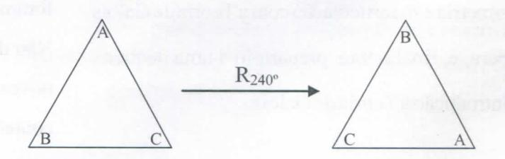
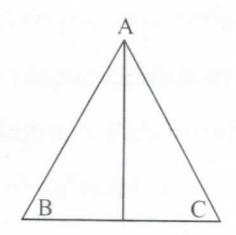
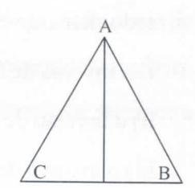
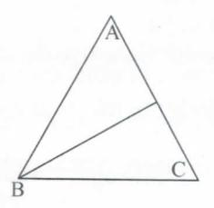
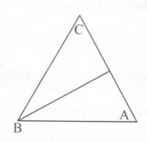
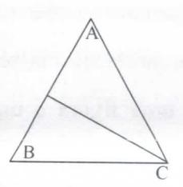
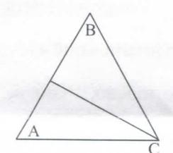

# FOLHETIM DE EDUCAÇÃO MATEMÁTICA

Folhetim Educ. Mat., Ano 14, n. 147, nov. / dez. 2008

ISSN 1415-8779

#### **OBJETIVO**

Este Folhetim é um veículo de divulgação, circulação de idéias e de estímulo ao estudo e à curiosidade intelectual. Dirige-se a todos os interessados pelos aspectos pedagógicos, filosóficos e históricos da Matemática. Pretende construiruma ponte para unir os que estão próximos e os que estão distantes.

#### **EDITORIAL**

Neste número são dadas definições de algumas importantes estruturas algébricas - monóide, semi-grupo e grupo. O propósito de relembrar as definições é preparar o leitor à compreensão de outros conceitos, como o de simetria e sua articulação com a Teoria de Galois para, e, finalmente, prepará-lo a uma pequena introdução à Teoria de Galois.

## COMITÊ EDITORIAL

Carloman Carlos Borges (UEFS)
Inácio de Sousa Fadigas (UEFS)
Marcos Grilo Rosa (UEFS)
Trazíbulo Henrique Pardo Casas (UEFS)

#### PERGUNTE QUE O NEMOC RESPONDE

Conversas sobre o ensino da matemática por Carloman Carlos Borges (Continuação)

Observemos que um grupo nada mais é do que um monóide acrescido da propriedade de que todo elemento possui inverso, isto é, é simetrizável.

Nesse sentido, o conceito de grupo é uma extensão do conceito de monóide, do mesmo modo, que o conceito de monóide é uma extensão do conceito de semi-grupo, pois, um monóide é um semi-grupo que satisfaz a condição de existência do elemento neutro. Vale notar que este método construtivo de conceitos é característico da Matemática. Partiu-se de um conceito simples, o de semi-grupo e, sobre ele, pela adjunção de novas propriedades, foram elaborados dois novos conceitos, o de monóide e o de grupo. Não deve ter passado despercebido o fato importante de que os novos conceitos, além de novas propriedades, trazem, em seu conteúdo, as propriedades pertencentes aos conceitos mais simples sobre os quais eles foram construídos. Nesse sentido, podemos afirmar que o conceito de monóide "herdou" do conceito de semigrupo, a propriedade associativa, e o conceito de grupo, "herdou" do conceito demonóide a própria propriedade associativa e a existência de elemento neutro.

O conceito de grupo é de fundamental importância na Teoria de Galois, pelo que vale a pena observá-lo mais de perto, através de

alguns exemplos ilustrativos. Vejamos, inicialmente o exemplo: seja o conjunto {-1, 1}. A operação usual de multiplicação definenesse conjunto uma estrutura algébrica de grupo. Para mais clareza dessa afirmativa, façamos a "tábua" seguinte:

| •   | 1   | -1  | 1000     |
| --- | --- | --- | -------- |
| 1   | 1   | -1  |          |
| -1  | -1  | 1   | , temos: |

- i) Fechamento, isto é, a operação "•" aplicada ao conjunto {-1,1} produz sempre um elemento pertencente a esse conjunto;
- ii) a operação "•" é associativa;
- iii) existência do elemento neutro: 1;
- iv) todo elemento é simetrizável. Assim, o inverso multiplicativo de 1 é 1 e o inverso multiplicativo de -1 é -1;

Observemos, ainda, que:

v) $(-1 \bullet 1) = (1) \bullet (-1) = -1$ , isto é, a operação é comutativa. Embora a comutatividade não seja uma propriedade indispensável à caracterização da estrutura de grupo, quando este a possui, damos-lhe o nome de grupo comutativo ou grupo abeliano.

Consideremos um triângulo equilátero ABC, e estudemos as diversas rotações em tôrno do seu centro, capazes de fazê-lo coincidir com ele mesmo. Após um rápido exame, verificamos que existem apenas 3

rotações em torno do seu centro e que o levam à coincidência com ele mesmo. A primeira rotação será, evidentemente, a de 0°; a segunda, será a de 120 graus e a terceira será a de 240 graus. Estamos considerando estes três movimentos no sentido anti-horário. Como consideramos duas rotações iguais quando produzem o mesmo efeito, as outras três rotações no sentido horário não serão levadas em conta.

Temos o seguinte esquema:

### NEMOC - NÚCLEO DE EDUCAÇÃO MATEMÁTICA OMAR CATUNDA

Folhetim Educ. Mat., Ano 14, n. 147, nov./dez. 2008 - Editores: Carloman, Inácio, Grilo e Trazíbulo - Digitação: Josenildes Oliveira Venas Almeida e Manoel Aquino dos Santos - Editoração: Evandro Vaz e Nivaldo Assis - Impressão: Imprensa Gráfica Universitária - Periodicidade: bimestral - Tiragem: 1.300 exemplares - Distribuição gratuita - Endereço: Av. Universitária, s/n - km 03 - BR 116 - Campus Universitário - Telefone: (75)3224-8115 - Fax: (75)3224-8086 - CEP: 44031-460 - Feira de Santana - Ba - BRASIL - E-mail: nemoc@uefs.br

Estabeleçamos neste conjunto de rotações a operação "adição de rotações", lembrando que duas rotações são iguais quando produzem o mesmo efeito ou, o que é o mesmo, quando diferem de múltiplo de 360°; ainda vamos estabelecer o seguinte:

$$R_x + R_y = R_{x+y}$$

significando $R_x + R_y$ , que devemos, primeiro, efetuar $R_y$ e, em seguida, efetuar $R_x$ . Assim, por exemplo: $R_{0^\circ} + R_{120^\circ}$ = $R_{0^\circ + 120^\circ} = R_{120^\circ}$ ; $R_{120^\circ} + R_{240^\circ} = R_{360^\circ} = R_{0^\circ}$ .

Temos a seguinte tábua:

$$\begin{array}{c|ccccccccccccccccccccccccccccccccccc$$

Mostremos que o sistema formado por estas três rotações e a operação adição de rotações, forma um grupo abeliano:

- a operação "+" atuando sobre dois quaisquer elementos do conjunto em questão, produz um terceiro elemento sempre do mesmo conjunto; expressamos este fato dizendo que o conjunto das rotações do triângulo equilátero é fechado em relação a esta operação;
  - existência do elemento neutro, que é a rotação Ros;
- a operação é, evidentemente, associativa, pela própria definição;
  - a simetria em relação à diagonal principal, assegura

a comutatividade da operação;

- -todo elemento é simetrizável:
- i) o inverso de R0° é R0°;
- ii) o inverso de R120° é R240°;
- iii) o inverso de R240° é R120°.

Este grupo é chamado de grupo das rotações do triângulo equilátero.

No exercício anterior, o triângulo equilátero pode ser levado a coincidir consigo mesmo através de três movimentos de rotação em tôrno do seu centro; portanto, o triângulo equilátero goza de <u>simetria rotacional</u>.

Por <u>simetria de uma figura</u> entendemos um conjunto de movimentos que a levam a coincidir com ela mesma, sem deformação, isto é, simetria de uma figura é uma transformação um a um (injetora).

Vejamos, agora, quais são os outros movimentos capazes de levarem o triângulo equilátero a coincidir consigo mesmo.

O triângulo equilátero possui três alturas correspondentes aos seus três vértices. Podemos, portanto, através de três <u>reflexões</u>, levá-lo a coincidir consigo mesmo.

Lembramos que <u>reflexão</u> é a transformação que associa a cada ponto do plano o seu simétrico - em relação a uma reta dada. A reflexão em relação a uma reta, chamase <u>reflexão axial</u>, enquanto que a reflexão em relação a um ponto, chama-se de <u>reflexão pontual</u>.

Para o triângulo equilátero, temos as seguintes reflexões em relação as suas três alturas:

É fácil observar que o conjunto destes movimentos, em relação à composição de movimentos, não forma um grupo; para isto, basta notar a inexistência do elemento neutro.

# NOTÍCIAS

#### Site do Nemoc

ONEMOC colocou recentemente na internet a sua Home-Page. Acessando www2.uefs.br/nemoc você obterá informações sobre o Curso de Especialização em Educação Matemática, o Folhetim, além de outras atividades desenvolvidas pelo NEMOC. Você também terá acesso a um texto publicado na RPM contendo uma

biografia do Prof. Omar Catunda além de uma entrevista concedida pelo Prof. Carloman publicada no Caderno de Física da UEFS, em 2004.

#### Curso de Aperfeiçoamento de Professores 2009

ONEMOC ofereceráno período de maio a outubro de 2009 um Curso de Aperfeiçoamento de Professores, com duração de 120h, dividido em 04 módulos de 30h cada, que tratarão dos seguintes tópicos: Trigonometria, Geometria, Funções e Tópicos de Álgebra. Esse curso é destinado a Professores de Matemática do Ensino Fundamental (6° ao 9° ano) e Ensino Médio da Região de Feira de Santana. As inscrições ocorrerão no período de 16 de maio a 15 de abril. Maiores informações no NEMOC, pelo telefone 3224-8115, pelo e-mail nemoc@uefs.br, ou pelo site www2.uefs.br/nemoc.

# PRÓXIMO NÚMERO

Conversas sobre o ensino da matemática (continuação).

Aguardem!

## **NÚMEROS ATRASADOS**

Envie para cada folhetim um selo de postagem nacional de 1º porte. Dentro de no máximo quatro semanas, contadas a partir da data de recebimento do seu pedido, você receberá os folhetins solicitados.

OBS.: É permitida a reprodução total ou parcial deste folhetim, desde que citada a fonte.
