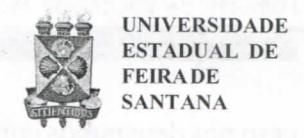
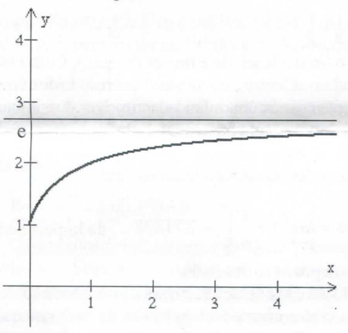

# FOLHETIM DE EDUCAÇÃO MATEMÁTICA

Folhetim Educ. Mat., Ano 14, n. 148, jan. / fev. 2009

ISSN 1415-8779

## **OBJETIVO**

Este Folhetim é um veículo de divulgação, circulação de idéias e de estímulo ao estudo e à curiosidade intelectual. Dirige-se a todos os interessados pelos aspectos pedagógicos, filosóficos e históricos da Matemática. Pretende construiruma ponte para uniros que estão próximos e os que estão distantes.

## **EDITORIAL**

Interrompemos nossas considerações sobre o ensino da Matemática, para responder a uma curiosa carta recebida do leitor Nostradamus S.O.S., da cidade do Rancho Fundo.

Ele apresenta algumas constatações sobre resultados importantes da Matemática. Naturalmente, constatações improcedentes - frutos, talvez, de suas fantasias...

# COMITÊ EDITORIAL

Carloman Carlos Borges (UEFS) Inácio de Sousa Fadigas (UEFS) Marcos Grilo Rosa (UEFS) Trazíbulo Henrique Pardo Casas (UEFS)

## PERGUNTE QUE O NEMOC RESPONDE

Resposta a uma carta

por Carloman Carlos Borges

Interrompemos o assunto tratado nos dois _Folhetins_ anteriores (números 146 e 147) para responder à carta abaixo, com a promessa de retornarmos ao assunto anterior já no próximo _Folhetim_ número 149.

Do colega Nostradamus S. O. S. da cidade de Rancho Fundo, recebemos a seguinte carta:

"Qualquer estudante de Cálculo (pois eles se encontram em todos os livros dessa disciplina) sabe que $y = \lim_{x \to \infty} \left( \frac{1}{x} \right) = 0$ (1) eque, $\lim_{x \to \infty} y = e = \left( 1 + \frac{1}{x} \right)^x = 2,71828...$ (2)

Se o primeiro limite (equação 1) está certo, o segundo limite, a equação (2), está paradoxalmente incompatível, porque deveria tender a 1 e não a 2,718... O raciocínio é claro para sustentar essa minha tese: o número 1 elevado a qualquer número é, igual a ele

mesmo, isto é, igual a 1. Logo para achar o valor de $\lim_{n\to\infty} \left(1 + \frac{1}{n}\right)^n$ ,

basta verificar que $\lim_{n\to\infty} \left(1+\frac{1}{n}\right)^n = \left(1+\frac{1}{\infty}\right)^{\infty} = (1)^{\infty} = 1$ . Como entender

que uma coisa, qual seja, $\lim_{n\to\infty} \left(1+\frac{1}{n}\right)^n$ ora é igual a 1, ora é igual a 2,718?"

E nosso Nostradamus prossegue no seu raciocínio: "Querer afirmar que a equação (2), no infinito, tende a "e", é, no mínimo, um paradoxo, uma inverdade, de acordo com a própria Matemática, que nos parece bem clara e não precisa de subterfúgios para ser aceita. Além disso, afirmar que o número "e" é transcendente é outra tolice."

Agradecemos ao colega a carta recebida e passemos ao seu questionamento.

Quando se vai calcular um limite matemático, nem sempre os primeiros procedimentos conduzem ao resultado desse limite. Nesse

caso nos deparamos com aquilo designado em nossos livros de cálculo, de <u>formas de indeterminação</u>. Quais são essas formas de indeterminação? São sete formas:

$$i \rightarrow \infty - \infty; ii \rightarrow 0.\infty; iii \rightarrow 0.\infty; iii \rightarrow 0.\infty; iii \rightarrow 0.00; vi \rightarrow 0.00; vii \rightarrow 0.00; vii \rightarrow 0.00; vii \rightarrow 0.00; vii \rightarrow 0.00; vii \rightarrow 0.00; vii \rightarrow 0.00; vii \rightarrow 0.00; vii \rightarrow 0.00; vii \rightarrow 0.00; vii \rightarrow 0.00; vii \rightarrow 0.00; vii \rightarrow 0.00; vii \rightarrow 0.00; vii \rightarrow 0.00; vii \rightarrow 0.00; vii \rightarrow 0.00; vii \rightarrow 0.00; vii \rightarrow 0.00; vii \rightarrow 0.00; vii \rightarrow 0.00; vii \rightarrow 0.00; vii \rightarrow 0.00; vii \rightarrow 0.00; vii \rightarrow 0.00; vii \rightarrow 0.00; vii \rightarrow 0.00; vii \rightarrow 0.00; vii \rightarrow 0.00; vii \rightarrow 0.00; vii \rightarrow 0.00; vii \rightarrow 0.00; vii \rightarrow 0.00; vii \rightarrow 0.00; vii \rightarrow 0.00; vii \rightarrow 0.00; vii \rightarrow 0.00; vii \rightarrow 0.00; vii \rightarrow 0.00; vii \rightarrow 0.00; vii \rightarrow 0.00; vii \rightarrow 0.00; vii \rightarrow 0.00; vii \rightarrow 0.00; vii \rightarrow 0.00; vii \rightarrow 0.00; vii \rightarrow 0.00; vii \rightarrow 0.00; vii \rightarrow 0.00; vii \rightarrow 0.00; vii \rightarrow 0.00; vii \rightarrow 0.00; vii \rightarrow 0.00; vii \rightarrow 0.00; vii \rightarrow 0.00; vii \rightarrow 0.00; vii \rightarrow 0.00; vii \rightarrow 0.00; vii \rightarrow 0.00; vii \rightarrow 0.00; vii \rightarrow 0.00; vii \rightarrow 0.00; vii \rightarrow 0.00; vii \rightarrow 0.00; vii \rightarrow 0.00; vii \rightarrow 0.00; vii \rightarrow 0.00; vii \rightarrow 0.00; vii \rightarrow 0.00; vii \rightarrow 0.00; vii \rightarrow 0.00; vii \rightarrow 0.00; vii \rightarrow 0.00; vii \rightarrow 0.00; vii \rightarrow 0.00; vii \rightarrow 0.00; vii \rightarrow 0.00; vii \rightarrow 0.00; vii \rightarrow 0.00; vii \rightarrow 0.00; vii \rightarrow 0.00; vii \rightarrow 0.00; vii \rightarrow 0.00; vii \rightarrow 0.00; vii \rightarrow 0.00; vii \rightarrow 0.00; vii \rightarrow 0.00; vii \rightarrow 0.00; vii \rightarrow 0.00; vii \rightarrow 0.00; vii \rightarrow 0.00; vii \rightarrow 0.00; vii \rightarrow 0.00; vii \rightarrow 0.00; vii \rightarrow 0.00; vii \rightarrow 0.00; vii \rightarrow 0.00; vii \rightarrow 0.00; vii \rightarrow 0.00; vii \rightarrow 0.00; vii \rightarrow 0.00; vii \rightarrow 0.00; vii \rightarrow 0.00; vii \rightarrow 0.00; vii \rightarrow 0.00; vii \rightarrow 0.00; vii \rightarrow 0.00; vii \rightarrow 0.00; vii \rightarrow 0.00; vii \rightarrow 0.00; vii \rightarrow 0.00; vii \rightarrow 0.00; vii \rightarrow 0.00; vii \rightarrow 0.00; vii \rightarrow 0.00; vii \rightarrow 0.00; vii \rightarrow 0.00; vii \rightarrow 0.00; vii \rightarrow 0.00; vii \rightarrow 0.00; vii \rightarrow 0.00; vii \rightarrow 0.00; vii \rightarrow 0.00; vii \rightarrow 0.00; vii \rightarrow 0.00; vii \rightarrow 0.00; vii \rightarrow 0.00; vii \rightarrow 0.00; vii \rightarrow 0.00; vii \rightarrow 0.00; vii \rightarrow 0.00; vii \rightarrow 0.00; vii \rightarrow 0.00; vii \rightarrow 0.00; vii \rightarrow 0.00; vii \rightarrow 0.00; vii \rightarrow 0.00; vii \rightarrow 0.00; vii \rightarrow 0.00; vii \rightarrow 0.00; vii \rightarrow 0.00; vii \rightarrow 0.00; vii \rightarrow 0.00; vii \rightarrow 0.00; vii \rightarrow 0.00; vii \rightarrow 0.00; vii \rightarrow 0.00; vii \rightarrow 0.00; vii \rightarrow 0.00; vii \rightarrow 0.00; vii \rightarrow 0.00; vii \rightarrow 0.00; vii \rightarrow 0.00; vii \rightarrow 0.00; vii \rightarrow 0.00; vii \rightarrow 0.00; vii \rightarrow 0.00; vii \rightarrow 0.00; vii \rightarrow 0.00; vii \rightarrow 0.00; vii \rightarrow 0.00; vii \rightarrow 0.00; vii \rightarrow 0.00; vii \rightarrow 0.00; vii \rightarrow 0.00; vii \rightarrow 0.00$$

Diante de uma dessas <u>formas de indeterminação</u> que fazer, uma vez que nenhuma delas nos fornece o valor do limite? Simplesmente submeter o limite em questão àquelas operações permitidas na matemática.

Exemplificando:
$$f(t) = \frac{t^2 - 9}{t - 3}$$
(a).

Qual será o limite de f(t), quando $t \rightarrow 3$ ? Se substituirmos t = 3 na expressão (a), encontraremos:

$$\frac{t^2 - 9}{t - 3} = \frac{9 - 9}{3 - 3} = \frac{0}{0}$$
, que não tem sentido.

A definição $\lim_{t\to 3} f(t) = L$ , não exige que a função f se ja definida em t = 3. O que interessa é o que ocorre quando t tende para t 3. Assim, fatorando t 2-9, obtemos:

$$f(t) = \frac{(t-3)(t+3)}{t-3} = t+3$$
, quando $t \neq 3$ .

Logo, para aqueles valores de $t \neq 3$ , f(t) = t + 3. Quando t está <u>muito próximo</u> de 3, f(t) está <u>muito próximo</u> de 6. Daí poderemos afirmar que

$$\lim_{t \to 3} \frac{t^2 - 9}{t - 3} = \lim_{t \to 3} (t + 3) = 6$$

Os símbolos de indeterminação. Que representa o símbolo $\infty$ ? Segundo o colega Nostradamus, ele representa um número imenso, muito grande. Daí, ele afirmar ser $1^\infty$ igual a 1, pois, "1 elevado a qualquer número é igual a 1", conforme afirma com segurança fora de propósito.

<u>Definição</u>. Diz-se que uma variável x se torna infinitamente grande positivamente $[x \to +\infty]$ , se, para qualquer valor positivo, previamente escolhido, M, por maior que seja, x se torna e permanece maior do que M. Por exemplo, $x \to +\infty$ quando x toma sucessivamente

os valores da sequência 1, 2, 3, 4, 5, ... . Diz-se que uma variável x torna-se infinitamente grande, negativamente $[x \to -\infty]$ se para qualquer valor negativo, previamente escolhido, N, por menor que seja, x se torna e permanece menor do que N. Por exemplo, $x \to -\infty$ quando toma sucessivamente os valores da sequência -3, -6, -9, -12, ...

Uma variável x torna-se infinita, $[x \to \infty]$ se $|x| \to +\infty$ , isto é, $x \to +\infty$ ou $x \to -\infty$ . Assim, caro colega, $\infty$ não simboliza um número muito grande e sim uma variável x que se torna infinitamente grande.

E, agora, qual o significado de uma daquelas <u>formas de indeterminação</u> mencionadas linhas acima? Veja bem: $\frac{a}{b}$ , para a e b diferentes de zero (a = 0 e b = 0, daria uma indeterminação $\frac{0}{0}$ ), quanto ao seu resultado, pode ser apontado aprioristicamente, ou seja, o resultado de $\frac{a}{b}$ , nesse caso é o número real único c, que multiplicado por b reproduz o número a. Quando a e b são nulos o resultado de $\frac{a}{b}$ não pode ser apontado aprioristicamente e daí, a forma indeterminada $\frac{0}{0}$ . Esse mesmo raciocínio vale para as demais formas de indeterminação. Claramente, também vale para a indeterminação $1^{\infty}$ .... Apresentados esses esclarecimentos fica aberto o caminho para mostrarmos a inexistência de qualquer paradoxo entre as expressões (1) e (2) da carta de Nostradamus.

O famoso número "e" não nasceu de uma necessidade matemática, lógica, como, exemplificando, o conceito de número irracional e mesmo os conceitos de conjuntos <u>vazio</u> e <u>unitário</u>, uma vez que a palavra conjunto diz respeito a pluralidade.

Quanto ao número "e" aconteceu o seguinte: O matemático Jacques Bernoulli (1654-1705) apresentou a si mesmo o seguinte problema: "Como calcular o crescimento de uma quantia emprestada a juros composto, isto é, juros sobrejuros, contados a cada instante?" Recordemos, primeiro, o seguinte: ao emprestarmos uma moeda a juros de 100% ao

## NEMOC - NÚCLEO DE EDUCAÇÃO MATEMÁTICA OMAR CATUNDA

Folhetim Educ. Mat., Ano 14, n. 148, jan./fev. 2009 - Editores: Carloman, Inácio, Grilo e Trazíbulo - Digitação: Josenildes Oliveira Venas Almeida e Manoel Aquino dos Santos - Editoração: Evandro Vaz e Nivaldo Assis - Impressão: Imprensa Gráfica Universitária - Periodicidade: bimestral - Tiragem: 1.300 exemplares - Distribuição gratuita - Endereço: Av. Universitária, s/n - km 03 - BR 116 - Campus Universitário - Telefone: (75)3224-8115 - Fax: (75)3224-8086 - CEP: 44031-460 - Feira de Santana - Ba - BRASIL - E-mail: nemoc@uefs.br

ano, no fim de um ano teremos de volta o montante M de 2 moedas:

$$M = 1 + 1 = 2$$

Quem trabalha com matemática financeira sabe o seguinte:

Se contarmos juros todos os dias (todos os instantes), o montante no fim do ano, será $M = \left(1 + \frac{1}{n}\right)^n$ moedas.

O que o matemático Jaques Bernoulli estudou foi o comportamento de $\left(1+\frac{1}{n}\right)^n$ para a variável n sempre crescendo. A expressão $\left(1+\frac{1}{n}\right)^n$ cresceria, também, sem limite? Essa questão é análoga àquela do cálculo de $\lim_{n\to\infty} \left(1+\frac{1}{n}\right)^n$ , a qual imediatamente no primeiro momento

nos conduz à indeterminação 1°. Na superação da indeterminação apontada, cuidado, se você recorrer à uma dessas conhecidas máquinas de calcular como, HP; após alguns cálculos, a máquina parece emperrar criando a

ilusão de que $\left(1 + \frac{1}{n}\right)^n$ é igual a 1. Em nosso local de

trabalho já recebemos a visita de adeptos da HP que tentaram nos convencer da veracidade dos cálculos. O que acontece é o seguinte: dependendo do método empregado ele é sempre diferente: ora a máquina emperra para $n>10^{14}$ , ora para n>64 (empregando o método de iterações recursivas). Todos os "truncamentos" apontados mostram algo banal: máquinas não são "boas" para demonstrações matemáticas.

Finalmente, como calculamos o famoso limite:

$$\lim_{n\to\infty} \left(1+\frac{1}{n}\right)^n ?$$

A resposta é simples: com o emprego de procedimentos matemáticos permitidos pela lógica. No caso presente, toma-se a expressão:

$$\left(1+\frac{1}{n}\right)^n$$
e faz-se seu desenvolvimento pelo

binômio de Newton, quando chega-se, após algumas simplificações ao resultado

$$\left(1+\frac{1}{n}\right)^n=1+\binom{n}{1}\left(\frac{1}{n}\right)+\binom{n}{2}\left(\frac{1}{n}\right)+\binom{n}{3}\left(\frac{1}{n}\right)+\dots$$

$$= 1 + n \frac{1}{n} + \frac{n(n-1)}{2!} \cdot \frac{1}{n^2} + \frac{n(n-1)(n-2)}{3!} \cdot \frac{1}{n^3} + \dots$$
$$= 1 + 1 + \frac{1}{2!} \left(\frac{n-1}{n}\right) + \frac{1}{3!} \left(\frac{n-1}{n}\right) \left(\frac{n-2}{n}\right) + \dots$$

Quando fazemos $n \to \infty$ os quocientes $\left(\frac{n-1}{n}\right), \left(\frac{n-2}{n}\right)$ , etc. todos tendem a 1, de modo que

$$e = \lim_{n \to \infty} \left( 1 + \frac{1}{n} \right)^n =$$

$$= 1 + \frac{1}{1!} + \frac{1}{2!} + \frac{1}{3!} + \frac{1}{4!} + \frac{1}{5!} + \dots \quad (\alpha)$$

Aí está o famoso número "e" desenvolvido através da série ( $\alpha$ ). Claramente que a expressão ( $\alpha$ ) em seu desenvolvimento, émaior que 2. Mostremos que ela émenor do que 3. Temos:

$$1 + \frac{1}{1!} + \frac{1}{2!} + \frac{1}{3!} + \frac{1}{4!} + \dots + \frac{1}{(n-1)!} < 2 + \frac{1}{2} + \frac{1}{2^2} + \dots + \frac{1}{2^{n-1}} = 3 - \frac{1}{2^{n-1}}.$$

Logo, o limite desejado é menor do que 3. Como escreve Nostradamus, entre 2 e 3 há uma "imensidão de números"; acrescentemos nós: uma infinidade ou melhor, duas infinidades, uma racional e outra irracional. Entre essas infinidades se destaca o mais notável número matemático. Essas considerações nos autorizam a escrever:

$$e = \lim_{n \to \infty} \left(1 + \frac{1}{n}\right)^n = 2,71828...$$
, dado pela série ( $\alpha$ )

ocorreu a precisão desejada.

Essas considerações, em nosso entendimento, deverão convencer plenamente o colega Nostradamus do seu equívoco, enxergando "paradoxo" onde ele não existe.

Mesmo assim, retornemos ao problema proposto por Jacques Bernoulli, tornando-o concreto ainda mais.

Vejamos a tabela abaixo e consideremos o montante final em períodos de tempo cada vez menor:

1 real a 100% dá, a juros anuais... (1+1) = 2 reais

1 real a 100% dá, a juros semestrais... $\left(1 + \frac{1}{2}\right)^2 = 2,25$ reais.

1 real a 100% dá, a juros mensais... $\left(1 + \frac{1}{12}\right)^{12} = 2,6130$ reais.

1 real a 100% dá, a juros semanais... $\left(1+\frac{1}{50}\right)^{50} = 2,6926$ reais.

1 real a 100% dá, a juros diários...
$$\left(1 + \frac{1}{365}\right)^{365} = 2,715$$
reais.

1 real a 100% dá, a juros horários... $\left(1 + \frac{1}{8700}\right)^{8700} = 2,715$ reais.

O capital aumenta continuamente, porém, não parece crescer sem limites (conforme, aliás, já provamos teoricamente). Essemétodo de ficar experimentando valores particulares para a verificação de fórmulas gerais é denominado indução empírica, muito empregado, com êxito, nas ciências naturais. A Matemática o emprega apenas para criar conjecturas, porém, estas somente são aceitas como teoremas quando confirmadas por métodos lógicos ematemáticos - como, aliás, fizemos anteriormente com o limite mencionado linhas acima.

O esboço do gráfico da função $f(x) = \left(1 + \frac{1}{x}\right)^x$ dá uma idéia do seu comportamento.

Em trechos dessa carta, o colega Nostradamus nega a existência não só de números irracionais como dos números transcedentes.

A propósito devemos recordar:

Qualquer solução de uma equação polinomial da forma $x^n + a_{n-1}x^{n-1} + ... + a_1x + a_0 = 0$ , onde os coeficientes $a_0, ..., a_{n-1}$ são números inteiros é chamado de inteiro algébrico. Dessa forma, qualquer número racional $\frac{p}{q}$ é algébrico, porque $\frac{p}{q}$ é raiz da equação qx - p = 0.

Um número real que não seja algébrico, é chamado de transcendente, e não é dificil provar que:

a soma e o produto de números algébricos, é um

número algébrico. (β)

Indicamos ao colega a leitura do livrinho: _Números Irracionais e Transcendentes_, escrito por Djairo Guedes de Figueiredo, Coleção Iniciação Científica, Sociedade Brasileira de Matemática.

Apenas, a título ilustrativo, mostremos ser o número $\pi$ transcendente (que Nostradamus chama de constante geométrica...)

O problema da demonstração da transcendência de um número sofreu uma verdadeira reviravolta com alguns brilhantes resultados provados pelo matemático Alan Baker, nos anos 60. Um deles diz: "Dados os números $x \neq 0$ e $e^x$ , um deles, pelo menos, é transcendente". Vamos lá: sabe-se que $e^{i\pi} = -1$ ; aqui temos $e^x = e^{i\pi} e^x = i\pi$ . No caso, $e^x = e^{i\pi}$ é algébrico, pois $e^{i\pi} = -1$ , e-1 é um número algébrico. Logo o número $i\pi$ é transcendente; mas i é algébrico, por ser solução da equação algébrica $x^2+1=0$ . Conclusão: $\pi$ étranscendente. (Veja observação (β) acima). Agora, é deixado ao colega Nostradamus a prova da transcendência do número "e". Observar que os números reais são divididos em duas classes: os racionais e os transcendentes. Pelo já visto, todo número transcendente é irracional, o que, também, não é aceito pelo colega.

#### Considerações Finais:

- 1. Não confie demais na máquina calculadora HP, apesar de seu gosto de "fazer matemática" com ela. Quando tratar-se de limite, fuja dela, pois limite é um processo infinito, e ela não sabe lidar com processos infinitos.
- 2. Em suas futuras "pesquisas" não esqueça: a contestação de resultados matemáticos secularmente comprovados por grandes matemáticos é uma tarefa inútil.
- 3. O argumento de que os matemáticos também erram, usado por você, é correto. Não esqueça, porém: quando uma proposição matemática é provada logicamente dentro da Axiomática A, ela é verdadeira para sempre dentro de A.

Assim, a soma dos ângulos internos do triângulo euclidiano é sempre 180°, eternamente.

4. Deixe Euler descansar em paz. Não lhe peça desculpas. Olhe o vexame.

# PRÓXIMO NÚMERO

Conversas sobre o ensino da matemática (continuação). Aguardem!
