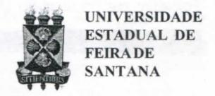

# **FOLHETIM DE EDUCAÇÃO MATEMÁTICA**

**Folhetim Educ. Mat., Ano 15, n. 149, mar. / abr. 2009** 

**ISSN 1415-8779** 

### **OBJETIVO**

' Este *Folhetim* é um veículo de divulgação, circulação de ideias e de estímulo ao estudo e à curiosidade intelectual. Dirige-se a todos os interessados pelos aspectos pedagógicos, filosóficos e históricos da Matemática. Pretende construir uma ponteparaunirosqueestão próximos e os que estão distantes.

## **EDITORIAL**

Continuamos enfatizando alguns conceitos básicos à compreensão da Teoria de Galois, tais como, permutação, simetria e grupo. Também mencionamos contribuições de outros matemáticos - como Lagrange - à resolução da quíntica.

# **COMITÉ EDITORIAL**

Carloman Carlos Borges (UEFS) Inácio de Sousa Fadigas (UEFS) Marcos Grilo Rosa (UEFS) Trazíbulo Henrique Pardo Casas (UEFS)

#### **PERGUNTE QUE O NEMOC RESPONDE**

*Conversas so£re o ensino cfa maiemáiica por Carloman Carlos CBoryes* 

*(Continuação)* 

Após uma breve interrupção para responder a uma carta de um leitor - retomamos, neste *Folhetim,* à equação algébrica do 5° grau e à posição de Galois sobre fórmulas de resolução para as equações algébricas do 5° grau em diante. Este *Folhetim* é, pois, a continuação do denúniero 147. É impressionante como dois conceitos, de certa maneira simples, como os de grupos e simetria jogam um papel tão importante no estudo dos mais variados fenómenos. Hoj e se conhecem figuras desenhadas por nossos antepassados, hámais de 10milanos,nasquaisasimetriajogaum papel relevante na sua estética - permitindo a conclusão de que a estética não é, apenas, um valor cultural. Toda vez quenos envolvemos emjulgamentosobreo feio e o belo, o agradável e o desagradável, adentramos o terreno chamado relativismo estético e aí, a simetria assvimepapel relevante. Aqui, estamos interessados sobre estes dois conceitosjámencionados: Grupos e simetria e suas ligações com as equações algébricas. Quem, ainda, alimenta dúvidas sobre aimportânciadaqueleprimeiro conceito (o de grupo) no esclarecimento de fenómenos físicos, basta ler os trabalhos do grandematemático Hermann Weyl (1885-1955), nascido na Alemanha, sobre grupos contínuos mediante representações degruposmatriciais. Elemostrou "que amaiorparte

das propriedades dos fenômenos quânticos da física atômica podem ser sistematizados e melhor compreendidos utilizando a teoria dos grupos". Um livro específico ainda sobre o assunto e cuja leitura é proveitosa é Group Theory in Quantum Mechanics, Volker Heina, Dover Publications, Inc., New York.

Na exploração da simetria, os matemáticos empregaram um instrumento poderoso: a teoria dos grupos. É difícil imaginar a riqueza e a grandeza dessa teoria. É conveniente notar, porém, que essa riqueza e a grandeza manifestadas em suas quase infinitas aplicações, deve-se ao seu alto grau de abstração. Como sabemos é a partir dessa, que generalizamos e é na abstração - generalização que reside o poder epistemológico da matemática.

Ahistória das equações algébricas é longa e repleta de lances dramáticos. Aqui, vale citar um fato curioso: esse assunto, por incrível que pareça, foi objeto de intensos debates no parlamento britânico no ano de 2005. Abordando o tema do currículo escolar, o parlamentar Tony McWalter explicou:

"Por que uma pessoa deveria se incomodar com os x's e y's em sistemas de equações? Uma resposta é esta: porque se a pessoa não fizer um esforço para ver o que esses x's e y's ocultam, ela não poderá ter qualquer compreensão real da ciência (...). Por que uma pessoa

deveria tentar entender equações quadráticas e os princípios que estão por trás de sua resolução? Sem dúvida alguma, porque elas são a base de sustentação da ciência moderna, assim como os métodos de fundição de minerais dos romanos foram a chave para a construção de sua cultura". Esse trecho foi extraído do livro: A equação que ninguém conseguia resolver, Marcio Lívio, Record, Rio de Janeiro - São Paulo.

Um rápido parêntese para recordar as propriedades das raízes das Equações Algébricas.

A forma mais geral da equação quadrática (estudada já no ensino fundamental) é a seguinte:

$$ax^2 + bx + c = 0$$
 (1)

Como sempre  $a \neq 0$ , dividimos por ele:

$$x^2 + \frac{b}{a}x + \frac{c}{a} = 0$$
(2)

Se  $x_1$  e  $x_2$  forem soluções de (1), então,

$$(x - x_1)(x - x_2) = 0 (3)$$

o que nos leva a

$$x^2 - (x_1 + x_2)x + x_1x_2 = 0 (4)$$

## NEMOC - NÚCLEO DE EDUCAÇÃO MATEMÁTICA OMAR CATUNDA

Folhetim Educ. Mat., Ano 15, n. 149, mar./abr. 2009 - Editores: Carloman, Inácio, Grilo e Trazíbulo - Digitação: Josenildes Oliveira Venas Almeida e Manoel Aquino dos Santos - Editoração: Evandro Vaz e Nivaldo Assis - Impressão: Imprensa Gráfica Universitária - Periodicidade: bimestral - Tiragem: 1.400 exemplares - Distribuição gratuita - Endereço: Av. Transnordestina, s/n - Novo Horizonte - Caixa Postal 252 e 294 - Telefone: (75)3224-8115 - Fax: (75)3224-8086 - CEP: 44036-900 - Feira de Santana - Ba - BRASIL - E-mail: nemoc@uefs.br

De (4) e de (2), conclui-se que:

$$x_1 + x_2 = -\frac{b}{a}$$

$$x_1 x_2 = \frac{c}{a}$$
(5)

Aindado ensino fundamental, sabemos da existência da fórmula

$$x = \frac{-b \pm \sqrt{b^2 - 4ac}}{2a}$$

para a resolução de (1). Para a equação do 3º grau

$$ax^3 + bx^2 + cx + d = 0$$

após a sua redução à equação

$$x^3 + px + q = 0,$$

existe a famosa fórmula de Cardano. Também a equação do 4º grau possui a sua fórmula de resolução. O problema de encontrar uma fórmula de resolução surge na equação do 5º grau. Assim, como as equações do 1º, 2º, 3º e 4º graus são resolvíveis por intermédio de fórmulas, a pergunta natural é esta: e a do 5º grau não teria, analogamente, também, uma fórmula que desse os valores de suas raízes?

Retornemos mais uma vez à conhecida equação do 2º grau

$$ax^2 + bx + c = 0$$

Logo, acima, vimos as propriedades de suas raízes. Vejamos como a sua forma de resolução

$$x = \frac{-b \pm \sqrt{b^2 - 4ac}}{2a}$$

pode ser escrita de outra maneira, isto é, como combinação da soma de suas raízes  $(x_1+x_2)$  e do produto dessas mesmas raízes:  $x_1x_2$ .

Temos a relação (5) logo acima:

$$x_1 + x_2 = -\frac{b}{a}$$

$$x_1 x_2 = \frac{c}{a}$$

Assim,  

$$x = \frac{-b \pm \sqrt{b^2 - 4ac}}{2a} = -\frac{b}{2a} \pm \frac{\sqrt{b^2 - 4ac}}{2a}$$

$$= \frac{1}{2} \left[ -\frac{b}{a} \pm \sqrt{\frac{b^2}{a^2} - \frac{4a}{a}} \right] = \frac{1}{2} \left[ (x_1 + x_2) \pm \sqrt{(x_1 + x_2)^2 - 4x_1x_2} \right]$$

Há algo de surpreendente nessa expressão. A surpresa éa seguinte: ela permanece inalterada mesmo sobo intercâmbio das duas raízes; ela é simétrica sob tal intercâmbio.

Agora, é razoável a pergunta: será que a solução para qualquer equação não poderia ser representada por uma expressão simétrica, tal como acontece com a equação do 2º grau?

Aqui, entra em cena o grande matemático francês Lagrange. Você está lembrado do seguinte: na resolução da equação do 3º grau

$$ax^3 + bx^2 + cx + d = 0$$
.

mostra-se sua equivalência com a equação

$$x^{3} + \frac{b}{a}x^{2} + \frac{c}{a}x + \frac{d}{a} = 0$$

Logo, basta considerar equações nas quais o coeficiente de  $x^3$  seja igual a 1 como a equação  $x^3 + ax^2 + bx + c = 0$ . Nela, faz-se a substituição  $x = y - \frac{a}{3}$  que a transforma em

$$\left(y - \frac{a}{3}\right)^3 + a\left(y - \frac{a}{3}\right)^2 + b\left(y - \frac{a}{3}\right) + c = 0$$

ou

$$y^{3} + \left(b - \frac{a^{2}}{3}\right)y + \frac{2a^{3}}{27} - \frac{ab}{3} + c = 0$$

que é uma equação desprovida do termo do segundo grau. Logo, é suficiente estudar equações do 3º grau tipo,

$$x^3 + px + q = 0$$

Na resolução dessa equação, faz-se x = u + v. Substituindo, vem

$$u^3 + v^3 + (3uv + p)(u + v) + q = 0$$

Dessa forma, o problema da resolução da equação do 3º grau fica resumido na questão de encontrarmos dois números u e v tais que

$$\begin{cases} u^3 + v^3 = -q \\ u - v = -\frac{p}{q} \text{ ou seja } \begin{cases} u^3 + v^3 = -q \\ u^3 \cdot v^3 = -\frac{p^3}{27} \end{cases}$$

quando, então, x = u + v será raiz da equação  $x^3 + px + q = 0$ . Claramente, achar  $u^3$  e  $v^3$  conhecendo a sua soma e o seu produto recai-se numa equação do  $2^{\circ}$  grau

$$w^2 + qw - \frac{p^3}{27} = 0$$

Resumo: a idéia central na resolução da equação do 3º grau, foi reduzi-la a outra de grau imediatamente inferior (uma equação do 2º grau). Essa idéia vale para as equações do 2º e do 4º graus.

Voltemos a Lagrange. Quando esse artificio de redução foi tentado na quíntica, surgiu um inesperado. Em

lugar de resultar numa equação imediatamente inferior (uma equação do 4º grau), surgiu uma equação de grau 4! Amargurado, Langrange escreveu: "é, portanto, improvável que tais métodos levam à solução da quíntica - um dos problemas mais célebres e importante da álgebra." Mesmo, assim, esse grande matemático chegou a resultados notáveis como à descoberta sobre as propriedades das equações e sua resolubilidade, mostando que elas dependem de certas simetrias das soluções sob permutações (chama-se permutação de um conjunto E toda bijeção de E em si mesmo).

#### NOTÍCIAS

Acessando www2.uefs.br/nemoc você obterá informações sobre o Curso de Especialização em Educação Matemática, o Folhetim, além de outras atividades desenvolvidas pelo NEMOC.

#### PRÓXIMO NÚMERO

Conversas sobre o ensino da matemática (continuação).

Aguardem!

#### **NÚMEROS ATRASADOS**

Envie para cada folhetim um selo de postagem nacional de 1º porte. Dentro de no máximo quatro semanas, contadas a partir da data de recebimento do seu pedido, você receberá os folhetins solicitados.

OBS.: É permitida a reprodução total ou parcial deste folhetim, desde que citada a fonte.