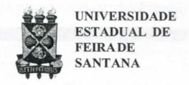
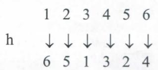
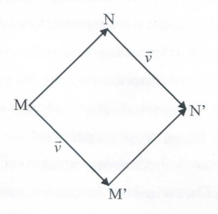
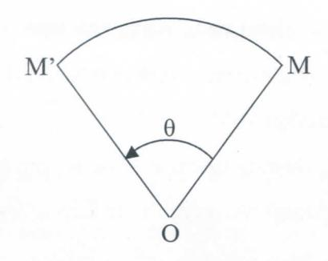
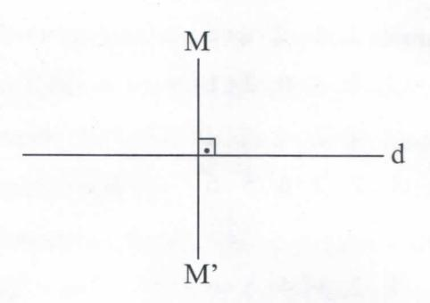

# **FOLHETIM DE EDUCAÇÃO MATEMÁTICA**

Folhetim Educ. Mat., Ano 15, n. 150, mal. / jun. 2009

**ISSN 1415-8779** 

#### **OBJETIVO**

Este *Folhetim* é um veículo de divulgação, circulação de ideias e de estímulo ao estudo e à curiosidade intelectual. Dirige-se a todos os interessados pelos aspectos pedagógicos, filosóficos ehistóricos daMatemática. Pretende construirumaponteparaunir os queestão próximos e os que estão distantes. '

#### **EDITORIAL**

Na explanação preparatória à Introdução da Teoria de Galois, alguns conceitos são esclarecidos. como os de automorfismo, simetria, permutação, etc. Assim, estaremos nos aproximando cada vez mais daquelabela teoria.

# **COMITÉ EDITORIAL**

Carloman Carlos Borges (UEFS) Inácio de Sousa Fadigas (UEFS) Marcos Grilo Rosa (UEFS) Trazíbulo Henrique Pardo Casas (UEFS)

### **PERGUNTE QU E O NEMOC RESPOND E**

*Conversas so£re o ensino tia maÉemáiica por Caríomaa Carlos OSoryes* 

*(Continuação)* 

Agora, temos quenos deter um pouco sobre alguns importantes conceitos ligados ao assunto explanado, como, exemplificando, os conceitos de automorfismo, simetria, etc. Lei de composição intema sobre um conjunto E. Um conjunto E com uma lei de composição intema chama-se magm.a. Exemplos: a adição e a multiplicação dentro deN. Morfismos ou homomorfismo. Sejam (E, T) e (F, \*) dois magmas. Chama-se morfismo de E dentro de F, para as leis T e \*, toda aplicação f: E ->F, tal que, (Va,òeE)f(aTò) = f**(í2) \***  f(ò). Exemplo: a aplicação f(X)=E - X de P(E) dentro dele mesmo é um morfismo do monoide (monoide é um magma associativo, com elemento neutro) (P(E), u ) dentro do monoide (P(E), n) . De fato, para todas as partes X e Y de E,

$$f(X \cup Y) = E - (X \cup Y) = (E - X) \cap (E - Y) = f(X) \cap f(Y)$$

Mais definições. Ummorfismobijetivo chama-se isomorfismo. Exemplo: f(X)=E-Xéum isomorfismo domonoide(P(E), u )sobre o monoide (P(E), n )• (Trata-se deumainvolução: toda permutação de E que coincide com sua recíproca. A aplicação (P(E), P(E), f): f(X) = E-Xéumainvolução de P(E). Observar que, VX eP(E): **(Cg** X)=X).Quando E e F coincidem juntamente com as leis T e \*. S ej a (E, T) um magma e f uma aplicação de E dentro dele mesmo. Se fé um morfismo do magma (E, T) nele mesmo, ele se chama endomorfismo. Se, além disso, ele é bijetivo, então toma o nome de automorfismo, isto é, todo isomorfismo de E em E.

> O quadro abaixo, resume a situação: automorfismo => isomorfismo

endomorfismo => homomorfismo

Uma primeira aproximação do conceito de Permutação de *n* elementos são os diversos agrupamentos possíveis de serem formados com esses *n* elementos, colocando-os em linha, ao lado uns dos outros, de maneira que cada agrupamento contenha os *n* elementos e se diferencie dos outros apenas pela posição relativa dos elementos. Exemplos: a) com dois elementos*aeb,*  podemos formar as duas permutações *ab* e *ba;* b) com três elementos *a,bec,* formamos as permutações *abe, acb, cab, bac, bca, cba* (primeiramente, formamos as permutações dedois elementos e, em seguida, colocamos o terceiro elemento *c* em cada uma dessas permutações, em todas as posições possíveis, apartir da direita). Assim podemos definir: seja E um conjunto com *n* elementos. Chama-sepermutação simples de *n* elementos a qualquer sequência de *n* elementos distintos de E. Isto é uma bijeção de E nele mesmo. Para fixar melhor algumas ideias vejamos o seguinte: sejam os números 1,2,3,4,5

e 6. Eis dois exemplos de permutações, designadas por f e g.

12345 6 12345 6 35462 1 26531 4

Isto é umabijeção de E nelemesmo.

Observar que as permutações acima efetuam transformações, como (em f) 1 é transformado em 3, 2 é transformado em 5, etc; em g, 1 é transformado em 2,2 é transformado em 6, etc.

Mostremos, agora, que o conjunto de todas as permutações de 1 2 3 4 5 6 forma um grupo.

- l)Existea"transformação"quedeixaosnúmeros 1 2 3 45 6 na mesma posição. É como se ela não fizesse nada!
- ^" 2) A combinação de duas permutações, produz a combinação fg. Atenção fg significa fazer primeiro g e depois f Abaixo, os detalhes:

Primeiro fazer g 
$$\downarrow \downarrow \downarrow \downarrow \downarrow \downarrow \downarrow \downarrow \downarrow \downarrow \downarrow \downarrow \downarrow \downarrow \downarrow \downarrow \downarrow \downarrow$$

3) Para qualquer permutação, há o inverso? Veja a permutação h

# **NEMOC - NÚCLEO DE EDUCAÇÃO MATEMÁTICA OMAR CATUNDA**

Folhetim Educ. Mat., Ano 15,n. 150, mai./jun. 2009 - **Editores:** Carloman, Inácio, Grilo e Trazíbulo **-Digitação:**  Josenildes Oliveira Venas Almeida e Manoel Aquino dos Santos - **Editoração:** Evandro Vaz e Nivaldo Assis - **Impressão:** Imprensa Gráfica Universitária - **Periodicidade:** bimestral - **Tiragem:** 1.400 exemplares - *Distribuição gratuita -* **Endereço:** Av. Transnordestina, s/n - Novo Horizonte - Caixa Postal 252 e 294 - **Telefone:**  (75)3224-8115 - **Fax:** (75)3224-8086 - CEP: 44036-900 - Feira de Santana - Ba - BRASIL - **E-mail:** nemoc@uefs.br

Como mostrar que h é o inverso de f? Basta verificar que hf é o mesmo que a operação de não fazer nada.

$$\begin{array}{cccccccccccccccccccccccccccccccccccc$$

Mostramos, assim, que o conjunto de todas as permutações de 1 2 3 4 5 6 forma um grupo.

Anotações: De uma maneira geral o grupo das permutações de *n* elementos, será designado S^^ (S indicador de "simétrico")

> Notação Cíclica. Considere a permutação (5 2 1 3)

Ela é interpretada da seguinte maneira "5 é transformadoem2,2étransformadoem 1,1 étransformado em 3 e 3 é transformado em 5". Esse é um exemplo de um ciclo. Deve-sè observar que o ciclo em foco não menciona o número 4. Isso significa que esse número não se move. Os números não mencionados em um ciclo não se movem. Para manter a coerência do discurso, o "ciclo vazio" O representa a operação de não fazer nada. O ciclo com um só número, como, (5) é, também, igual à mesma equação, qual seja, adenão fazernada. Observequeo ciclo (5) (ou qualqueroutrodeum único número)significaqueonúmero 5 é levado nele mesmo, logo, não se move.

Na combinação de ciclos, começa-se da direita para a esquerda, fazendo-se, primeiro, o ciclo da direita. Exemplo:

(3 5 2) (6 1 3) significa: "O 6 vai parai, o 1 vaipara3,eo3 vaipara6,depois,o3 vaipara5,o5vai para2, eo2vaipara3". --

Historicamenteforamaspermutaçõesquederam origem ao conceito de grupo e, esse fato histórico, por si só justificaria a nossa exposição acima sobre as permutações. Ademais, eles assumem grande importâncianateoriados grupos.

Reforçando tal afirmativa, basta recordar o teorema do matemático inglês Arthur Cayley: "Todo grupo é feito no mesmo molde de um grupo de permutações".

Outro conceito ligado ao de permutação e ao de grupo é o de simetria. Ela está ligada a ordem, harmonia das formas, enfim, ligado à beleza. Foi descoberta em culturas que já desapareceram há mais de dez mil anos. Isso pode provocar debates sobrejulgamentos em tomo do belo, do agradável e desagradável. Enfim, suscita grandes discursões envolvendo o relativismo estético. A presença da simetria em diversas culturas parece mostrar que amesmabeleza atravessa várias culturas - como uma ameaça ao relativismo estético. Mas, o que é simetria? Uma aproximação do conceito: é um movimento rígido que deixa a figura exatamente da mesma forma. E o que é um movimento rígido? Em um movimento rígido (conceito bem familiar aos físicos) do plano movemos todos os pontos do plano, de tal maneira que:

- tanto a distância como a posição relativa dos pontos permanece inalterada.

Exemplos de movimentos rígidos são as nossas conhecidas, desde o ensino médio, transformações:

- a) Translação
- b) Rotação

#### c) Reflexão

*M'N' = MN:* 

Recordemos algo em tomo dessas transformações. **->**  A translação de vetor v associa a cada ponto Mo ponto **-> -»**  M', tal que: *MM'* = v . Para todos os pontos M e N, de imagens respectivas M ' e N' , pela translação,

#### Rotação

- a rotação de centro O e de ângulo O deixa O invariante e associa a cada ponto M, diferente de O, o ponto M' tal que

$$OM' = OM e \left( \overrightarrow{OM}, \overrightarrow{OM'} \right) = \theta$$

- Para todos os pontos M eN de imagens respectivas M'eN':

$$(\overrightarrow{MN}, \overrightarrow{M'N'}) = \theta e M'N' = MN$$

Reflexão. A reflexão em relação àreta *d* associa

- a cada ponto M exteior *kd,o* ponto M', tal que c? sej a a mediatriz de [MM];
  - a cada ponto M de J, o ponto M (ele mesmo)

Todos temos uma ideia do que sej a a simetriabilateral, tão visivel nos animais superiores e no corpo humano. Claramente ele envolve operações como reflexão e rotação.

## **NOTÍCIAS**

**o** NEMOC participará da OBM 2009 - Nível Universitário. A primeira fase desse nível será no dia 12 de setembro de 2009 e as inscrições já estão abertas, de segunda a sexta, no horário das 14:30 às 17:00, no NEMOC. Estamos disponibilizando aos estudantes interessados todas as edições da revista Eureka!, para consulta.

# **PRÓXIMO NUMERO**

*Conversas sobre o ensino da matemática (continuação).* 

*Aguardem!* 

## **NÚMEROS ATRASADOS**

Envie para cada folhetim um selo de postagem nacional de 1° porte. Dentro de no máximo quatro semanas, contadas a partir da data de recebimento do seu pedido, você receberá os folhetins soUcitados.

OBS.: É permitida a reprodução total ou parcial deste folhetim, desde que citada a fonte.