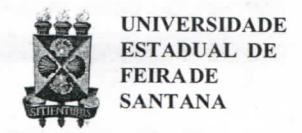

# FOLHETIM DE EDUCAÇÃO MATEMÁTICA

Folhetim Educ. Mat., Feira de Santana, Número Especial, 2009

ISSN 1415-8779

#### **OBJETIVO**

Este Folhetim é um veículo de divulgação, circulação de idéias e de estímulo ao estudo e à curiosidade intelectual. Dirige-se a todos os interessados pelos aspectos pedagógicos, filosóficos e históricos da Matemática. Pretende construiruma ponte para uniros que estão próximos e os que estão distantes.

#### **EDITORIAL**

Este número do Folhetim é dedicado aos oitenta anos do matemático Elon Lages, o qual, por opção própria, resolveu dedicar a maior parte desuas atividades intelectuais à divulgação científica - no caso, a divulgar, a Matemática, em todos os níveis: secundário, graduação e pós-graduação. Parabéns, Elon, e ... muitos anos de vida...

### COMITÊ EDITORIAL

Carloman Carlos Borges (UEFS)
Inácio de Sousa Fadigas (UEFS)
Marcos Grilo Rosa (UEFS)
Trazíbulo Henrique Pardo Casas (UEFS)

#### PERGUNTE QUE O NEMOC RESPONDE

Uma homenagem ao meu amigo Elon, pelos seus oitenta anos

por Manfredo Perdigão

Este ano, comemoramos os oitenta anos de Elon Lima. É uma comemoração mais do que justa, e agradeço a oportunidade de explicar as razões desta minha afirmação.

Em 1987 escrevi uma resenha\* do livro "Meu Professor de Matemática e outras histórias", escrito por Elon Lima. Lámencionei a grande dúvida que temos nós, matemáticos brasileiros, para com o trabalho de divulgação e ensino que vem sendo realizado há várias décadas pelo Elon. Algumas das considerações feitas naquela ocasião continuam tão atuais hoje como eram então, e me permito a repetílas.

Quando falo na divulgação e ensino, me refiro àquela nobre e árdua tarefa de tornar simples as coisas aparentemente complicadas. Isto requer competência para entendê-las, argúcia para reduzí-las ao essencial, e o talento que permite passar da mente para o papel das conclusões assim obtidas. Esta última etapa é parte crucial do processo. A ela se pode aplicar a judiciosa observação de Kepler (V. Matemática Universitária, nº 2, pag. 90) que tanto a concisão quanto a prolixidade têm, cada uma a seu modo, uma certa dose de obscuridade: a primeira, por falta de luz, a segunda, por excesso de luminosidade. É nesta etapa que se define o escritor bem sucedido e onde se estabelece a relação necessária entre leitor e escritor, sem a qual todo o processo anterior fica desperdiçado.

\* Matemática Universitária, nº 26, pp. 113-117, SBM, 1987

Qual é arazão pela qual alguns matemáticos gastam tempo e energia nesta tarefa de arrumar e organizar fatos conhecidos? Primeiro, porque não se trata de uma mera arrumação mas de um processo de recriação e entendimento que é importante para o próprio desenvolvimento da Matemática. Segundo, porque ao lado da paixão de criar, existe a paixão de entender, e, para alguns espíritos, a segunda pode se tornar tão ou mais forte que a primeira.

É bom que assim seja. O que teria sido de nós, quando aprendizes de Matemática, se espíritos lúcidos e generosos não se tivessem se debruçado sobre os seus assuntos e escrito livros que se tornaram clássicos de exposição matemática? No meu caso particular, tenho uma dívida enorme para com vários destes escritos: Grupos Topológicos de Pontriagin, Topologia de Seifert-Threlfall, Álgebra de Van der Warden, Métodos Matemáticos da Física de Courant, Notas de Geometria de Hopf, e muitos outros, entre os quais quero citar explicitamente "Introdução à Topologia Diferencial", de ElonLima.

Considero "Introdução à Topologia Diferencial" (1961) um clássico. Escrito alguns anos antes do "Topology from the Differentiable Viewpoint" (1965) de J. Milnor, ele só não teve a repercursão internacional porque foi escrito em Português, uma língua que, como dizia Olavo Bilac, "é a um tempo esplendor e sepultura". É um livro enxuto elímpido que, junto com "Introdução às Variedades

Diferenciáveis" (1960), do mesmo autor, se constituíram em um texto básico que influenciou decisivamente os matemáticos brasileiros interessados em Geometria e Topologia na década dos anos 60.

Destaquei a "Introdução à Topologia Diferencial" por ser o meu favorito. Entretanto, ele é apenas um exemplo de como Elon Lima vem ajudando gerações sucessivas de matemáticos brasileiros com seus livros, cursos, conferências e ações. As novas gerações o conhecem pelos excelentes textos de Análise, volumes 1 e 2, do Projeto Euclides. A geração a qual pertenço recorda com saudade a primeira edição de Topologia dos Espaços Métricos (provavelmente o seu primeiro livro) que ajudou muita gente a dar os primeiros passos em Análise. É curioso observar que o Brasil progrediu tanto em Matemática, que se torna dificil acreditar que na década de 50 um tal texto era necessário. Quando, anos mais tarde reolhei a Topologia dos Espaços Métricos, entendi o que G. H. Hardy queria dizer quando mencionava que escreveu o seu primeiro livro de Análise (quando eram escassos na Inglaterra os livros de Análise) "como um missionário falando para canibais".

Entretanto, o trabalho de divulgação e ensino do Elon é apenas uma das facetas de suas ações. Há o seu trabalho de pesquisador, ao qual foi dado o devido valor por ocasião da entrega do seu título de Pesquisador Emérito do IMPA. Há a sua pouco lembrada participação na criação do primeiro Colóquio Brasileiro de Matemática, decidida em conjunto com Leopoldo Nachbin e Chaim Hönig em uma reunião no

## NEMOC - NÚCLEO DE EDUCAÇÃO MATEMÁTICA OMAR CATUNDA

Folhetim Educ.Mat., Feira de Santana, Número Especial, jul./ago. 2009 - Editores: Carloman, Inácio, Grilo e Trazíbulo - Digitação: Josenildes Oliveira Venas Almeida e Manoel Aquino dos Santos - Editoração: Evandro Vaz e Nivaldo Assis - Impressão: Imprensa Gráfica Universitária - Periodicidade: bimestral - Tiragem: 1.400 exemplares - Distribuição gratuita - Endereço: Av. Transnordestina, s/n - Novo Horizonte - Caixa Postal 252 e 294 - Telefone: (75)3224-8115 - Fax: (75)3224-8086 - CEP: 44036-900 - Feira de Santana - Ba - BRASIL - E-mail: nemoc@uefs.br

através de livros, tem-se apenas uma diminuta e muitas

México. Há a organização do primeiro Programa de Verão, realizado no IMPA, e que serviu de modelo para os Programas de Verão que se espalharam pelo país. Há sua influência na criação de vários Departamentos de Matemática (Fortaleza, Brasília, PUC), e sua atuação como Diretor do IMPA na época em que foram organizados os Programas de Mestrado e Doutorado do IMPA. Há muitos mais, cujos detalhes desconheço ou que não me ocorrem neste momento.

Elon viveu, até agora, oitenta anos de um vidarica e cheia de realizações. Se a natureza negou-lhe o sonho de ser um grande jogador de futebol, deu-lhe, em troca, a realidade de ser um grande matemático brasileiro.

## \*Elon Bages Bima

Carloman Carlos Borges

Quando de seus 70 anos, o Prof. Elon Lages foi homenageado, através de um número especial do _Folhetim de Educação Matemática_. Agora nos seus 80 anos, lançamos outro número especial em sua homenagem e reproduzimos o que anteriormente (por ocasião do 70° aniversário) havia escrito. Porém, neste número, transcrevemos um belo artigo do eminente matemático Manfredo Perdigão, bastante conhecido nos meios científicos internacionais.

O Brasil ainda não possui a cultura da divulgação científica. Os grandes jornais do País não lhe reservam, de forma sistemática, espaço suficiente. Algumas notícias soltas, desordenadas, são publicadas, de quando em quando, em algumas revistas interessantes... enquanto outros semanários de grande circulação nacional são destinados à cobertura de notícias pertencentes ao universo político-partidário, juntamente com notícias criminais. No que diz respeito ao saber matemático,

vezes pálida divulgação. Olhando para um passado não muito remoto, o que vemos? Um dos mais famosos divulgadores foi Malba Tahan, pseudônimo de Júlio César de Melo e Souza (1895-1974), conhecidíssimo nas décadas de 40, 50 e 60 entre os amantes desse saber. Autor de dezenas de livros tratando de assuntos desde Literatura Oriental até Didática e Matemática, ele celebrizou-se com o livro O Homem que Calculava. Quem não se lembra de seu personagem principal, Beremis, deitado sobre a relva a contar as folhas da frondosa árvore que lhe dava cobertura? E os "intrincados" problemas que lhe eram propostos por reis, herdeiros e plebeus? E o mais famoso deles: o problema dos camelos? Ainda hoje quando o nome de Malba Tahan vem à tona - algumas pessoas me perguntam se ele foi um grande matemático. Atualmente, o movimento conhecido como Educação Matemática vem tentando ressucitar esse admirável contador de histórias. Relendo, hoje, seus escritos, chegase a uma melancólica conclusão: Malba Tahan ou Júlio César de Mello e Souza não tinha conhecimento matemático suficiente para tornar-se um confiável divulgador desse saber. Outro divulgador, este mais preparado que àquele, foi Manoel Amoroso Costa, nascido em janeiro de 1885 e falecido, prematuramente, aos 43 anos de idade. Seu livro As Idéias Fundamentais da Matemática e outros Ensaios, Editora Convívio, EDUSP, ainda hoje pode ser lido com proveito. Se mais vivesse, talvez com novas publicações pudesse ser considerado o iniciador dessa divulgação em nível de seriedade e competência. Em meu entendimento, o pioneiro - dentro das condições mencionadas tanto em nível universitário como em nível de Ensino Médio - continua sendo o Prof. Elon Lages Lima. Há quatro décadas, mais precisamente, desde a década dos 50 com a edição de _Topologia dos Espaços Métricos_ (seu primeiro livro ainda escrito quando estudante) esse matemático vem iluminando o caminho de gerações e gerações de matemáticos brasileiros, quer por intermédio de seus livros, cursos e conferências, quer através de suas ações como o Projeto Euclides, a criação e desenvolvimentos de Departamentos de Matemática em Brasília, Fortaleza e PUC do Rio de Janeiro. A história dos Colóquios Brasileiros de Matemática e dos Programas de Verão do IMPA faz parte da própria história da vida de Elon Lages Lima.

Em 1961 ele publicou o clássico _Introdução à Topologia Diferencial_, cujo único "pecado" foi ter sido escrito em Português, "túmulo do pensamento humano". Se fosse escrito em qualquer outra Língua, em Inglês, exemplificando, seria hoje uma obra de renome.

Mas, o que o torna autor tão lido? A sua competência matemática? Embora essa seja uma condição necessária para o grande divulgador desse saber, não é apenas isso que o torna agradável de ser lido. Talvez alguns exemplos do cotidiano nos indique uma pista segura capaz de esclarecer essa indagação. Vejamos, primeiro, como se comporta, em sala de aula, um professor inexperiente, jovem, porém possuidor daquela já mencionada condição: a preocupação maior dele é mostrar conhecimento e, daí, torna-se prolixo e obscuro. Na outra face da moeda temos o professor que só fala o que ele acha indispensável, tornando-se, igualmente obscuro. Esses dois exemplos mostram que tanto a verbosidade como a concisão, estão ambos ligados à obscuridade; podem mostrar, também, que ensinar ou divulgar qualquer saber é mais uma arte e menos uma ciência mas, cuidado: é indispensável

possuir conhecimento matemático para saber divulgálo. Em meu entendimento, o que torna o Prof. Elon Lages Lima, um escritor que sempre consegue estabelecer uma relação necessária com o leitor é, além do que já citamos, o seu estilo convidativo, a sua fina ironia, a sua paixão pelo que faz, fazendo-o com seriedade e competência. Essas qualidades são sentidas pelo leitor e criam aquele laço necessário entre o Prof. Elon e o leitor. Leiam, mais um exemplo, o seu livro Meu Professor de Matemática: ele começa mostrando uma das qualidades básicas no caráter humano, a gratidão. Assim, começa homenageando o seu professor Benedito, lá de Maceió, onde fez os seus primeiros estudos escolares. Em seguida, com todas as outras qualidades apontadas, escreve páginas admiráveis: Ainda sobre o Teorema de Euler para Poliedros Convexos, a Equação do Terceiro Grau, Grandezas Proporcionais...

É, portanto, com alegria, que o homenageamos com este _Folhetim_ na passagem do seu 80° aniversário ocorrido em 09/07/2009 conforme consta em sua Certidão de Nascimento...

# PRÓXIMO NÚMERO

Conversas sobre o ensino da matemática (continuação).

Aguardem!

## **NÚMEROS ATRASADOS**

Envie para cada folhetim um selo de postagem nacional de 1º porte. Dentro de no máximo quatro semanas, contadas a partir da data de recebimento do seu pedido, você receberá os folhetins solicitados.

OBS.: É permitida a reprodução total ou parcial deste folhetim, desde que citada a fonte.
