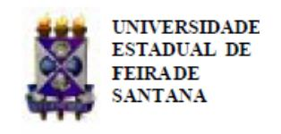

Folhetim Educ. Mat., Ano 16, n. 152, set./out. 2009 ISSN 1415-8779

Este Folhetim ´e um ve´ıculo de divulga¸c˜ao, circula¸c˜ao de id´eias e de est´ımulo ao estudo e `a curiosidade intelectual. Dirige-se a todos os interessados pelos aspectos pedag´ogicos, filos´oficos e hist´oricos da Matem´atica. Pretende construir uma ponte para unir os que est˜ao pr´oximos e os que est˜ao distantes.

Continuamos a preparar-nos matematicamente - rumo a um pouco de entendimento sobre a luminosa Teoria de Galois - extraordin´ario ponto de inflex˜ao na curva de desenvolvimento das equa¸c˜oes alg´ebricas.

Carloman Carlos Borges (UEFS)

In´acio de Sousa Fadigas (UEFS)

Marcos Grilo Rosa (UEFS)

Traz´ıbulo Henrique Pardo Casas (UEFS)

Conversas sobre o Ensino da Matem´atica por Carloman Carlos Borges (continua¸c˜ao)

A Quinta Sinfonia de Beethoven ´e um belo exemplo de simetria translacional, bem como os belos desenhos de M. C. Escher. Ali´as, vejam a "explica¸c˜ao"dada pelo pr´oprio Escher sobre essa maneira de fazer desenhos peri´odicos: "Muitas vezes eu ficava espantado com as minhas pr´oprias manias de fazer desenhos peri´odicos. Certa vez perguntei a um amigo meu, um psic´ologo, sobre a raz˜ao de ser t˜ao fascinado por eles, mas a resposta dele - de que devo ser impelido por um instinto primitivo, protot´ıpico - n˜ao explica nada. Qual deve ser a raz˜ao de eu estar sozinho nesse campo? Por que nenhum de meus colegas artistas parece ser t˜ao fascinado como eu por essas formas entrela¸cadas? Contudo, suas regras s˜ao puramente objetivas, regras essas que todo artista poderia aplicar da sua pr´opria maneira pessoal!"

Segundo M´ario Livio, em seu livro A equa¸c˜ao que ningu´em conseguia resolver, Editora Record, Rio de Janeiro - S˜ao Paulo e do qual transcrevemos o trecho acima: "As medita¸c˜oes retrospectivas de Escher tocam em dois pontos importantes: o papel da simetria no processo "primitivo"da percep¸c˜ao e as regras subjacentes `a simetria."

A relevˆancia da simetria na percep¸c˜ao foi estudada pela psicologia gestaltista. Para os matem´aticos, por´em, o caminho preferido na explora¸c˜ao desse conceito ´e a Teoria dos Grupos, o que veremos, agora com alguns detalhes.

Anteriormente falamos que os animais superiores apresentam simetria bilateral. O ser humano, possuindo esse tipo de simetria, quando submetido `a reflex˜ao em torno de um plano vertical, permanece inalterado. As duas simetrias, a identidade (I) que n˜ao modifica nada, deixa tudo como ´e, e a reflex˜ao (r) em torno de um plano vertical, a simetria bilateral - formam um grupo. Veja a t´abua para as duas simetrias:

| \*  | I   | r   |
| --- | --- | --- |
| I   | I   | r   |
| r   | r   | I   |

Figura 1:

Essa t´abua de composi¸c˜ao atrav´es da opera¸c˜ao de (∗), tamb´em conhecida como opera¸c˜ao de multiplica¸c˜ao, funciona dessa maneira, exemplificando:

$$I * r = r$$

( r composto com I, isto ´e, o s´ımbolo `a direita (r) deve ser a primeira transforma¸c˜ao a ser aplicada no objeto, seguida em seguida por I).

a ∗ b ∗ c significa, primeiro a aplica¸c˜ao c, logo em seguida a aplica¸c˜ao de b e, finalmente seguida pela transforma¸c˜ao a. (A leitura ´e sempre efetuada da direita para a esquerda). Que significa a aplica¸c˜ao de duas reflex˜oes, isto ´e, que significa r ∗ r? Significa que a figura humana volta ao original, uma vez que a primeira transforma¸c˜ao permuta esquerda e direita enquanto a segunda volta a permut´a-las. Portanto, podemos, tranquilamente, escrever r ∗ r = I.

Que revela a t´abua acima? Revela esta coisa supreendente: o conjunto de todas as transforma¸c˜oes de simetria da forma humana ´e um grupo, composto de dois elementos apenas: I e r. Isso pode ser verificado facilmente.

- Fechamento: A combina¸c˜ao de duas simetrias ´e, uma, transforma¸c˜ao de simetria;
- Associatividade: na express˜ao I ∗ r ∗ r, vocˆe pode colocar os parˆenteses "a sua vontade", I ∗ (r ∗ r) = (I ∗ r) ∗ r pois o resultado permanecer´a o mesmo.
- Elemento Neutro: ele ´e uma transforma¸c˜ao de simetria.

- Inverso:
  $$I * I = I = r * r$$

Fica claro o seguinte: a composta de duas simetrias de uma figura, resulta em outra simetria da figura, pois, ambas as simetrias s˜ao movimentos r´ıgidos, donde a sua combina¸c˜ao, ser, tamb´em, um movimento r´ıgido.

Quem n˜ao se recorda da "misteriosa regra dos sinais":

$$(-1) \times (-1) = +1$$

$$(-1)\times(+1)=-1$$

$$(+1) \times (+1) = +1$$

## NEMOC - NUCLEO DE EDUCAC¸ ´ AO MATEM ˜ ATICA OMAR CATUNDA ´

Folhetim Educ. Mat., Ano 16, n. 152, set./out. 2009 - Editores: Carloman, In´acio, Grilo e Traz´ıbulo - Digita¸c˜ao: Josenildes Oliveira Venas Almeida e Manoel Aquino dos Santos - Editora¸c˜ao: Evandro Vaz e Nivaldo Assis - Impress˜ao: Imprensa Gr´afica Universit´aria - Periodicidade: bimestral - Tiragem: 1.400 exemplares - Distribui¸c˜ao gratuita - Endere¸co: Av. Universit´aria, s/n - km 03 - BR 116 - Campus Universit´ario - Telefone: (75)3224-8115 - Fax: (75)3224-8086 - CEP: 44031-460 - Feira de Santana - Ba - BRASIL - E-mail: nemoc@uefs.br

$$(+1) \times (-1) = -1$$

E os "recursos pedag´ogicos"empregados pelo professor para explic´a-la? Os mais afoitos ainda continuam "demonstrando-a".

N˜ao seria mais simples mostrar a sua compatibilidade com o axioma da distributividade? Lembro-me, ainda no ensino fundamental a jovem professora nos presenteando com a sua regra minemˆonica:

- inimigo do meu inimigo ´e meu amigo;
- inimigo do meu amigo ´e meu inimigo;
- amigo do meu amigo ´e meu amigo;
- amigo do meu inimigo ´e meu inimigo.

Mas, que tem a ver essa regra de sinais com o assunto do qual estamos a falar? Pois bem, veja sua t´abua de multiplica¸c˜ao (multiplica¸c˜ao normal):

| ×   | 1   | -1  |
| --- | --- | --- |
| 1   | 1   | -1  |
| -1  | -1  | 1   |

Figura 2:

Estamos novamente na presen¸ca da estrutura de grupo. Agora, algo mais interessante: por interm´edio das correspondˆencias I ↔ 1, r ↔ −1, os dois grupos mostrados nas figuras 1 e 2, possuem a mesma estrutura. Assim, podemos acrescentar: o grupo de simetrias da figura humana ´e isomorfo ao grupo apresentado na figura 2, organizado pelos elementos 1 e −1 sob a transforma¸c˜ao operada pela multiplica¸c˜ao normal.

Algumas li¸c˜oes devemos tirar desse exemplo de isomorfismo. A primeira delas: a Matem´atica possui por finalidade o estudo de rela¸c˜oes. Os elementos do primeiro grupo acima s˜ao movimentos r´ıgidos enquanto os elementos do segundo grupo s˜ao n´umeros, de natureza bem diferente da natureza daquela. Excetuando a natureza de seus elementos, vocˆe pode usar um desses grupos no lugar do outro, pois, com tal condi¸c˜ao, um n˜ao pode ser diferenciado do outro. Fica, assim, resgatada a importˆancia de nossa inesquec´ıvel e querida "misteriosa regra dos sinais".

Outra li¸c˜ao importante a extrair-se do explanado: a relevˆancia do conceito de isomorfismo, que nos leva, mais uma vez, a falar sobre ele.

Na aprendizagem humana, o c´erebro humano n˜ao se cansa, desde os primeiros anos de existˆencia, de modelar, simular os mais diversos fenˆomenos. Essa modelagem ´e feita atrav´es do conceito de isomorfismo. Um modelo matem´atico de um recorte da realidade h´a de ser isomorfo a tal recorte. Atrav´es de aproxima¸c˜oes mais finas, o modelo, isomorfo `a realidade, tende `a dela aproximar-se. Assim, a aprendizagem humana emprega a poderosa ferramenta conceitual do isomorfismo na compreens˜ao do mundo.

Finalmente outra li¸c˜ao. No conhecimento matem´atico papel relevante cabe `a abstra¸c˜ao. Aqui, uma pequenina nota: estamos tratando daquela abstra¸c˜ao organizadora de rela¸c˜oes, bem diferente da chamada abstra¸c˜ao f´ısica, fundamentada na elimina- ¸c˜ao de alguns aspectos do objeto sob estudo e privilegiando outros aspectos n˜ao desprez´ıveis. O objeto da matem´atica ´e o estudo de rela¸c˜oes e n˜ao de coisas. O conceito basilar de n´umeros, exemplificando, j´a apresenta essa singularidade da matem´atica. Quando, ainda exemplificando, falamos no conceito homem, temos duas op¸c˜oes: podemos us´a-lo para nos referir a uma classe de equivalˆencia, mas, tamb´em, nos referir a um determinado homem, Paulo, por exemplo. Temos, ent˜ao, dois aspectos: como classe de equivalˆencia, ele ´e geral, abstrato, e como caso particular, Paulo, ele ´e bem concreto. J´a no conceito de n´umero, os dois aspectos mencionados, referem-se a abstra¸c˜oes. Vocˆe pode referir-se a ele como classe de equivalˆencia e, tamb´em, a um n´umero fixo, exemplificando, sete. Veja, como mesmo assim, o conceito n˜ao se particulariza, como o conceito de homem ao referir-se a Paulo. No conceito do n´umero sete, h´a, ainda, uma dose muito grande de abstra¸c˜ao o que n˜ao acontece com o de homem: Paulo.

Quando o matem´atico estuda o n´umero 6, est´a interessado n˜ao na natureza do 6, n˜ao em sua ontologia, e, sim, ele se interessa pelas rela¸c˜oes de 6 com outros n´umeros: 1, 2, 3, a soma deles: 1 + 2 + 3 = 6 (igual ao pr´oprio 6), etc., pois, ao estudar rela¸c˜oes, o matem´atico estuda todas as poss´ıveis e, assim, envolve a Matem´atica, a id´eia fascinante do infinito. Veja, nas regras mais simples, em seus postulados, essa id´eia aparece "ingenuamente": para todos os n´umeros reais a e b vale: a + b = b + a. Por isso, pode-se afirmar: a Matem´atica ´e a ciˆencia do infinito.

# Site do NEMOC

Acessando www2.uefs.br/nemoc vocˆe obter´a informa¸c˜oes sobre o Curso de Especializa¸c˜ao em Educa- ¸c˜ao Matem´atica, o Folhetim, al´em de outras atividades desenvolvidas pelo NEMOC.

### Livraria Virtual do IMPA

O IMPA lan¸cou recentemente a sua Livraria Virtual, oferecendo desta forma, mais uma op¸c˜ao para aquisi¸c˜ao de livros. Para obter mais informa¸c˜oes, acesse o site: www.impa.br .

### Bibliotecas Virtuais

O site Math on the Web, mantido pela American Mathematical Society - AMS - disponibiliza um guia contendo endere¸cos de sociedades matem´aticas, departamentos, peri´odicos, bibliotecas virtuais, anais etc. Vocˆe poder´a acessar a Biblioteca Virtual da pr´opria AMS, bem como poder´a baixar livros que tratam de conceitos b´asicos da Matem´atica ou de An´alise Funcional, por exemplo. Se preferir, poder´a conhecer o site da Sociedade Matem´atica de Cingapura.

O endere¸co: www.ams.org/mathweb

Conversas sobre o ensino da matem´atica (continua¸c˜ao). Aguardem!

Envie para cada folhetim um selo de postagem nacional de 1o porte. Dentro de no m´aximo quatro semanas, contadas a partir da data de recebimento do seu pedido, vocˆe receber´a os folhetins solicitados. OBS.: E permitida a reprodu¸c˜ao total ou parcial deste folhe- ´ tim, desde que citada a fonte.
