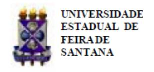
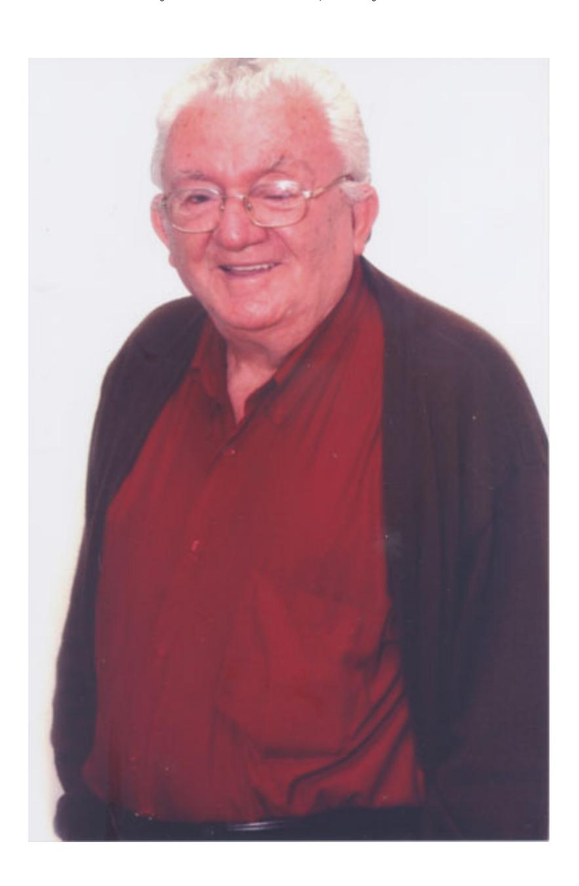

Folhetim Educ. Mat., Feira de Santana, N´umero Especial, 2010 ISSN 1415-8779

Este Folhetim ´e um ve´ıculo de divulga¸c˜ao, circula¸c˜ao de id´eias e de est´ımulo ao estudo e `a curiosidade intelectual. Dirige-se a todos os interessados pelos aspectos pedag´ogicos, filos´oficos e hist´oricos da Matem´atica. Pretende construir uma ponte para unir os que est˜ao pr´oximos e os que est˜ao distantes.

Este n´umero do Folhetim junta-se a outras homenagens prestadas ao nosso Professor Em´erito Carloman Carlos Borges, nesse primeiro semestre de 2010: amigos e familiares nomearam o m´odulo da Uefs no qual Professor Carloman esteve presente cotidianamente desde 1984 de M´odulo Prof. Carloman Carlos Borges e, no Nemoc, montaram a Sala Carloman Carlos Borges - neste ambiente encontra-se muito material sobre a vida do Professor Carloman, desde objetos pessoais, diplomas, prˆemios, a sua tese de doutorado al´em de um rico acervo bibliogr´afico; a ´area de Matem´atica-Dexa/Uefs promoveu o semin´ario Professor Carloman. Sim, o t´ıtulo de Professor Em´erito ´e mais uma homenagem de alunos, colegas e amigos ao Professor Carloman.

Carloman Carlos Borges (UEFS) - in memoriam In´acio de Sousa Fadigas (UEFS) Marcos Grilo Rosa (UEFS) Traz´ıbulo Henrique Pardo Casas (UEFS)

Nosso Professor Em´erito, Professor Carloman

Nascido em Frei Paulo, no Estado de Sergipe, aos onze dias do mˆes de mar¸co de 1931, o professor Carloman estudou a 1a s´erie do 1o Ciclo (atual 6o ano do Ensino Fundamental) em 1945, na Escola T´ecnica Com´ercio de Uberlˆandia, a 2a s´erie na Escola T´ecnica Com´ercio de Sergipe, em 1946, e a 3a e 4a s´eries na Escola T´ecnica Com´ercio de Botafogo no Rio de Janeiro, nos anos de 1959 e 1960. Concluiu no ano de 1963 o 2o Ciclo (atual Ensino M´edio) na Escola T´ecnica de Eletrˆonica Francisco Moreira da Costa em Minas Gerais. Em 1968, obteve sua Licenciatura Plena em Matem´atica pela Universidade de Itajub´a, MG, especializando-se em Equa¸c˜oes Diferenciais pela mesma universidade em 1970 e em Conte´udos e M´etodos do Ensino Superior pela Universidade Federal da Bahia em 1974. Parte, ent˜ao, academicamente, para o stricto sensu apresentando, em 1978, a disserta¸c˜ao de mestrado intitulada Analyse Compartimentale na Universidade de Ciˆencias e T´ecnicas de Languedoc, tamb´em conhecida como Universidade de Montpellier II (Fran¸ca). No ano seguinte, apresenta sua tese de doutorado intitulada Sur Certains Mod`eles Math´ematiques dans les Sciences Exp´erimentales, na mesma universidade. Em seus estudos na Fran¸ca, o professor Carloman foi orientado pelo matem´atico ilustre Artibano Micalli e teve como um de seus professores Alexander Grothendieck, um dos maiores matem´aticos do s´eculo XX e ganhador do Prˆemio Crafoord em 1988 e da Medalha Field em 1966.

Desde a d´ecada de 50 do s´eculo passado, o professor Carloman dedicou-se ao magist´erio. Em 1958 era professor do gin´asio (hoje 6o ao 9o ano do Ensino Fundamental), em Alagoinhas, BA, onde trabalhou tamb´em com a disciplina Geografia. Entre os seus alunos, encontrava-se Antonio Torres, escritor de reconhecimento internacional, com quem trocou correspondˆencias frequentemente.

"Meu interesse pela Matem´atica nasceu de dificuldades econˆomicas. Desempregado, em Alagoinhas, em 1958 aceitei dar aulas dessa disciplina no ent˜ao Gin´asio de Alagoinhas. Gostei da experiˆencia e esse gosto ainda se prolonga at´e hoje... O que me aproxima da Matem´atica, j´a que n˜ao sou um matem´atico e sim um simples professor ´e a dimens˜ao filos´ofica, ´e a sua clarividˆencia, a sua significa¸c˜ao - no meu entendimento - mais pr´oxima da "realidade"do que qualquer outra ciˆencia. Que outra ciˆencia me assegura que certos acontecimentos f´ısicos n˜ao s˜ao calcul´aveis, portanto n˜ao s˜ao previs´ıveis, enquanto outros, previstos pelo modelo matem´atico n˜ao se produzir˜ao na realidade f´ısica? Esses dois importantes resultados devidos ao grande matem´atico francˆes Poincar´e provocar˜ao, certamente, em alguns esp´ıritos, longas e intermin´aveis medita¸c˜oes." (Entrevista publicada no Caderno de F´ısica da UEFS, 03 (01): 31-41, 2004.)

Em 1970, ingressou no magist´erio superior e lecionou na Universidade Federal da Bahia (UFBA) e na Universidade Cat´olica de Salvador (UCSal). Na UFBA, trabalhou como assistente do professor Omar Catunda, experiˆencia que o marcou profundamente:

"Alguns professores e/ou matem´aticos me influenciaram. No topo da pirˆamide, coloco, Omar Catunda, com o qual tive uma convivˆencia de sete anos no Instituto de Matem´atica da UFBa como seu assistente: ele ministrava as aulas te´oricas e eu, as aulas pr´aticas (resolu¸c˜ao de listas de exerc´ıcios) e corrigia as provas elaboradas pelo mestre na avalia¸c˜ao do alunado. Aposentado da USP, como catedr´atico de An´alise, o "velho"Catunda mudou-se para Bahia. Ele foi um divisor de ´aguas no que diz respeito ao ensino de Matem´atica na Bahia. Pode-se falar numa Matem´atica neste Estado antes e em outra Matem´atica depois de sua vinda. Antes de Catunda vir morar na Bahia, a Matem´atica era "comandada"por alguns professores da Escola Polit´ecnica que possu´ıam uma "vis˜ao puramente instrumental"dessa ciˆencia. Al´em disso alguns deles desconheciam completamente princ´ıpios b´asicos, hoje, conhecidos pelo estudante de licenciatura. Lembro-me muito de um deles: de palet´o e gravata, bem penteado `a base de brilhantina, ele come¸cava sua primeira aula, afirmando: como n´os sabemos, o conjunto dos n´umeros reais ´e um conjunto enumer´avel... O simples desconhecimento de alguns dos princ´ıpios b´asicos de Matem´atica, como o apresentado acima seria in´ocuo, n˜ao fora a sua atividade

# NEMOC - NUCLEO DE EDUCAC¸ ´ AO MATEM ˜ ATICA OMAR CATUNDA ´

Folhetim Educ.Mat., Feira de Santana, N´umero Especial, mar./abr. 2010 - Editores: In´acio, Grilo e Traz´ıbulo - Digita¸c˜ao: Josenildes Oliveira Venas Almeida e Manoel Aquino dos Santos - Editora¸c˜ao: Evandro Vaz e Nivaldo Assis - Impress˜ao: Imprensa Gr´afica Universit´aria - Periodicidade: bimestral - Tiragem: 1.500 exemplares - Distribui¸c˜ao gratuita - Endere¸co: Avenida Transnordestina s/n, M´odulo Prof. Carloman Carlos Borges, bairro Novo Horizonte, Feira de Santana, BA, Brasil. CEP 44.036-900. - Telefone: (75)3224-8115 - Fax: (75)3224-8086 - E-mail: nemoc@uefs.br - Home-Page: www2.uefs.br/nemoc

quer em salas de aula quer em reuni˜oes de colegiados e congrega¸c˜oes, onde se decidiam as diversas programa¸c˜oes do curso de licenciatura em Matem´atica. Omar Catunda foi, antes de tudo , um humanista. Com ele era poss´ıvel conversar acerca dos mais variados assuntos: arte, filosofia, literatura, pol´ıtica e at´e mesmo, Matem´atica... Ele teve uma grande influˆencia sobre mim, principalmente quanto a sua dimens˜ao human´ıstica. Convivi com Martin Tygel alguns anos e soube apreciar a sua grande curiosidade intelectual. Hoje, matem´atico premiado internacionalmente, ele exerce suas atividades cient´ıficas na Unicamp, no Departamento de Matem´atica. Ele, tamb´em, teve influˆencia sobre mim. Durante os trˆes anos de estudos na Fran¸ca, na d´ecada de 70 quando obtive os Diplomas de Estudos Aprofundados em Matem´atica e o de Doutor em Matem´atica travei conhecimentos com Grothendieck, medalha Fields e um dos maiores matem´aticos do s´eculo XX assistindo suas aulas. Como n˜ao sou matem´atico, por´em, simples professor de, n˜ao pude explor´a-lo profundamente... Outra figura inesquec´ıvel, ainda quando da minha permanˆencia na Fran¸ca ´e a de Artibano Micali, algebrista conhecido entre seus pares, em n´ıvel internacional. Radicado na Fran¸ca h´a algumas dezenas de anos ele vem prestando inestim´aveis servi¸cos com a sua atividade cient´ıfica. J´a orientou em torno de 80 teses de doutorado e, brevemente, publicar´a atrav´es da Springer-Verlag, uma obra sobre as Algebras de ´ Clifford. Como sou amigo pessoal dele, n˜ao cabe, aqui, tecer-lhe maiores elogios. Ele exerceu forte influˆencia sobre mim. E uma daquelas pessoas que se tornam ´ inesquec´ıveis em nossas vidas. As demais pessoas que me influenciaram - e foram muitas - est˜ao mortas. Ali´as, com o passar dos anos, come¸camos a apreciar melhor a mensagem contida na frase do fundador do positivismo, Comte: "Cada vez mais os mortos governam os vivos"..."( Entrevista publicada no Caderno de F´ısica da UEFS, 03 (01): 31-41, 2004.)

E evidente que sua plasticidade mental provia, ´ grande parte, de sua curiosidade e inquietude intelectual em diversas ´areas do conhecimento, tais como a Matem´atica, Filosofia, Literatura, F´ısica e a Psican´alise. Esta caracter´ıstica o levou a reunir mais de quatro mil livros, construindo uma biblioteca particular em sua casa, em S˜ao Gon¸calo dos Campos, BA.

O professor Carloman foi um dos grandes batalhadores na cria¸c˜ao da Escola de Engenharia da UCSal, tendo atuado ainda como professor da UFBA (conforme j´a mencionamos) e de trˆes das quatro universidades estaduais baianas: Universidade Estadual de Feira de Santana (UEFS), Universidade do Estado da Bahia (UNEB) e Universidade Estadual do Sudoeste da Bahia (UESB).

O professor Carloman tamb´em foi um dos fundadores da Universidade Estadual de Feira de Santana (UEFS), onde chegou em 1970. O professor foi o grande respons´avel pela funda¸c˜ao do N´ucleo de Educa¸c˜ao Matem´atica Omar Catunda (NEMOC). Mesmo antes da institucionaliza¸c˜ao deste n´ucleo, o professor Carloman, preocupado com a situa¸c˜ao do ensino de Matem´atica na regi˜ao, elaborou, promoveu e executou alguns cursos de extens˜ao para professores, bem como para alunos do ent˜ao curso de Licenciatura em Ciˆencias - Habilita¸c˜ao em Matem´atica. Dentre os cursos realizados, citamos: Trigonometria e N´umeros Complexos (1987), T´opicos de Matem´atica do 2o grau (1989) e Introdu¸c˜ao ao C´alculo e a An´alise (1994).

A partir de 1998, o NEMOC atendeu a editais do Pr´o-Ciˆencias, convˆenio CAPES/CADCT-Ba/UEFS, elaborando e executando projetos de forma¸c˜ao de professores nas modalidades de aperfei¸coamento e atualiza¸c˜ao. O professor Carloman atuou como coordenador e professor nos referidos projetos.

Como mais um passo para a melhoria da forma¸c˜ao dos professores de Matem´atica, o NEMOC passou a oferecer um curso de p´os-gradua¸c˜ao lato-sensu em Educa¸c˜ao Matem´atica, recomendado pela CAPES, tendo como objetivos:

- aprimorar e atualizar conte´udos espec´ıficos da Matem´atica;
- iniciar o discente-professor `a pesquisa em Educa¸c˜ao Matem´atica;
- melhor qualificar os egressos do curso de Licenciatura em Matem´atica da UEFS;
- promover o contato do discente-professor com t´opicos de ponta da matem´atica;
- dar embasamento aos rec´em-graduados para uma p´os-gradua¸c˜ao stricto-sensu.
- O Curso de Especializa¸c˜ao em Educa¸c˜ao Matem´atica - CEEM - foi o primeiro em Educa¸c˜ao Matem´atica do Estado da Bahia e vem consolidando um dos prop´ositos do NEMOC de qualifica¸c˜ao, em n´ıvel de p´os-gradua¸c˜ao, dos profissionais da ´area. De 1998 at´e a presente data o curso ofereceu 08 turmas e formou 65 especialistas. Atualmente, est´a em funcionamento a 9a turma.

O professor Carloman foi fundador e coordenador do Curso de Especializa¸c˜ao em Educa¸c˜ao Matem´atica desde a sua cria¸c˜ao. At´e o final do ano passado, o professor Carloman ainda ministrava aulas bem como organizava e dirigia semin´arios no CEEM, orientava discentes em trabalhos de conclus˜ao de curso, al´em de ter participado do processo seletivo de todas as nove turmas que foram oferecidas at´e hoje.

Com a institucionaliza¸c˜ao do N´ucleo de Educa¸c˜ao Matem´atica Omar Catunda atrav´es da Resolu¸c˜ao do CONSAD no 05/92 (vide Folhetim no 02), o professor Carloman e toda a equipe do NEMOC, se propuseram a fazer de cada folhetim "um ve´ıculo de divulga¸c˜ao, circula¸c˜ao de id´eias e de est´ımulo ao estudo e `a curiosidade intelectual. Dirigi-se a todos os interessados pelos aspectos pedag´ogicos, filos´oficos e hist´oricos da Matem´atica. Pretende construir uma ponte para unir os que est˜ao pr´oximos e os que est˜ao distantes".

Em 1993, gra¸cas a atua¸c˜ao e prest´ıgio do professor Carloman, o extinto Jornal Feira Hoje come¸cou a publicar semanalmente, aos domingos, textos de divulga¸c˜ao cient´ıfica sobre o ensino de Matem´atica, coluna esta intitulada "Pergunte que o NEMOC Responde". Essas publica¸c˜oes, ainda em 1993, foram transformadas em Folhetins e distribu´ıdas a escolas da rede p´ublica de Feira de Santana. A procura e o interesse foram crescendo e come¸cou-se a cadastrar leitores para o Folhetim, com distribui¸c˜ao gratuita aos interessados.

Desde a sua primeira publica¸c˜ao, no primeiro dia do mˆes de agosto de 1993, o Folhetim de Educa¸c˜ao Matem´atica ´e distribu´ıdo (gratuitamente) a professores, alunos e funcion´arios da UEFS assim como a todos que manifestam interesse em adquiri-lo. Os arquivos do NEMOC possuem referˆencias elogiosas da Sociedade Brasileira de Matem´atica, a qual, inclusive, j´a transcreveu na sua Revista do Professor de Matem´atica, artigo desse boletim. Alguns conhecidos matem´aticos brasileiros - entre eles, Elon Lages Lima, Geraldo Avila, Irineu Bicudo, Aron Simmis e Man- ´ fredo Perdig˜ao do Carmo j´a manifestaram elogiosas referˆencias a esse folhetim, tendo todos publicado artigo nesse boletim que, de certa forma, encorajaram cada vez mais os professores Carloman Carlos Borges e In´acio de Sousa Fadigas, editores da supracitada publica¸c˜ao.

O Folhetim de Educa¸c˜ao Matem´atica consta, tamb´em, como referˆencia em artigos cient´ıficos constantes de teses de P´os-Gradua¸c˜ao, em livros did´aticos, em documentos do MEC (a exemplo do Programa GESTAR), al´em de livros voltados para a Educa¸c˜ao Matem´atica. Alguns artigos do Folhetim j´a foram publicados no Jornal de Matem´atica Elementar, peri´odico da Sociedade Portuguesa de Matem´atica.

Em 2001, a UEFS abriu as atividades do primeiro semestre letivo, homenageando com a Aula Magna dois dos seus mais antigos professores: Carloman Carlos Borges e Jos´e Jerˆonimo de Morais, que deixaram o quadro de docentes da UEFS, por aposentadoria compuls´oria. Em seu pronunciamento, a ent˜ao reitora Anaci Bispo Paim, ex-Secret´aria de Educa¸c˜ao do Estado da Bahia e ex-Membro do Conselho Nacional de Educa¸c˜ao, ao homenagear os dois professores, disse que eles "se ausentam, mas n˜ao se separam de n´os. Estar˜ao sempre presentes, pois a presen¸ca deles entre n´os vem desde os alicerces da UEFS".

Na mesma ocasi˜ao, Anaci Paim lembrou ainda que os dois professores, "mestres na acep¸c˜ao mais ampla da palavra, nos legam o exemplo, o referencial, o compromisso com a institui¸c˜ao, o testemunho. Portanto, n˜ao haveria melhor indica¸c˜ao para a abertura do primeiro semestre do ano do nosso Jubileu de Prata, do que a homenagem, mais do que justa aos professores Carloman Carlos Borges e Jos´e Jerˆonimo de Morais, espelhos que refletem a imagem da dignidade, da coerˆencia, da retid˜ao e da ´etica, far´ois que orientam os jovens, que indicam o melhor caminho em dire¸c˜ao ao porto mais seguro".

Em 2002, o professor Carloman foi convidado pelo professor Olival Freire Jr. (Instituto de F´ısica - UFBA) a participar do Programa Interdisciplinar sobre Ciˆencia e Educa¸c˜ao (PICE), mais especificamente no Mestrado em Ensino, Filosofia e Hist´oria das Ciˆencias, em que ministrou aulas e orientou uma disserta¸c˜ao sobre o "C´alculo n˜ao Standard no Ensino M´edio". Na UNEB orientou a disserta¸c˜ao intitulada "Os cursos de Licenciatura em Matem´atica ante o impacto dos avan¸cos tecnol´ogicos: o caso da UNEB".

Em 2006, foi lan¸cado o livro A Matem´atica para Todos, Volume 1, contendo uma sele¸c˜ao de artigos publicados no Folhetim. O referido livro foi prefaciado pelo professor Elon Lages Lima. O professor Carloman tamb´em foi um dos maiores incentivadores para que estudantes do curso de Licenciatura em Matem´atica da UEFS ingressassem em programas de mestrado e doutorado nos melhores centros do pa´ıs e do mundo. N˜ao ´e por acaso que temos diversos egressos que atualmente s˜ao mestres e doutores em Matem´atica pela UFPE, Unicamp, USP, Politecnico de Torino - It´alia, University of Texas - EUA, etc.

O professor Carloman nunca tirou f´erias e exerceu suas atividades na UEFS at´e o dia 22 de dezembro de 2009. Apesar de ter sido o primeiro doutor da UEFS, o primeiro coordenador da Area de Matem´atica e o ´ primeiro professor a publicar um artigo (Topologia: Considera¸c˜oes Te´oricas e Implica¸c˜oes para o Ensino da Matem´atica, 1986) pelo Departamento de Ciˆencias Exatas, n˜ao era dif´ıcil conversar com o professor Carloman. Sempre receptivo, o nosso ilustr´ıssimo professor atendia `a todos aqueles, sem exce¸c˜ao, que desejavam ouvi-lo falar sobre Matem´atica ou qualquer outro assunto. De segunda a sexta (e `as vezes em feriados, por esquecimento!), por volta das 07 horas da manh˜a, o professor Carloman j´a estava em sua sala fazendo o que mais gostava: lendo. Quando n˜ao o encontr´avamos no NEMOC, com certeza, estava em sala de aula.

Em 03 de fevereiro de 2010, o professor Carloman Carlos Borges faleceu em Feira de Santana, BA, por volta das 07 horas da manh˜a.