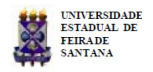

Folhetim Educ. Mat., Feira de Santana, Ano 16, N´umero 154, maio/jun., 2010 ISSN 1415-8779

Este Folhetim ´e um ve´ıculo de divulga¸c˜ao, circula¸c˜ao de ideias e de est´ımulo ao estudo e `a curiosidade intelectual. Dirige-se a todos os interessados pelos aspectos pedag´ogicos, filos´oficos e hist´oricos da Matem´atica. Pretende construir uma ponte para unir os que est˜ao pr´oximos e os que est˜ao distantes.

Iniciamos, neste Folhetim, uma s´erie que trar´a a transcri¸c˜ao das notas intituladas "A Matem´atica: suas origens, seu objeto e seus m´etodos - Parte I", de autoria do professor Carloman, publicada em janeiro de 1983, pelo Departamento de Ciˆencias Exatas da UEFS. Essas notas originaram-se do curso "T´opicos de Matem´atica", ministrado, na ´epoca, pelo nosso saudoso professor e era destinado a alunos do 8o semestre do Curso de Matem´atica, licenciatura plena. Neste n´umero, veremos duas correntes filos´oficas importantes: o Racionalismo e o Apriorismo.

Algumas corre¸c˜oes, em sua maioria de natureza tipogr´afica, foram necess´arias mas nada que descaracteriza a originalidade da obra. Adequa¸c˜oes `as terminologias atuais tamb´em foram indispens´aveis, como por exemplo, "Ensino M´edio" ao inv´es de "2o Grau". Por fim, destacamos que, a partir desta edi¸c˜ao, estaremos adotando as regras do Acordo Ortogr´afico da L´ıngua Portuguesa que entrou em vigor em 1o de janeiro de 2009.

Carloman Carlos Borges (UEFS) - in memoriam In´acio de Sousa Fadigas (UEFS) Marcos Grilo Rosa (UEFS)

Traz´ıbulo Henrique (UEFS)

A Matem´atica: suas origens, seu objeto e seus m´etodos

Carloman Carlos Borges

# 1. Origem do Conhecimento Matem´atico

Parece existir um grave perigo no excessivo predom´ınio do car´ater axiom´atico-dedutivo da Matem´atica. Certamente, o elemento de inven¸c˜ao construtiva, de intui¸c˜ao direta, escapa a uma simples formula¸c˜ao filos´ofica; sem embargo, continua sendo o n´ucleo de todo resultado matem´atico, ainda mesmo nos campos mais abstratos. Se a forma dedutiva cristalizada ´e a meta, a intui¸c˜ao e a constru¸c˜ao s˜ao, no m´ınimo, as for¸cas dirigentes.

R. Courant e H. Robbins

A apresenta¸c˜ao de qualquer ciˆencia deve vir acompanhada daquilo que ela estuda - que ´e o seu objeto - e da maneira como ela estuda esse objeto - que ´e o seu m´etodo. O esclarecimento dos dois problemas cria a necessidade, para o estudioso, de um retorno `as origens primeiras da ciˆencia que se deseja estudar. Para isto ´e preciso localizar as diversas fontes objetivas - independentes de nossas ideias - e das quais provierem as principais categorias desse conhecimento organizado e sistematizado.

O objeto e a metodologia de uma determinada ciˆencia s˜ao insepar´aveis, pois aquele sem esta n˜ao passa de uma massa ca´otica de informa¸c˜oes, e esta sem aquela se torna em pura ret´orica. E sempre bom ter presente que o papel principal cabe ´ `a realidade, da qual nasceu um modelo devido `as for¸cas criadoras da raz˜ao humana. Por´em, por maior prazer est´etico proporcionado por essa constru¸c˜ao intelectual - ´e bom n˜ao esquecer que ele nasceu, principalmente, para iluminar uma realidade e, atrav´es dessa ilumina¸c˜ao, nos aproximar de sua essˆencia - num processo limite de aproxima¸c˜oes sucessivas.

Come¸caremos o nosso estudo escutando, primeiro, o que os outros pensaram ou ainda pensam a respeito do assunto. Daremos ˆenfase, claramente, `aqueles que, n˜ao somente tem algo a dizer como, tamb´em, influenciaram diversas gera¸c˜oes pela for¸ca de seus pensamentos e sugeriram, inclusive, muitas de nossas ideias, embora, elas sejam contr´arias `as deles.

Hoje em dia, a Matem´atica se apresenta revestida da mais alta sofistica¸c˜ao e contemplando as ´ultimas conquistas, escondidas no ˆamago da mais alta abstra¸c˜ao. Ela se nos apresenta, aparentemente, sem qualquer conte´udo intuitivo ou mesmo real. N˜ao ´e de estranhar, portanto, que em torno de tamanha abstra¸c˜ao vicejam as mais esquisitas teorias objetivando explicar o "conhecimento matem´atico".

Se abrirmos, ao acaso, um desses livros de Epistemologia, em qualquer uma das livrarias da cidade, certamente, l´a veremos longas p´aginas nas quais o "conhecimento matem´atico" ´e "explicado" atrav´es de estranhas teorias. Vamos dar um olhar de soslaio em um desses livros.

### 1.1 O Racionalismo

Os racionalistas, seus adeptos, enxergam no pensamento, na raz˜ao, a fonte principal do conhecimento humano. O racionalismo proclama o culto do conhecimento racional; o culto obtido atrav´es das ciˆencias; despreza o conhecimento dito sobrenatural. O conhecimento cient´ıfico ´e o seu culto e o paradigma desse conhecimento ´e, sobretudo, a Matem´atica. N˜ao ´e `a toa que os racionalistas em sua grande maioria procedam da Matem´atica. Citemos, apenas, dois de seus maiores expoentes: Descartes e Leibniz. O primeiro foi o criador da Geometria Anal´ıtica, que estabelece uma conex˜ao entre as curvas do plano e as equa¸c˜oes alg´ebricas com duas inc´ognitas, e o segundo criou, simultaneamente com Newton, o C´alculo Diferencial e Integral, admir´avel instrumento para o conhecimento do mundo que nos cerca.

Os racionalistas ao postularem a existˆencia de ideias inatas, para eles as mais importantes e fundamentais para a aquisi¸c˜ao do conhecimento, se esqueciam de que na aprendizagem, ´e o particular que precede o geral n˜ao este precedendo `aquele. Eles esqueciam que na origem do conhecimento h´a trˆes participa¸c˜oes: o pensamento, a experiˆencia e a intui¸c˜ao. Esqueciam, igualmente, uma das leis fundamentais na forma¸c˜ao dos conceitos matem´aticos: "os conceitos surgem depois de uma s´erie de sucessivas abstra¸c˜oes e generaliza¸c˜oes, cada uma das quais repousa na combina¸c˜ao de experiˆencias com conceitos abstratos pr´evios".

E dif´ıcil entender que os conceitos b´asicos da ´ Matem´atica surgem do "pensamento puro", como algo acabado, completo. As verdades matem´aticas n˜ao s˜ao eternas, imut´aveis - pois est˜ao em um cont´ınuo processo de aprofundamento. Por enquanto, um simples exemplo ilustrar´a este ponto de vista: o conceito de "adi¸c˜ao"dos antigos ´e mais pobre que o atual apresentado por uma crian¸ca que tenha aprendido a teoria das progress˜oes geom´etricas. Como se sabe, o primitivo conceito de adi¸c˜ao dizia respeito ao processo de contar coisas, objetos: era um processo finito. Nenhum dos nossos antigos teria a ousadia de imaginar uma adi¸c˜ao cujo n´umero de parcelas fosse infinito mas que, apesar dessa infinitude, fosse limitado por um n´umero. Hoje, um atento estudante do ensino m´edio saber´a mostrar que a "soma infinita":

$$1 + \frac{1}{2} + \frac{1}{4} + \frac{1}{8} + \frac{1}{16} + \frac{1}{32} + \dots$$

mesmo prolongando-se indefinidamente, jamais ir´a ultrapassar o n´umero 2. Se, al´em de atento, este hipot´etico estudante possuir uma imagina¸c˜ao razo´avel, compreender´a que a soma dessas infinitas parcelas se aproximar´a indefinidamente de 2 tal que, a diferen¸ca em valor absoluto entre este n´umero e aquela soma tornar-se-´a cada vez mais, menor, "caminhando"para zero, por´em, sem jamais confundir-se com zero.

Apesar de tudo, o racionalismo teve o grande m´erito de enfatizar o papel da raz˜ao humana no processo do conhecimento. O racionalismo expressa, assim, um conhecimento parcial da realidade.

### 1.2 O Apriorismo

Outra corrente filos´ofica que tamb´em se interessou pela origem do conhecimento da Matem´atica foi o apriorismo; esta corrente foi fundada pelo fil´osofo alem˜ao Kant. Segundo ele, h´a dois tipos de asser¸c˜oes:

- a) asser¸c˜oes anal´ıticas;
- b) asser¸c˜oes sint´eticas.

## NEMOC - NUCLEO DE EDUCAC¸ ´ AO MATEM ˜ ATICA OMAR CATUNDA ´

Folhetim Educ. Mat., Feira de Santana, Ano 16, N´umero 154, maio/jun. 2010 - Editores: In´acio, Grilo e Traz´ıbulo - Digita¸c˜ao: Josenildes Oliveira Venas Almeida e Manoel Aquino dos Santos - Editora¸c˜ao: Evandro Vaz e Nivaldo Assis - Impress˜ao: Imprensa Gr´afica Universit´aria - Periodicidade: bimestral - Tiragem: 1.500 exemplares - Distribui¸c˜ao gratuita - Endere¸co: Avenida Transnordestina s/n, M´odulo Prof. Carloman Carlos Borges, bairro Novo Horizonte, Feira de Santana, BA, Brasil. CEP 44.036-900. - Telefone: (75)3224-8115 - Fax: (75)3224-8086 - E-mail: nemoc@uefs.br - Home-Page: www2.uefs.br/nemoc

Consideremos as duas seguintes asser¸c˜oes:

- 1. O primeiro Reitor da Universidade Estadual de Feira de Santana era alto;
- 2. O primeiro Imperador dos franceses era um Monarca.

Com rela¸c˜ao a asser¸c˜ao (1) deve-se notar que, nela, n˜ao existe nenhum termo do qual possamos concluir pela altura do Reitor, enquanto que, na asser¸c˜ao (2), o termo Imperador implica que ele era Monarca. Notemos que a validade da asser¸c˜ao (1), pode ser aceita ou refutada pela experiˆencia, o mesmo n˜ao ocorrendo com a validade da asser¸c˜ao (2). Observemos a inexistˆencia de qualquer rela¸c˜ao causal entre "ser Reitor da Universidade Estadual de Feira de Santana"e "ser alto", enquanto que, h´a uma rela¸c˜ao causal entre ser Imperador e ser Monarca.

Podemos resumir. Segundo Kant, uma asser¸c˜ao ´e sint´etica, se, e somente se, a determina¸c˜ao de sua validade n˜ao provier exclusivamente dos conceitos nela combinados, isto ´e, a combina¸c˜ao desses conceitos ´e insuficiente para atestar ou n˜ao a sua validade; uma asser¸c˜ao ´e anal´ıtica, se, e somente se, a sua validade provier exclusivamente dos conceitos combinados nesta asser¸c˜ao. Assim, ainda exemplificando, a asser¸c˜ao: "todos os desquitados foram casados"´e anal´ıtica, enquanto que, a asser¸c˜ao: "os corpos s˜ao pesados"´e sint´etica.

Segundo Kant, s˜ao de natureza sint´etica os postulados da Geometria de Euclides e a maioria dos seus teoremas fundamentais. Aqui, temos o seguinte problema: como pode a raz˜ao humana adquirir conhecimento da Geometria, uma vez que o conhecimento sint´etico n˜ao depende intrinsicamente da compreens˜ao dos significados de seus termos?

Vejamos como Kant "resolve"o problema: o conhecimento de verdades geom´etricas n˜ao depende de nada exterior ao esp´ırito. H´a, dentro da mente, "forma de sensibilidade". As verdades geom´etricas resultam de uma penetra¸c˜ao interna da mente em sua pr´opria "forma de sensibilidade". Ainda segundo Kant, as coisas exteriores n˜ao possuem car´ater espacial, pois a aparˆencia espacial das coisas ´e mera aparˆencia introduzida pelo esp´ırito.

O espa¸co que nos cerca ´e o espa¸co euclidiano, o espa¸co pr´oximo a n´os, suficientemente pr´oximo para formar o nosso contorno. N˜ao ´e de admirar que dentro de n´os, tenhamos uma ideia bem clara desse espa¸co, isto como reflexo do espa¸co real, fora de n´os, independente de n´os. Jamais tal forma espacial, como afirma Kant, ´e uma forma pura a priori.

Aprofundemos mais um pouco a quest˜ao, sempre

seguindo Kant. Para este fil´osofo, a referˆencia imediata entre um conhecimento e seus objetos se chama intui¸c˜ao. Quando a intui¸c˜ao se refere ao objeto atrav´es de uma sensa¸c˜ao, ele a chama de emp´ırica.

Como, por´em, o esp´ırito n˜ao recebe passivamente as sensa¸c˜oes e sim imp˜oe a essas sensa¸c˜oes uma ordem ou uma forma a priori, surge da´ı, ent˜ao, a chamada intui¸c˜ao pura, que assume duas formas fundamentais:

- a) o espa¸co, ordem da sensibilidade externa;
- b) o tempo, ordem da sensibilidade interna.

Daqui, o fil´osofo Kant procura derivar a origem da Matem´atica: a Geometria ´e constru´ıda tendo como base a intui¸c˜ao espacial, enquanto que a Aritm´etica ´e constru´ıda a partir da ideia de n´umero, cuja origem se encontra na intui¸c˜ao temporal. Toda vez que Kant fala em espa¸co se refere, evidentemente, ao espa¸co euclidiano. Contudo, depois de Kant, surgiram diversas outras Geometrias, todas elas n˜ao euclidianas.

Em fevereiro de 1826, Lobachevsky fez uma conferˆencia na Universidade Kazan, na qual, pela primeira vez deu informa¸c˜oes acerca de seu invento: a geometria n˜ao euclidiana. Vamos dar resumidamente, os caminhos seguidos por Lobachevsky na cria¸c˜ao desta nova geometria.

Por dois milˆenios, "Os Elementos"de Euclides desfrutaram de incontest´avel autoridade perante o mundo cient´ıfico. Foi a primeira vez na hist´oria da Matem´atica, que esta era apresentada de maneira axiom´atica; antes de Euclides n˜ao se conhecia uma demonstra¸c˜ao matem´atica, ou pelo menos, foi ele o primeiro a tentar erguer a Matem´atica sobre uma axiom´atica que permitia a demonstra¸c˜ao de seus v´arios teoremas.

Com esse sentido, pode-se afirmar que a Matem´atica nasceu com Euclides, embora, naturalmente, antes dele, os babilˆonicos, os jˆonicos, os chineses, etc., j´a dominassem diversos algoritmos matem´aticos. Quando se diz que a Matem´atica nasceu com Euclides, isto significa dizer que a demonstra¸c˜ao matem´atica com a elegˆancia do m´etodo axiom´atico foi pela primeira vez empregada por Euclides de modo sistem´atico. Entre os axiomas de Euclides, o mais famoso ´e:

Por um ponto n˜ao pertencente a uma reta dada existe uma s´o paralela `a reta dada.

Este axioma despertou a aten¸c˜ao de famosos matem´aticos do mundo inteiro. Nenhum matem´atico alimentava d´uvidas quanto a justeza do axioma. O problema era colocado da seguinte forma: este axioma n˜ao poderia passar `a categoria dos teoremas e, assim, ser suscept´ıvel de demonstra¸c˜ao? Numerosas gera¸c˜oes de s´abios fracassaram no intento de achar uma demonstra¸c˜ao para este axioma. Lobachevsky, ap´os muita reflex˜ao seguiu outro caminho, deixando de lado o quinto axioma de Euclides e criando, ele mesmo, o seguinte axioma:

Sendo dada uma reta e um ponto n˜ao pertencente `a reta existem pelo menos duas retas que possuem o ponto, e paralelas `a reta dada.

Esta descoberta de Lobachevsky foi recebida com reservas at´e mesmo entre os matem´aticos da ´epoca. Somente no ano de 1868 ela obteve o reconhecimento geral, gra¸cas ao matem´aticos italiano Eugˆenio Beltrami a quem se deve a descoberta de uma superf´ıcie que tem as propriedades do plano de Lobachevsky. Nesta nova geometria, a soma dos ˆangulos internos do quadril´ateros ´e menor do que quatro retos, a raz˜ao entre o comprimento de uma circunferˆencia e o seu diˆametro ´e sempre maior do que π (esta raz˜ao aumenta quando a ´area limitada pela circunferˆencia sofre qualquer aumento).

Uma outra geometria n˜ao euclidiana ´e a chamada Geometria de Riemann ou El´ıptica. Nesta geometria, tamb´em ´e negado o quinto Postulado de Euclides, pois, nela, n˜ao existe nenhuma paralela `a uma reta dada; a soma dos ˆangulos internos de um triˆangulo ´e maior que dois retos, a raz˜ao entre o comprimento de uma circunferˆencia e o seu diˆametro ´e sempre inferior a π (esta raz˜ao decresce quando a ´area do c´ırculo limitado pela circunferˆencia aumenta). O progresso da ciˆencia moderna tem mostrado a justeza das geometrias n˜ao euclidianas, pois a descri¸c˜ao n˜ao euclidiana de muitos de seus fenˆomenos ´e mais adequada que a descri¸c˜ao euclidiana. Assim, na Teoria Geral da Relatividade de Einstein, a geometria do espa¸co ´e uma Geometria de Riemann.

Voltemos, agora, ao famoso autor da Cr´ıtica da Raz˜ao Pura; ele considerava os axiomas de Euclides como verdades a priori, preexistentes no esp´ırito, irrevog´aveis, porque provenientes do reino da intui¸c˜ao pura. Assim, o surgimento das novas geometrias n˜ao euclidianas, fundamentadas em princ´ıpios que s˜ao a nega¸c˜ao de alguns princ´ıpios euclidianos, coloca uma p´a de cal nesse tipo de ideias inatas. Surge, agora, a quest˜ao, qual das geometrias apontadas acima, ´e a verdadeira? Cada uma delas ´e logicamente consistente, embora cada uma delas tenha princ´ıpios que entram em contradi¸c˜ao com alguns princ´ıpios das outras duas. A resposta ´e: todas elas s˜ao verdadeiras.

Essas geometrias representam instrumentos de es-

tudos de formas espaciais; a Geometria de Euclides ´e suficiente para o estudo de muitos problemas importantes de nossa vida di´aria desde o s´eculo III a.C. at´e os nossos dias e assim continuar´a sendo porque ela ´e reflexo de uma parte do mundo real; as geometrias n˜ao euclidianas tamb´em refletem partes do mundo real, por´em, com mais amplitude. N˜ao existe nenhuma geometria acabada e jamais existir´a tal coisa, no sentido de que ela reflita com absoluta exatid˜ao todas as formas espaciais. A importˆancia epistemol´ogica das geometrias n˜ao euclidianas ´e evidente pois, desde Plat˜ao, era atribu´ıdo aos axiomas de Euclides um car´ater absoluto, negando a eles qualquer procedˆencia experimental.

Outro problema importante sugerido pela cria¸c˜ao das Geometrias n˜ao euclidianas ´e o da homogeneidade de espa¸co, o problema de saber se o espa¸co possui uma estrutura geom´etrica igual em todas as suas partes. A descoberta de Lobachevsky pode ser interpretada no sentido de que o espa¸co n˜ao possui, por toda parte, as mesmas propriedades geom´etricas, e isso era desconhecido da F´ısica cl´assica. Admitindo a heterogeneidade do espa¸co, conclui-se que suas propriedades, em seus diversos dom´ınios dependem dos fenˆomenos materiais que a´ı se verificam. N˜ao ´e dif´ıcil concluir, da´ı, que o espa¸co ´e curvo. Estes princ´ıpios geom´etricos, desconhecidos da F´ısica cl´assica, foram plenamente confirmados na Teoria da Relatividade Generalizada, muitos anos ap´os a descoberta de Lobachevsky. Basta lembrar o desvio sofrido nas vizinhan¸cas do Sol pelos raios luminosos - devido `a a¸c˜ao do campo de gravita¸c˜ao sobre as massas de f´otons - o que provoca a caracter´ıstica n˜ao euclidiana das propriedades geom´etricas do espa¸co.

A Matem´atica: suas origens, seu objeto e seus m´etodos. (Continua¸c˜ao)

Envie para cada folhetim um selo de postagem nacional de 1o porte. Dentro de no m´aximo quatro semanas, contadas a partir da data de recebimento do seu pedido, vocˆe receber´a os folhetins solicitados. OBS.: E permitida a reprodu¸c˜ao total ou parcial deste folhe- ´ tim, desde que citada a fonte.