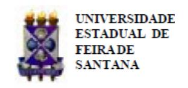

Folhetim Educ. Mat., Feira de Santana, Ano 16/17, Número 155, jul./ago. 2010 ISSN 1415-8779

Este Folhetim é um veículo de divulgação, circulação de ideias e de estímulo ao estudo e à curiosidade intelectual. Dirige-se a todos os interessados pelos aspectos pedagógicos, filosóficos e históricos da Matemática. Pretende construir uma ponte para unir os que estão próximos e os que estão distantes.

Prosseguimos com a transcrição das notas intituladas "A Matemática: suas origens, seu objeto e seus métodos - Parte I", de autoria do professor Carloman, publicada em janeiro de 1983, pelo Departamento de Ciências Exatas da UEFS. Neste número, veremos duas outras correntes filosóficas: o Logicismo e o Realismo.

Aproveitamos a oportunidade para informar que, desde o mês de fevereiro do ano vigente, temos recebido diversas mensagens de consternação e apoio de várias partes do Brasil e do exterior. A todos, registramos nossos sinceros agradecimentos.

Por fim, nosso saudoso Professor Emérito, no ano passado, apontou o seguinte equívoco cometido na segunda coluna da página 04 do Folhetim no 148: onde se lê "... os números reais são divididos em duas classes: os racionais e os transcendentes", leia-se "... os números reais são divididos em duas classes: os algébricos e os transcendentes".

Carloman Carlos Borges (UEFS) - in memoriam Inácio de Sousa Fadigas (UEFS) Marcos Grilo Rosa (UEFS) Trazíbulo Henrique (UEFS)

A Matemática: suas origens, seu objeto e seus métodos (continuação)

Carloman Carlos Borges

# 1.3 Logicismo

Outra interpretação da Matemática, é a chamada interpretação logística. Um de seus principais representantes foi Bertrand Russell. Eis suas ideias principais:

- a) os axiomas matemáticos são princípios a priori da Lógica;
- b) a Matemática pode ser deduzida da Lógica.

E inegável que entre a Lógica e a Matemática há uma ´ relação muito íntima. O objeto da Lógica Formal possui muitas aproximações com o objeto da Matemática: ambas se movem, fundamentalmente, no espaço dos conceitos abstratos, seus métodos são abstratos e teóricos, ambas podem servir de linguagens para outras ciências, dando-lhes mais clareza e solidez. Damos a palavra, agora, ao autor do Principia Mathematica:

Na Matemática Pura partimos de determinadas regras de inferência, que nos permitem inferir que, se um teorema é verdadeiro, então outro teorema também é verdadeiro. Tais regras de inferência representam a maior parte dos princípios da lógica formal. Construimos uma hipótese que parece atraente e derivamos as suas consequências. Se a nossa hipótese se refere a algo bem geral e nada de muito ou pouco específico, as nossas inferências representam a Matemática.

Em contestação a tais assertivas, citemos os matemáticos R. Courant e H. Robbins:

O nervo vital da Matemática está ameaçado pela afirmação de que esta ciência nada mais é que um sistema de conclusões deduzidas de definições e postulados que devem ser isentos de contradição, mas no restante se originam da arbritariedade do matemático. Fosse isso verdade, a Matemática não atrairia pessoas inteligentes; seria uma brincadeira com regras, definições e conclusões, sem meta nem sentido.

Ainda desses mesmos matemáticos:

O elemento da invenção construtiva, da intuição criadora, se subtrai a uma simples formulação filosófica. Não deixa, porém, de ser o cerne de qualquer realização matemática, mesmo nos campos mais abstratos.

Todas as tentativas no sentido de deduzir a Matemática inteiramente da Lógica fracassaram inteiramente. A esperança de que cada setor do pensamento matemático pode ser axiomatizado e, através dessa axiomática, pode ser desenvolvido de uma maneira exaustiva - é uma esperança vã. Para um sistema matemático dedutivo é de fundamental importância o problema da consistência, isto é, o princípio da não contradição.

Um sistema matemático é consistente se e somente se não possui contradições, isto é, se dele não se pode deduzir duas proposições, sendo uma a negação da outra. Como mostrar, por exemplo, a consistência da Geometria de Lobachevsky? Como provar que seus postulados não nos levam a teoremas contraditórios? É bem verdade que todos os teoremas já conhecidos dessa Geometria são consistentes mas, e o próximo ainda a ser deduzido?

Inicialmente, pensava-se que este problema poderia ser facilmente resolvido - de uma maneira geral - com a criação de _modelos_, os quais serviriam para interpretar os axiomas de um determinado sistema matemático. Exemplificando: a demonstração da consistência da Geometria de Lobachevsky há de ser encontrada, se for o caso, fora dela mesma. Pode-se, pois, construir um modelo euclidiano e, então, basta demonstrar que a Geometria de Euclides não é contraditória; porém, para demonstrar a consistência dessa Geometria, é necessário sair de seus limites, recorrer, por exemplo, à Aritmética. Contudo, não é possível demonstrar que a Aritmética é não contraditória sem sair de seus limites. Aqui, torna-se necessário recorrer à experiên-

cia, à atividade prática e verificar se há uma adequação entre seus postulados e a realidade objetiva.

Consequentemente, é impossível reduzir a Matemática à Lógica. Este é o sentido do Teorema de Gödel. Em Aritmética este Teorema estabelece que é impossível examinar todas as relações entre os números inteiros com base em um único sistema de hipóteses. Como consequência, o método axiomático tem certas limitações próprias e são essas limitações que criam a impossibilidade de uma plena axiomatização da Aritmética dos números inteiros.

### 1.4 Realismo

Aparentemente a Matemática parece pairar acima da realidade, tal o grau de abstração atingido por ela. Seus conceitos são todos abstratos, com as características de que eles aparecem depois de uma série de sucessivas abstrações e generalizações, cada uma das quais repousando na combinação de experiências com conceitos abstratos prévios. Seus conceitos sofrem um constante refinamento. Até mesmo o seu extraordinário rigor sofre contínuo desenvolvimento como consequência desse refinamento.

Assim, começa-se por definir logarítmo de um número positivo pela comparação entre duas progressões, uma geométrica e outra aritmética; em seguida este mesmo conceito é generalizado: considera-se a função $f(x) = a^x$ (a positivo e diferente de 1) e x real; esta função tem inversa a qual é o logaritmo de base a: $f^{-1}(x) = log_a x$ . Na definição de $f(x) = a^x$ para todo x real, procura-se uma função de modo que f(x+y) = f(x).f(y) para quaisquer x e y reais . É claro que f é não nula e deve possuir a condição adicional de ser f(1) diferente de zero. Assim de generalização em generalização, chega-se à definição: se x é positivo, $\log x = \int_1^x \frac{1}{t} dt$ .

Consideremos o conceito de _espaço_. Inicialmente, ele traduzia a experiência do ser humano que vive mergulhado no espaço físico que nos cerca, de três dimensões; porém, é da natureza da Matemática, a generalização de seus conceitos; assim, partindo de um

### NEMOC - NÚCLEO DE EDUCAÇÃO MATEMÁTICA OMAR CATUNDA

Folhetim Educ. Mat., Feira de Santana, Ano 16/17, Número 155, jul./ago. 2010 - Editores: Inácio, Grilo e Trazíbulo - Digitação: Josenildes Oliveira Venas Almeida e Manoel Aquino dos Santos - Editoração: Evandro Vaz e Nivaldo Assis - Impressão: Imprensa Gráfica Universitária - Periodicidade: bimestral - Tiragem: 1.500 exemplares - Distribuição gratuita - Endereço: Avenida Transnordestina s/n, Módulo Prof. Carloman Carlos Borges, bairro Novo Horizonte, Feira de Santana, BA, Brasil. CEP 44.036-900. - Telefone: (75)3224-8115 - Fax: (75)3224-8086 - E-mail: nemoc@uefs.br - Home-Page: www2.uefs.br/nemoc

conceito simples proveniente de uma realidade que faz parte de um contorno bem próprio a nós e apoiado sobre ele, a Matemática vai ampliando-o, quer por motivos de compatibilidade lógica, quer por exigência da atividade prática do homem. O espaço n-dimensional parece um ente inteiramente estranho a nossa intuição, mas, os progressos das ciências experimentais não só exigem como confirma-o em diversas situações.

Embora o espaço real só tenha três dimensões, o conhecimento de determinadas situações pode exigir que n seja diferente de três. Para caracterizar a posição de cada uma das moléculas de gás ideal, em coordenadas cartesianas, necessitamos de três valores das coordenadas e dos três componentes da velocidade para cada instante t. Este espaço de fases de seis dimensões, (x, y, z) definindo o chamado espaço de configurações e (u, v, w) definindo o espaço de velocidades retrata uma realidade objetiva.

Não podemos ter uma boa ideia da Matemática se nos fixarmos em seus conceitos mais elaborados, pois já vimos, através de exemplos, que ela progride por meio de sucessivas generalizações dos mesmos. Grande parte da Matemática contemporânea é baseada nos números; isto sugere procurarmos no completo entendimento desse conceito alguma luz sobre seus fundamentos.

A noção de número está inicialmente, ligada ao problema da contagem e este surge como consequência da atividade humana em sua luta para sobreviver. A parte da Matemática que estuda a regra dos números, suas relações recíprocas - já que não tem sentido estudar um número isoladamente - chama-se Aritmética. Subjacente à ideia de número existe outra, bem mais simples, chamada de correspondência; suponhamos duas coleções não vazias de objetos, A e B; se a cada elemento de A corresponder um só elemento de B e a cada elemento de B corresponder um só elemento de A, diremos que foi estabelecida uma correspondência entre os elementos das duas coleções; aqui, na realidade, temos duas correspondências, uma de A para B e outra de B para A mas, por simplicidade, vamos chamá-las de correspondência biunívoca.

Neste caso, diremos, que a quantidade de objetos existentes em A é a mesma quantidade de objetos existentes em B; diremos, ainda, que as duas coleções são equivalentes. A ideia de correspondência está, pois, ligada à ideia de associação mental entre dois entes; esta associação mental para os antigos tinha uma materialização bem concreta: quando um pastor queria " contar"suas ovelhas simplesmente estabelecia uma correspondência entre sua coleção de ovelhas e uma coleção de pedrinhas. Neste procedimento o número não é usado para nada. Vemos, assim, um aspecto do processo de contagem ser realizado sem o emprego de qualquer número.

O procedimento acima não é muito cômodo e pode mesmo ser impraticável em diversas situações; o homem primitivo deve ter notado que, ele mesmo, possui uma coleção capaz de substituir as pedrinhas: seus próprios dedos, tanto os das mãos como os dos pés. Até agora vimos coisas interessantes ligadas ao processo de contar: pode ser realizado sem o número e para ser realizado é preciso existir algo de concreto: tanto as ovelhas como as pedrinhas ou os dedos e estas coleções podem ser tudo menos produto da razão humana.

O homem primitivo percebia a totalidade de uma determinada coleção e, ao compará-la em outra diferente, percebia também a diferença. Claramente, era incapaz, ainda, de distinguir propriedades e relações entre elas. A sua visão, era uma visão do todo. O número ao qual correspondia a totalidade dos objetos não era percebido distintamente por ele, era inseparável, intrínseco em relação a essa coleção. Imaginemos, agora, esta operação sendo repetida milhões de vezes através de gerações e gerações. Esta quantidade enorme de repetições teria de provocar uma mudança qualitativa no procedimento do homem; nesta etapa, ele já emprega frases tais como: " tantos como uma mão", " tantas como um homem completo", etc., a primeira significando cinco objetos e a segunda vinte objetos. Ainda hoje vemos resquícios dessa etapa em nós mesmos quando dizemos: " duro como uma pedra", " negro como breu".

Novamente a repetição milenar desse procedimento através de gerações e gerações provocou no percebimento do homem um novo salto qualitativo. A repetição durante milhares de anos de " tantos como a mão", o levou a falar " cinco objetos"; a repetição de " tantos como um homem completo"o levou a falar " vinte objetos", etc. Isto foi, mais uma vez, repetido de gerações para gerações. Tomando contato com milhares de coleções tendo " vinte objetos", por exemplo e notando que ditas coleções possuiam algo de comum, uma propriedade que se repetia sempre da diferença de seus objetos, o homem criou o número vinte e assim o fez para com as demais coleções. Estava, pois, criado, o primeiro modelo do processo de contagem.

Foram precisos milhares de anos para o homem perceber que o número de objetos de uma coleção determinada é uma propriedade dela, porém, que este mesmo número pode ser empregado para contar todos os objetos de outra coleção contendo a mesma quantidade de objetos; que o número cinco, exemplificando, é uma propriedade comum a todas as coleções de cinco objetos. Eis, pois, o primeiro modelo criado pelo homem para dominar o processo de contagem:

1, 2, 3, 4, 5, ..., n, ...

A estes números damos o nome de números naturais. Observemos a inexistência do número zero, cuja justificativa é simples: ninguém começaria a contar partindo do zero. Não é dificil, nesta altura, definir um número como " cinco", " nove", etc. Em primeiro lugar, um número é uma propriedade ligada à coleções de objetos; em segundo lugar, esta propriedade é comum a todas as coleções cujos objetos podem ser postos em correspondência biunívoca uns com os outros. E conveniente observarmos o suporte material, con- ´ creto, objetivo, de um conceito tão abstrato como o de número: uma coleção de objetos. Observemos como foi preciso - para a criação do conceito de número - de o homem estabelecer relações entre coleções de objetos de natureza diferente e, da análise dessas relações desprezar tudo mais, menos o aspecto quantitativo; para a criação dessa capacidade de abstração o homem partiu de sua atividade diária, de sua vida social e, econômica, sem o que não seria possível a elaboração daquele conceito.

A formulação desse conceito mostra a participação efetiva da experiência e do poder criador da razão humana na elaboração do conhecimento; mostra a inseparabilidade entre aquela e esta; mesmo nas abstrações mais avançadas, a mente humana necessita embora de forma indireta - de um conteúdo concreto e objetivo. O emprego repetido de um determinado conceito pela mente humana estabelece entre esta e aquele certa experiência, a qual, depois de uma quantidade suficiente de repetições pode levar a uma nova ampliação do primitivo conceito; forma-se, assim, uma cadeia de generalizações sucessivas com o seu primeiro elo bem firmado na realidade fora de nós. Parece-nos ser, esta inseparabilidade, a principal responsável pela vitalidade de qualquer ciência.

A Matemática: suas origens, seu objeto e seus métodos. (Continuação)

### Sala Carloman Carlos Borges

A Sala Carloman Carlos Borges foi inaugurada no dia 25 de maio de 2010. Neste ambiente encontra-se vasto material sobre a vida do Professor Carloman, desde

objetos pessoais, diplomas, prêmios, a sua tese de doutorado além de um rico acervo bibliográfico. A Sala Carloman Carlos Borges localiza-se no NEMOC, Módulo Professor Carloman Carlos Borges - UEFS e está aberta para a visitação de segunda a sexta, das 09:00 às 10:00 e das 15:00 às 16:00.

## Mini-Curso

O NEMOC realizou nos dias 05, 06 e 12 de julho de 2010, no LABMAT, o mini-curso " O Ensino de Geometria Usando o Cabri-Géom`etre II". O mini-curso foi ministrado por alunos do Curso de Especialização em Educação Matemática e contou com a participação de estudantes do Curso de Licenciatura em Matemática da UEFS.

# Folhetins Digitalizados

Desde o número especial " Nosso Professor Emérito, Professor Carloman", estamos disponibilizando a versão digital deste folhetim, que pode ser acessada gratuitamente no site do NEMOC (www2.uefs.br/nemoc). Também pretendemos digitalizar todos os números publicados anteriormente, sendo que alguns já podem ser obtidos no endereço citado acima.

### I Olimpíada de Matemática da UEFS

O NEMOC realizou no dia 28 de agosto de 2010 a I Olimpíada de Matemática da UEFS. Aplicaremos também as provas da 32a Olimpíada Brasileira de Matemática, Nível Universitário. A primeira fase acontecerá no dia 18 de setembro e a segunda fase nos dias 16 e 17 de outubro de 2010.

### Lançamento

A Sociedade Brasileira de Matemática anunciou recentemente o lançamento do livro " A Construção dos Números", de autoria do professor Jamil Ferreira. A obra faz parte da coleção Textos Universitários e aborda a construção dos números naturais, inteiros, racionais, reais e complexos.

Envie para cada folhetim um selo de postagem nacional de 1o porte. Dentro de no máximo quatro semanas, contadas a partir da data de recebimento do seu pedido, você receberá os folhetins solicitados. OBS.: E permitida a reprodução total ou parcial deste folhe- ´ tim, desde que citada a fonte.
