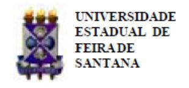
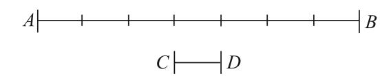
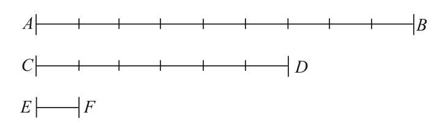
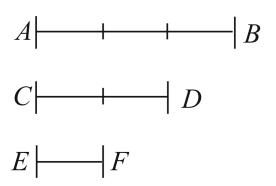
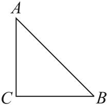

Folhetim Educ. Mat., Feira de Santana, Ano 17, Número 156, set./out. 2010 ISSN 1415-8779

Este Folhetim é um veículo de divulgação, circulação de ideias e de estímulo ao estudo e à curiosidade intelectual. Dirige-se a todos os interessados pelos aspectos pedagógicos, filosóficos e históricos da Matemática. Pretende construir uma ponte para unir os que estão próximos e os que estão distantes.

Prosseguimos com as notas intituladas "A Matemática: suas origens, seu objeto e seus métodos - Parte I", de autoria do professor Carloman, publicada em janeiro de 1983, pelo Departamento de Ciências Exatas da UEFS. Neste número, veremos um pouco mais sobre o Realismo.

Nesta edição, prestamos também uma singela homenagem ao professor Geraldo Avila. ´ Transcrevemos um texto elaborado por seus filhos e que foi publicado no site da Revista do Professor de Matemática - RPM.

Este ilustre matemático já nos brindou com a publicação do artigo " A Eficácia da Matemática", cuja versão digital já está disponível no site do NEMOC. Em 2005, ele ministrou, aqui na UEFS, uma palestra sobre " O Ensino da Análise Matemática na Licenciatura". Por fim, nunca é demais registrar que o professor Geraldo Avila ´ deixou um legado inestimável para todos aqueles envolvidos com a Matemática e com o ensino desta ciência.

Carloman Carlos Borges (UEFS) - in memoriam Inácio de Sousa Fadigas (UEFS) Marcos Grilo Rosa (UEFS) Trazíbulo Henrique (UEFS)

A Matemática: suas origens, seu objeto e seus métodos (continuação)

Carloman Carlos Borges

## 1.4 O Realismo (continuação)

Com a construção intelectual da série dos números naturais, o homem passou a empregá-la diariamente estabelecendo relações entre eles; da análise dessas relações deve ter surgido as primeiras operações aritméticas: a adição e a multiplicação; aquela, do hábito com diversas coleções e esta, da experiência de lidar com várias coleções iguais. Diante, por exemplo, de duas coleções de ovelhas, a coleção A com cinco ovelhas e a coleção B com dez ovelhas, ele deve ter percebido que A poderia ser " misturada" com B, resultando outra coleção C com quinze ovelhas da mesma forma que B poderia ser " misturada" com A, originando a mesma coleção C. Da abstração da natureza concreta dos elementos das coleções A, B e C, deve ter surgido a primeira lei da adição, a comutativa; sendo a, b e c, respectivamente, as quantidades de elementos das coleções A, B e C, então: a + b = b + a = c. Ainda no processo de adicionar coleções iguais, isto é, quando a = b, surgiu o percebimento de que a + b = a + a = 2a. Para adicionar doze coleções, cada uma com doze objetos, basta " multiplicar" doze por doze e, desta operação, resulta uma " grosa". Firmadas as duas operações aritméticas e com o seu desenvolvimento material, social e, consequentemente, mental, o homem teve de enfrentar outros problemas práticos, sem solução no quadro dessas duas operações.

Surgiu, então, a necessidade de novos números, os números racionais, como consequência de outro problema prático: o problema da medida. Assim, os números racionais surgiram como abstração do processo de medir. A medição de terras se impôs para os antigos como um problema vivo, concreto: " Sesórtis... repartiu o solo do Egito entre seus habitantes... Se o rio levava qualquer parte do lote de um homem... o rei mandava pessoas para examinar, e determinar por medida a extensão exata da perda... Por esse costume, eu creio, que a Geometria veio a ser conhecida no Egito, de onde passou para a Grécia". Estas palavras são do historiador grego Heródoto e esclarece muito bem o que queremos dizer com problema vivo e concreto.

Para simplificar a apresentação dessa questão, consideremos o problema da medida de segmentos. Seja o segmento AB; medi-lo, significa compará-lo com outro segmento CD, chamado de unitário; o resultado dessa comparação é um número que é a medida do segmento AB e será indicado por m(AB). Estes conceitos retratam o primeiro conhecimento, talvez, que o homem teve do problema da medida. Como fazer a comparação dos segmentos AB e CD? Basta sobrepor este último sobre aquele; desta sobreposição pode resultar:

- (a) o segmento CD cabe um número exato de vezes no segmento AB;
- (b) o segmento CD $n\tilde{a}o$ cabe um número exato de vezes no segmento AB, $por\acute{e}m$ , um pedaço de CD, cabe exatamente um número de vezes em AB:
- (c) não acontece nem a alternativa (a), nem a alternativa (b).

Quando se verifica (a), diremos que a medida do segmento AB é um n'umero inteiro; a medida de AB é um n'umero irracional quando se verifica (c). Na hipótese (a) temos, graficamente:

Note que, $m(AB) = 7 × m(CD)$ ; como CD é unitário, isto é, de comprimento igual a 1, temos, simplesmente: m(AB) = 7.

Na hipótese (b) vem, graficamente:

Temos
$$m(AB) = 9 × m(EF)$$
e $m(CD) = 6 × m(EF)$ , donde
$$m(AB) = \frac{9}{6}$$

Uma simples inspeção visual na figura anterior, sugere que a comparação AB com CD poderia ser mais simples:

Temos $m(AB) = 3 × m(EF)$ e $m(CD) = 2 × m(EF)$ , donde:

$$m(AB) = \frac{3}{2}$$

Consideremos mais atentamente a hipótese (b). Notemos que a ideia básica, neste caso, foi a mesma empregada em (a) ou melhor, conhecendo-se o procedimento (a) e perante uma situação desconhecida (b), nós reduzimos esta àquela. Este princípio é o Princípio de Redução do Desconhecido ao Conhecido, amplamente empregado nas ciências e, particularmente, em Matemática. Vamos, agora, introduzir mais alguns novos conceitos: ao segmento EF damos o nome de $submúltiplo\ comum\ de\ AB\ e\ de\ CD$ . Como os segmentos $AB \in CD$ possuem uma medida comum que $\acute{e}$ o segmento EF, diremos que estes dois segmentos são comensuráveis. Considerando no caso (a) o segmento CD como sua própria medida, podemos estender o conceito de comensurabilidade também para eles, dizendo que os segmentos $AB \in CD$ , tanto em (a)como em (b) são comensuráveis, isto é, admitem uma medida comum.

Ainda, generalizando tais situações: consideremos que CD contém EF n vezes, logo, a medida EF é $\frac{1}{n}$ e, consequentemente, a medida AB é $m × \frac{1}{n}$ , isto é, $m(AB) = \frac{m}{n}$ , pois, AB contém exatamente m segmentos iguais a EF. E a hipótese (c)? Quando a comparação entre dois segmentos não se enquadra em nenhum dos casos (a) ou (b)? Dois segmentos que não possuem medida comum são ditos incomensuráveis. Até aqui temos considerado a prática como a força predominante na aquisição dos primeiros conhecimentos matemáticos mas, para todas as atividades práticas, os casos (a) ou (b) são suficientes. Praticamente, as

## NEMOC - NÚCLEO DE EDUCAÇÃO MATEMÁTICA OMAR CATUNDA

Folhetim Educ. Mat., Feira de Santana, Ano 17, Número 156, set./out. 2010 - Editores: Inácio, Grilo e Trazíbulo - Digitação: Josenildes Oliveira Venas Almeida e Manoel Aquino dos Santos - Editoração: Evandro Vaz e Nivaldo Assis - Impressão: Imprensa Gráfica Universitária - Periodicidade: bimestral - Tiragem: 1.500 exemplares - Distribuição gratuita - Endereço: Avenida Transnordestina s/n, Módulo Prof. Carloman Carlos Borges, bairro Novo Horizonte, Feira de Santana, BA, Brasil. CEP 44.036-900. - Telefone: (75)3224-8115 - Fax: (75)3224-8086 - E-mail: nemoc@uefs.br - Home-Page: www.uefs.br/nemoc

coisas acontecem assim: dado um segmento AB, se a sua medida não for um número inteiro, é sempre possível encontrar uma parte da unidade que caiba um número exato de vezes em AB.

No Folhetim anterior, falamos do papel importante da compatibilidade lógica quando se trata de ampliação de conceitos. O poder criador da razão humana está implícito em qualquer conceito, mesmo concreto, o qual nunca se confunde com as representações sensíveis que o compõe; podemos dizer que o conceito é sempre mais amplo do que aquela parte da realidade que serviu de inspiração e cobre um aspecto do qual as representações sensíveis correspondentes constituem um subconjunto próprio. A realidade não se reflete em nossas mentes tal qual um objeto material na face de um espelho, pois, claramente, o nosso cérebro é muito mais rico, infinitamente mais complexo estruturalmente do que um simples espelho...

Quando desejamos pensar sobre algo, o primeiro esforço de nossa vontade parece dirigir-se à nossa memória, a qual libera ao nosso consciente uma sequência de informações afins com o objeto sobre o qual queremos pensar. Graças à associação de ideias, estas brotam da memória de uma maneira continuada, surgindo, assim, diversas bifurcações, variadas séries de ideias - todas elas, porém, tendo um elemento comum: " aquilo" sobre o qual queremos pensar; é justamente este " aquilo" que constitui o conceito fundamental de todas essas séries de ideias, no sentido de que serve para organizar as ideias em um mosaico lógico e compreensível. A organização desse mosaico é obra do pensamento, donde se conclui que este é, por definição, uma força criadora que se manifesta toda vez quando existe uma composição lógica de ideias dentro de nossa mente.

A criação dos números irracionais é um bom exemplo desse poder criador, guiado sempre, em cada dedução, pelo princípio da não contradição ou da compatibilidade lógica, o qual consiste em não admitir, numa mesma dedução, como verdadeiras, duas proposições logicamente contraditórias. É impossível, logicamente, negarmos a existência de números irracionais, apesar da " evidência" de que, dados dois segmentos, sempre podemos compará-los de acordo com a hipótese (a) ou a hipótese (b).

Vejamos como as coisas se passam: primeiro, confiados naquela " evidência", negamos a existência dos números irracionais; isto implica que, dado qualquer segmento AB, podemos sempre escrever: $m(AB) = \frac{m}{n}$ (1); segundo, imaginemos um triângulo retângulo com os dois catetos com medidas iguais a 1 (ver figura a seguir); terceiro: $m(AB) = \frac{m}{n}$ - conforme (1); porém, conforme o Teorema de Pitágoras, podemos escrever, também: $m(AB) = \sqrt{2}$ (2), comparando (1) com (2),

Triângulo retângulo com dois lados iguais: m(AC) = m(CB) = 1

temos $\sqrt{2} = \frac{m}{n}$ (3), e esta igualdade nos diz ser o número $\sqrt{2}$ um número racional.

Ora, é muito fácil mostrar que $\sqrt{2}$ não é um número racional pois, se o fosse, teríamos, elevando ao quadrado ambos os membros de (3): $2n^2 = m^2$ igualdade falsa, pois os números $m^2$ e $n^2$ , decompostos em fatores primos, contêm cada um dos seus fatores primos um número par de vezes; assim, $2n^2$ contêm um número ímpar de fatores primos e, consequentemente, a igualdade $2n^2 = m^2$ é falsa e, com ela, a suposição inicial de que $\sqrt{2}$ é um número racional.

A descoberta da irracionalidade do número $\sqrt{2}$ foi obra dos gregos e causou grande impacto entre os matemáticos da época e, até mesmo, entre os filósofos. Para aclarar melhor esta descoberta, consideremos o conjunto dos números racionais.

O conjunto dos números racionais possui uma propriedade notável: dados dois números racionais quaisquer, m e n, entre eles sempre podemos colocar outro número racional. Realmente, se os números são, por exemplo, 3 e 7, entre eles podemos colocar, sua soma dividida por dois, 5; entre m e n, podemos colocar o número $\frac{m+n}{2}$ que é um número racional. Dizer que entre dois números racionais quaisquer é sempre possível colocar um número racional é equivalente afirmar que entre dois números racionais quaisquer é possível colocar infinitos números racionais. Esta propriedade chama-se densidade. Dizemos que o conjunto dos números racionais é denso. Pois bem, apesar da densidade, os números racionais não " enchem" inteiramente a reta e isto parece estranho à nossa intuição comum.

Vimos assim que, enquanto os números racionais são uma abstração do problema da medida, os números irracionais são uma exigência da compatibilidade lógica. Embora criação da mente, os números irracionais não poderiam ser criados antes dos números racionais pois, como acabamos de verificar, todo o nosso raciocínio lógico nesta construção foi baseada, inicialmente, nos números racionais e este processo não poderia ser invertido pelo simples fato da realidade circundante ao homem primitivo, devido à sua simplicidade, não apresentar problemas práticos para servirem de inspiração a tal criação.

# Geraldo Severo de Souza Avila ´

Geraldo nasceu em Alfenas, Minas Gerais, em 17 de abril de 1933.

Nasceu na roça e atingiu os mais altos escalões da carreira acadêmica. Porém, seu sucesso não foi fruto de ambição carreirista, mas o resultado natural de uma aderência a princípios éticos e de muito trabalho. Ele nunca definiu o sucesso pelos títulos conquistados e nunca deixou de se identificar com as pessoas que não tiveram as oportunidades que ele teve. Nos momentos mais altos de sua carreira, nunca deixou de se dedicar também ao aprimoramento de material didático para o ensino fundamental e médio. Nesse espírito, era profundo admirador de Anísio Teixeira.

Destacou-se numa ilustre e riquíssima carreira acadêmica, mas acima de tudo foi um esposo, pai e avô que deixa um legado fortíssimo de lições de vida, caráter, integridade e dignidade. Admirava e se intrigava profundamente com a natureza e o conhecimento humano, os pequenos e grandes mistérios, o encontro da complexidade com a simplicidade. Seu entusiasmo era contagiante. Passou aos filhos e netos o profundo respeito por todas as pessoas, árvores, pedras, cachoeiras, montanhas e animais. Na natureza, ele via a presença de Deus. Era apaixonado por astronomia.

O interesse pelo conhecimento o acompanhou por toda a vida. Na UTI, pediu que a filha lhe trouxesse um livro.

Seu interesse pelo conhecimento desde jovem o levou a dar valor ao estudo. Seu primeiro trabalho foi como estagiário em curso de contabilidade, o que permitiu que se tornasse professor aos 18 anos. Após sua formatura pela USP e início de carreira no ITA, em São José dos Campos, foi um dos primeiros bolsistas do CNPq no exterior, onde fez mestrado e doutorado em Matemática na Universidade de Nova York. Lecionou e chefiou departamentos em universidades nos Estados Unidos e no Brasil. Foi um dos professores fundadores da Universidade de Brasília. Lá, anos depois, foi professor titular, Diretor do Instituto de Ciências Exatas e Decano de Pesquisa e Pós-Graduação. Foi também Professor Doutor da Unicamp e Professor Titular da UFG. Atuou como editor dos periódicos Revista do Professor de Matemática e Matemática Universitária, presidente da Sociedade Brasileira de Matemática e Membro Titular da Academia de Ciências do Estado de São Paulo e da Academia Brasileira de Ciências. Foi autor de vários artigos acadêmicos e livros didáticos de nível universitário, dos quais dois foram indicados para o Prêmio Jabuti da Câmara Brasileira do Livro e um deles foi agraciado com o Prêmio. Em 1985, foi eleito reitor pelo Colegiado da Universidade através de lista sêxtupla, de acordo com o estatuto da UnB na época, e empossado pela Ministra da Educação. Porém, no contexto político do momento de transição, conturbado pela doença de Tancredo Neves, colocou o cargo à disposição, à espera do posicionamento do novo governo porque sua imagem estava sendo associada pela mídia ao governo anterior. Com a morte de Tancredo Neves, e decidido a não permanecer no cargo sem o apoio da comunidade universitária, renunciou ao cargo alguns dias depois.

Era sua convicção que o trabalho de um reitor não poderia sujeitar-se a interesses partidários imediatistas. A Fundação da UnB tinha como meta a autonomia universitária para poder desenvolver projetos educacionais consistentes e de longo alcance.

De volta às suas funções de pesquisa e docência, prestou concurso na Unicamp em 1987, assumindo o cargo de Professor Doutor. Participou de grupos de pesquisa em Análise Matemática na Universidade de Oxford, Universidade da Califórnia - Berkeley, Universidade de Utah e Universidade de Bordeaux. Permaneceu na Unicamp até novembro de 1994, quando foi diagnosticado como portador de câncer do pulmão. Mudou-se para Brasília para ficar perto da filha e netos. Foi operado, para retirar parte do pulmão. No ano seguinte, considerado curado, prestou concurso em Goiânia (Universidade Federal de Goiás), onde assumiu o cargo de professor titular efetivo.

Sua esposa, filhas e filhos, noras e genro, neta e netos, irmãs e irmão agradecem a Deus pelo esposo, pai, avô e irmão que guardam com amor indizível no coração. As palavras de condolências recebidas pela família revelam que não foram poucos os testemunhos de que era impossível conhecê-lo sem admirá-lo.

Ele não será esquecido por todos nós que com ele partilhamos momentos da Vida.

Fonte: Site da Revista do Professor de Matemática. http://www.rpm.org.br/cms/index.php?option=com content&vi ew=article&id=70. Acesso em 20/09/2010.

A Matemática: suas origens, seu objeto e seus métodos. (Continuação)

Envie para cada folhetim um selo de postagem nacional de 1 o porte. Dentro de no máximo quatro semanas, contadas a partir da data de recebimento do seu pedido, você receberá os folhetins solicitados. OBS.: E permitida a reprodução ´ total ou parcial deste folhetim, desde que citada a fonte.
