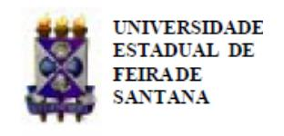

Folhetim Educ. Mat., Feira de Santana, Ano 17, N´umero 158, jan./fev., 2011 ISSN 1415-8779

Este Folhetim ´e um ve´ıculo de divulga¸c˜ao, circula¸c˜ao de ideias e de est´ımulo ao estudo e `a curiosidade intelectual. Dirige-se a todos os interessados pelos aspectos pedag´ogicos, filos´oficos e hist´oricos da Matem´atica. Pretende construir uma ponte para unir os que est˜ao pr´oximos e os que est˜ao distantes.

Prosseguimos com a transcri¸c˜ao das notas intituladas "A Matem´atica: suas origens, seu objeto e seus m´etodos - Parte I", de autoria do professor Carloman. Neste n´umero, encerramos o cap´ıtulo 1 e adentramos o cap´ıtulo 2, onde nosso professor em´erito trata com muita clareza da l´ogica cl´assica.

De forma precisa, o professor Carloman disserta sobre pontos que, tradicionalmente, causam certo pavor no nosso alunado, como por exemplo, teoremas e demonstra¸c˜oes. Que ´e um argumento? Que ´e uma demonstra¸c˜ao? Que ´e uma argumenta¸c˜ao? Como reconhecer que um determinado argumento ´e v´alido? A leitura desta edi¸c˜ao do Folhetim certamente provocar´a muitas reflex˜oes sobre as indaga¸c˜oes acima.

Para encerrar, destacamos a seguinte frase, dita repetidas vezes por nosso mestre: "qualquer ciˆencia ´e menos ac´umulo de conhecimento e mais uma maneira de pensar".

Carloman Carlos Borges (UEFS) - in memoriam In´acio de Sousa Fadigas (UEFS) Marcos Grilo Rosa (UEFS) Traz´ıbulo Henrique (UEFS)

A Matem´atica: suas origens, seu objeto e seus m´etodos (continua¸c˜ao)

Carloman Carlos Borges

# 1.7 Origem da Geometria (continua¸c˜ao)

O tra¸co marcante da Matem´atica Pura ´e o emprego do infinito. Com o infinito potencial impl´ıcito na s´erie dos n´umeros naturais, nasce a Teoria dos N´umeros: seus teoremas dizem respeito `as propriedades dos n´umeros, em geral. S˜ao propriedades v´alidas para determinadas classes de n´umeros, sendo estas classes infinitas. As defini¸c˜oes matem´aticas, por mais simples que sejam, dizem respeito a conjuntos infinitos. Exemplificando: Quaisquer que sejam dois pontos distintos, existe uma, e somente uma, reta que passa por eles. "De que valeria a regra da comutativa dos n´umeros reais se a mesma correspondesse apenas a alguns n´umeros reais e n˜ao a todos os n´umeros reais?" Citamos novamente A. D. Aleksandrov: "Aqui percebemos uma profunda particularidade da Matem´atica: a Matem´atica tem como objeto n˜ao s´o as rela¸c˜oes quantitativas dadas, por´em todas as poss´ıveis rela¸c˜oes quantitativas e, entre elas, o infinito". Nesse mesmo sentido o matem´atico Hermann Weyl escrevia: "A Matem´atica ´e ciˆencia do infinito".

Os primeiros ramos da Matem´atica foram a Aritm´etica e a Geometria e as suas caracter´ısticas principais tentamos expor com alguns detalhes, em virtude da sua grande importˆancia para o conhecimento das origens remotas da Matem´atica. Esta exposi¸c˜ao salta imediatamente `a vista que o conhecimento matem´atico se forma e se desenvolve da mesma maneira como se forma e se desenvolve o conhecimento nas demais ciˆencias. Somente em etapas superiores ´e que tais conhecimentos come¸cam a se diferenciar em virtude das diversas metodologias empregadas por essas ciˆencias.

### 2. A Matem´atica continua progredindo

Nenhum outro problema impregnou t˜ao profundamente a alma do homem como o infinito. Nenhuma outra ideia atuou com tanto est´ımulo e fertilidade sobre a mente como o infinito. Nenhum outro conceito necessita de esclarecimento como o infinito.

David Hilbert

A partir dos gregos a Matem´atica assumiu outra fei¸c˜ao. Qual a maior contribui¸c˜ao dos gregos `a Matem´atica? Sem d´uvida alguma a cria¸c˜ao de um sistema l´ogico, o qual veremos a seguir com algumas modifica¸c˜oes modernas.

### 2.1 L´ogica

Da totalidade de todas as coisas conhecidas do Universo, existe uma que de todas as demais se destaca: o homem, o qual possui alguma "coisa" que nenhuma outra coisa possui: o pensamento. Produto da Natureza, a grande luta do homem ´e a luta pela sobrevivˆencia; esta abrange o presente e o futuro e, por isso, ele precisa prever. Para prever ´e necess´ario conhecer, organizar o conhecimento em suas diversas sistematiza¸c˜oes. Criando a Ciˆencia, ampliando-a cada vez mais atrav´es de continuadas aproxima¸c˜oes com a realidade, o homem aumenta a sua liberdade e o seu poder sobre a Natureza. A ciˆencia ´e menos ac´umulo de conhecimentos do que maneira de pensar. H´a um modo cient´ıfico de pensar. Em que consiste o modo cient´ıfico de pensar? Parece-nos que, para pensar cientificamente, desejamos possuir as seguintes qualidades: coragem, curiosidade por tudo que nos cerca, imagina¸c˜ao e ceticismo.

A ciˆencia ao descobrir novos fatos, produz novas ideias, as quais, comumente, s˜ao opostas `aquelas que formam boa parte de nossa estrutura racional. O conflito, portanto, est´a criado. Sair dele requer coragem a fim de vencer os preconceitos e, enfrentar estes, significa abrir uma luta dura e penosa contra uma multid˜ao de rea¸c˜oes psicol´ogicas. O desejo de descobrir tem seu maior alimento na curiosidade e inegavelmente, cada nova descoberta feita por n´os, al´em de vir acompanhada de um indescrit´ıvel prazer intelectual, aumenta a nossa liberdade porque nos d´a maior poder sobre a Natureza.

A cria¸c˜ao das geometrias n˜ao euclidianas ´e um bom exemplo de grande imagina¸c˜ao criadora a servi¸co da ciˆencia. Sobre o ceticismo, gostar´ıamos de lembrar a frase do fil´osofo Bertrand Russel (Sceptical Essays - 1928): William James tinha o h´abito de pregar a vontade de acreditar. De minha parte, preferiria pregar a vontade de duvidar. (...) O que ´e necess´ario n˜ao ´e a vontade de acreditar, mas o desejo de descobrir, que ´e justamente o oposto. Para o nosso ponto de vista, consideramos, a tal respeito, inteiramente v´alido o m´etodo cartesiano.

Os gregos n˜ao foram somente os maiores mentirosos da antiguidade; deve-se a eles as primeiras sistematiza¸c˜oes dessa admir´avel disciplina mental chamada de L´ogica, a qual sofreu profundas modifica¸c˜oes com os trabalhos de Peirce (1839-1914), de G. Boole (1815- 1864), Frege (1848-1925) - aperfei¸coou alguns sistemas l´ogicos, como, exemplificando, o c´alculo sentencial - Peano (1858 - 1932) e Russel (1872 - 1970). Mais recentemente, podemos mencionar Kurt G¨odel (1906- 1978), David Hilbert (1862-1943) e Alfredo Tarski. Em sua obra de maior importˆancia, Investigations of the laws of thought, Boole estabelece analogia entre as leis do pensamento e as leis da Algebra. ´

Segundo Patrick Suppes, Introduccion a la logica simbolica - CECSA: No largo per´ıodo que se estende desde Arist´oteles, no s´eculo IV a.C. at´e Leibniz no s´eculo XVII, grande parte da importˆancia e significado da l´ogica foi descoberto por l´ogicos antigos, medievais e p´os-medievais, por´em o mais importante defeito desta tradi¸c˜ao cl´assica foi o seu fracasso em relacionar a l´ogica como teoria de inferˆencia `a classe de racioc´ınios dedutivos que se empregam constantemente na Matem´atica.

O uso de qualquer instrumento de trabalho para ser devidamente correto necessita da obediˆencia `a certas regras; igualmente, o uso desse admir´avel instrumento que ´e o pensamento humano h´a de ser guiado por regras que o tornem eficaz e cabe precisamente `a l´ogica a tarefa de fornecer tais subs´ıdios.

Que ´e um argumento? Que ´e uma demonstra¸c˜ao? Que ´e uma argumenta¸c˜ao? Como reconhecer que um determinado argumento ´e v´alido?

Por argumento entendemos um conjunto de enunciados, dos quais um ´e chamado de conclus˜ao ou tese

## NEMOC - NUCLEO DE EDUCAC¸ ´ AO MATEM ˜ ATICA OMAR CATUNDA ´

Folhetim Educ. Mat., Feira de Santana, Ano 17, N´umero 158, jan./fev. 2011 - Editores: In´acio, Grilo e Traz´ıbulo - Digita¸c˜ao: Josenildes Oliveira Venas Almeida e Manoel Aquino dos Santos - Editora¸c˜ao: Evandro Vaz e Nivaldo Assis - Impress˜ao: Imprensa Gr´afica Universit´aria - Periodicidade: bimestral - Tiragem: 1.500 exemplares - Distribui¸c˜ao gratuita - Endere¸co: Avenida Transnordestina s/n, M´odulo Prof. Carloman Carlos Borges, bairro Novo Horizonte, Feira de Santana, BA, Brasil. CEP 44.036-900. - Telefone: (75)3224-8115 - Fax: (75)3224-8086 - E-mail: nemoc@uefs.br - Home-Page: www.uefs.br/nemoc

e o(s) outro(s) de premissa(s). Claramente, o enunciado tem de ser de tal maneira que tenha sentido saber se ele ´e verdadeiro ou falso; - por isso, cada enunciado ´e expresso atrav´es de uma senten¸ca declarativa. Exemplos de argumentos:

- a) Todos os homens s˜ao mortais; Todos os gregos s˜ao homens; Logo, todos os gregos s˜ao mortais.
- b) Todos os homens s˜ao inteligentes; Todos os primatas s˜ao homens; Logo, todos os primatas s˜ao inteligentes.
- c) Todos os motoristas s˜ao velhos; Todos os octogen´arios s˜ao motoristas; Logo, todos os octogen´arios s˜ao velhos.

Analisemos os trˆes argumentos acima. No argumento (a) tanto as premissas como a conclus˜ao s˜ao verdadeiras; no (b) as premissas e a conclus˜ao s˜ao falsas e em (c) as premissas s˜ao falsas e a conclus˜ao verdadeira. Apesar disso, todos os trˆes argumentos s˜ao v´alidos, leg´ıtimos, pois, conforme Benson Mates, L´ogica Elementar, Cia Editora Nacional - Editora da Univerisade de S˜ao Paulo,"um argumento ´e leg´ıtimo se e somente se n˜ao ´e poss´ıvel que suas premissas sejam verdadeiras e a conclus˜ao, falsa". Ainda Benson: "N˜ao importa saber se a conclus˜ao ou as premissas s˜ao, de fato, verdadeiras; se as premissas fossem verdadeiras, a conclus˜ao teria de ser verdadeira - isso ´e tudo que se requer para assegurar a legitimidade. Outro modo de enunciar o mesmo crit´erio ´e este: um argumento ´e leg´ıtimo se e somente se qualquer circunstˆancia conceb´ıvel, que tornasse verdadeiras as premissas, tornaria tamb´em verdadeira a conclus˜ao". Em todo argumento leg´ıtimo a conclus˜ao ´e uma consequˆencia l´ogica, necess´aria, das premissas.

Argumenta¸c˜ao ´e o conjunto de todos os argumentos empregados em um determinado contexto e a sua legitimidade decorre da legitimidade de todos os seus argumentos.

Raciocinar ´e inferir, ´e extrair uma senten¸ca ou proposi¸c˜ao de uma ou mais proposi¸c˜oes aceitas como verdadeiras. O racioc´ınio dominante na Matem´atica ´e o racioc´ınio dedutivo. Dada uma teoria A, chama-se dedu¸c˜ao a forma¸c˜ao de um enunciado verdadeiro T, a partir de outro enunciado verdadeiro H; claramente, H pode ser composto de um ou mais enunciados, todos eles considerados como verdadeiros. Uma demonstra¸c˜ao em Matem´atica ´e um conjunto de racioc´ınios por meio dos quais a legitimidade da proposi¸c˜ao demonstrada ´e deduzida de axiomas ou de verdades

antes demonstradas.

Um setor da Matem´atica axiomatizado, ´e aquele que possui uma certa axiom´atica, isto ´e, um conjunto formado de termos primitivos, axiomas ou postulados e algumas defini¸c˜oes. Todos os demais enunciados que n˜ao perten¸cam ao conjunto acima s´o podem ser aceitos nesse setor se a sua legitimidade for provada; a tais enunciados, cuja legitimidade deve ser provada a partir da axiom´atica, com os recursos adicionais da l´ogica, damos o nome de teoremas. Quando uma disciplina ´e organizada seguindo os princ´ıpios acima, dizemos que essa disciplina emprega o m´etodo dedutivo. Aprofundemos um pouco mais o que acabamos de escrever.

Segundo Arist´oteles (nasceu no ano 384 a.C. em Estagira): "Se todas as coisas pudessem ser provadas, n˜ao se provaria coisa alguma". Realmente, para demonstrarmos algo, empregamos coisas que n˜ao foram demonstradas e, se fˆossemos demonstrar tais coisas e, assim, sucessivamente, n˜ao chegar´ıamos a demonstrar nada, pois cair´ıamos na regress˜ao ao infinito. Mais especificamente: demonstrar uma proposi¸c˜ao Pn+1 ´e deduzi-la da veracidade das proposi¸c˜oes Pi , (i = 1, 2, 3, ..., n); se suas proposi¸c˜oes Pi devessem ser demonstradas ter´ıamos de aceitar como verdadeiras outras proposi¸c˜oes anteriores a elas e este processo seria infinito.

Assim, em toda demonstra¸c˜ao temos de aceitar um determinado n´umero de proposi¸c˜oes tidas como verdadeiras; estas proposi¸c˜oes s˜ao chamadas de postulados ou axiomas; racioc´ınio idˆentico usamos para a defini¸c˜ao; como n˜ao podemos definir todas as coisas sem cair num c´ırculo vicioso (ali´as, n˜ao h´a necessidade de definir-se tudo...) ent˜ao admitimos alguns termos primitivos de uma determinada teoria. Aqui, surge o problema: se tais termos s˜ao aceitos sem defini¸c˜ao, como nosso entendimento dever´a percebˆe-los; como ter uma ideia clara sobre eles? Embora esses termos sejam definidos explicitamente, ´e poss´ıvel aprender o seu significado e, consequentemente o seu uso, da mesma maneira como aprendemos a nossa l´ıngua. Quando ´eramos bem crian¸cas, ningu´em nos definiu o que era mesa, uma toalha, um sabonete, etc. O m´etodo empregado era o de apontar a "coisa" e falar: isto ´e um sabonete, - etc. E assim, aprendemos a falar e a escrever. A aprendizagem de uma l´ıngua n˜ao define explicitamente seus termos. O significado dos chamados termos primitivos em Matem´atica est´a contido nos correspondentes axiomas e, nesse sentido, alguns matem´aticos afirmam que eles s˜ao definidos implicitamente.

Como h´a diversos setores da Matem´atica j´a devidamente axiomatizados ou mesmo um ´unico setor que apresente mais de uma axiom´atica, essa nomenclatura acima ´e dial´etica no seguinte sentido: termos que s˜ao primitivos em uma axiom´atica A podem receber defini¸c˜oes expl´ıcitas numa axiom´atica A0 , deixando, assim, de serem primitivos em A0 ; nesta, um teorema pode ser um axioma em A e vice-versa.

A pr´atica econˆomica, social, etc., do homem, durante milhares de anos, ´e que formou o seu racioc´ınio l´ogico deixando, indelevelmente em seu c´erebro certos "princ´ıpios l´ogicos", mediante os quais se processa boa parte de sua atividade mental. Destaquemos esses princ´ıpios de Leis Fundamentais da Raz˜ao:

I) Princ´ıpio da Identidade: uma proposi¸c˜ao verdadeira ´e sempre verdadeira, e uma falsa, sempre falsa. Empregando a l´ogica simb´olica, podemos formul´a-lo desta maneira:

$$\forall x, x = x$$

- II) Princ´ıpio da Contradi¸c˜ao: A n˜ao pode ser, simultaneamente e sob o mesmo aspecto, B e n˜ao B.
- III) Princ´ıpio do Terceiro Exclu´ıdo (tercium non datur): ou A ´e B ou A n˜ao ´e B, isto ´e, uma proposi¸c˜ao n˜ao pode, ao mesmo tempo, n˜ao ser verdadeira e n˜ao ser falsa.

Al´em dos trˆes princ´ıpios acima, gostar´ıamos de acrescentar mais um:

IV ) Princ´ıpio da Raz˜ao Suficiente: todas nossas afirma¸c˜oes devem ser fundamentadas em fatos ou em argumentos leg´ıtimos.

Outras considera¸c˜oes podem ser feitas a respeito desses princ´ıpios. Assim, pelo princ´ıpio da identidade, dentro de uma mesma dedu¸c˜ao, a hip´otese n˜ao pode ser a tese; este princ´ıpio traduz o acordo do pensamento consigo mesmo. Do princ´ıpio do terceiro exclu´ıdo se conclui que, se uma proposi¸c˜ao A ´e verdadeira, a sua nega¸c˜ao, n˜ao A ´e falsa e, reciprocamente, se uma proposi¸c˜ao A ´e falsa, a sua nega¸c˜ao, n˜ao A ´e verdadeira. Exemplificando: como 5 + 7 = 16 ´e falsa; ent˜ao, a sua nega¸c˜ao, 5 + 7 6= 16 ´e verdadeira.

Os teoremas em Matem´atica geralmente assumem a forma: Se, ... ent˜ao, ..., pelo que devemos estud´alos com mais aten¸c˜ao. Consideremos as seguintes proposi¸c˜oes:

- a) 2 + 3 = 5; multiplicando ambos os seus membros por 4, por exemplo, temos outra proposi¸c˜ao verdadeira: 8 + 12 = 20.
- b) 2 = 3; trocando os membros, temos: 3 = 2; adicionando membro a membro resulta: 5 = 5.

c) 5 = 4; multiplicando ambos os seus membros por 3, resulta: 15 = 12.

Nos trˆes casos acima salientamos os seguintes fatos: corretamente raciocinando podemos:

- a 0 ) partir de uma proposi¸c˜ao verdadeira e chegar a outra verdadeira;
- b 0 ) partir de uma proposi¸c˜ao falsa e chegar a outra verdadeira;
  - c 0 ) de uma proposi¸c˜ao falsa chegar a outra falsa.

E imposs´ıvel, logicamente, de uma proposi¸c˜ao ver- ´ dadeira concluir uma proposi¸c˜ao falsa. Tais fatos s˜ao representados na tabela a seguir:

| p   | q   | p⇒q |
| --- | --- | --- |
| V   | V   | V   |
| V   | F   | F   |
| F   | V   | V   |
| F   | F   | V   |

A Matem´atica: suas origens, seu objeto e seus m´etodos. (Continua¸c˜ao)

### Profmat

No per´ıodo de 01 a 31 de janeiro de 2011 acontecer´a as inscri¸c˜oes para o Mestrado Profissional em Matem´atica em Rede Nacional da SBM. Para maiores informa¸c˜oes: www.profmat-sbm.org.br

### Lan¸camento

As professoras Katia Regina Ashton Nunes e Estela Kaufman Fainguelernt lan¸caram recentemente mais um livro pela editora Artmed: Descobrindo Matem´atica na Arte - Atividades para o Ensino Fundamental e M´edio. Maiores informa¸c˜oes podem ser obtidas no site: www.matematicaearte.com.br.

Envie para cada folhetim um selo de postagem nacional de 1 o porte. Dentro de no m´aximo quatro semanas, contadas a partir da data de recebimento do seu pedido, vocˆe receber´a os folhetins solicitados. OBS.: E permitida a reprodu¸c˜ao ´ total ou parcial deste folhetim, desde que citada a fonte.
