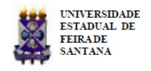
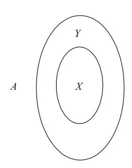
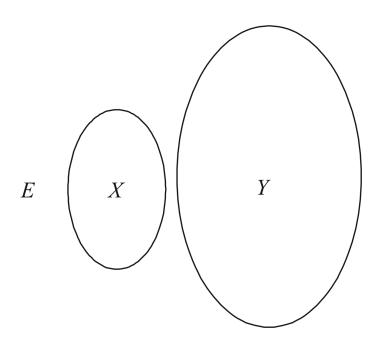
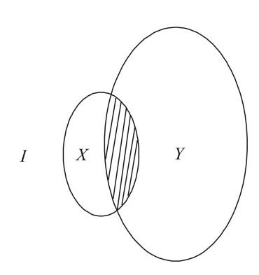
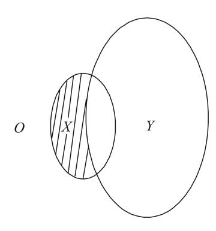
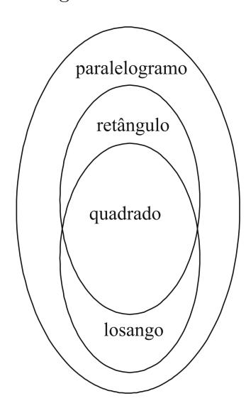
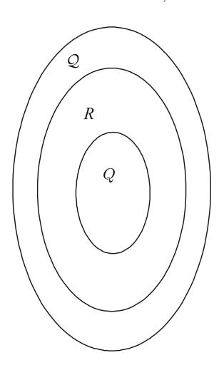
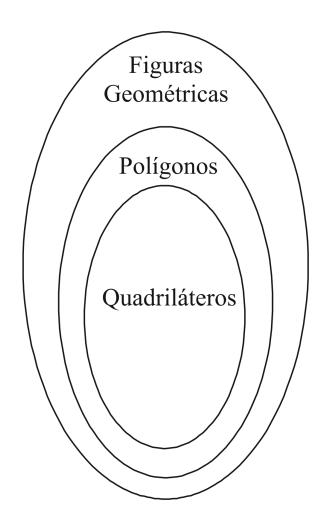
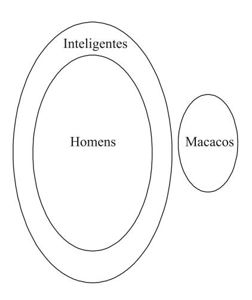

Folhetim Educ. Mat., Feira de Santana, Ano 17, N´umero 159, mar./abr., 2011 ISSN 1415-8779

Este Folhetim ´e um ve´ıculo de divulga¸c˜ao, circula¸c˜ao de ideias e de est´ımulo ao estudo e `a curiosidade intelectual. Dirige-se a todos os interessados pelos aspectos pedag´ogicos, filos´oficos e hist´oricos da Matem´atica. Pretende construir uma ponte para unir os que est˜ao pr´oximos e os que est˜ao distantes.

Prosseguimos com a transcri¸c˜ao das notas intituladas "A Matem´atica: suas origens, seu objeto e seus m´etodos - Parte I", de autoria do professor Carloman. Neste n´umero, o nosso professor em´erito continua sua explana¸c˜ao sobre a L´ogica Cl´assica, adentrando no silogismo. A Geometria Euclidiana reaparece nos exemplos, clarificando ainda mais a exposi¸c˜ao.

Registramos que no ´ultimo dia 11 de mar¸co, o professor Carloman completaria 80 anos. Na ocasi˜ao, o grupo de amigos do professor Carloman prestou mais uma singela homenagem. Outras homenagens dever˜ao ocorrer neste ano: o NEMOC, por exemplo, pretende realizar eventos cient´ıficos cujos temas estejam ligados ao legado do nosso saudoso professor.

Carloman Carlos Borges (UEFS) - in memoriam

In´acio de Sousa Fadigas (UEFS)

Marcos Grilo Rosa (UEFS)

Traz´ıbulo Henrique (UEFS)

A Matem´atica: suas origens, seu objeto e seus m´etodos (continua¸c˜ao)

Carloman Carlos Borges

## 2.1 L´ogica (continua¸c˜ao)

Tanto na constru¸c˜ao da Aritm´etica como da Geometria vimos que ambas nasceram de necessidades pr´aticas; seus primeiros conceitos foram abstra´ıdos de uma realidade bem concreta; neste processo houve a participa¸c˜ao direta de fatos reais, de milhares de "registros" sensoriais e da capacidade criadora da raz˜ao humana; da observa¸c˜ao e do manuseio de milhares de situa¸c˜oes objetivas e de seu reflexo no c´erebro humano formaram-se os princ´ıpios l´ogicos ou as leis b´asicas da raz˜ao humana sobre as quais falamos anteriormente (ver Folhetim n o 158). Nada disto ´e estranho, pois desde o tempo de Paul Broca, meados do s´eculo XIX, que a ciˆencia vem dando precisas indica¸c˜oes sobre a localiza¸c˜ao de determinadas atividades cerebrais em regi˜oes bem precisas do c´erebro. O pr´oprio Broca foi o descobridor da "´area de Broca" - regi˜ao da terceira circunvolu¸c˜ao do lobo frontal esquerdo do c´ortex cerebral e na qual est´a localizada a linguagem articulada, em sua grande parte.

Provavelmente, um dos primeiros m´etodos empregados na Matem´atica tenha sido o da indu¸c˜ao: em um primeiro momento, resultados gerais s˜ao obtidos a partir da observa¸c˜ao de muitos e muitos casos particulares. A este processo do conhecimento, formado a partir do particular, d´a-se o nome de indu¸c˜ao. Fazemos indu¸c˜ao, por exemplo, quando, dada uma progress˜ao aritm´etica de termo a1 e raz˜ao r observamos:

$$a_2 = a_1 + r$$
$a_2 = a_1 + r$  
 $a_3 = a_2 + r$ ou $a_3 = a_1 + 2r$  
 $a_4 = a_3 + r$ $a_4 = a_1 + 3r$

para finalmente, concluir que:

$$a_n = a_1 + (n-1)r$$

No processo de indu¸c˜ao, o conhecimento come¸ca a formarse a partir da observa¸c˜ao de casos particulares e suas rela¸c˜oes rec´ıprocas para, em seguida, atingir uma propriedade geral que evidencie as regularidades b´asicas surgidas nos diversos casos particulares. Este ´e um dos procedimentos b´asicos na aquisi¸c˜ao do conhecimento. Outro caminho empregado por n´os na aquisi¸c˜ao de conhecimentos consiste em, dadas determinadas leis gerais, delas extrairmos um certo ju´ızo. Em Matem´atica, com uma determinada axiom´atica, a mais geral poss´ıvel, produzimos os teoremas que s˜ao verdades menos gerais do que as contidas na axiom´atica. A esta via de conhecimento damos o nome de dedu¸c˜ao, e a este m´etodo de conhecimento, m´etodo de obter verdades, d´a-se o nome de "m´etodo dedutivo". Surge, ent˜ao, a quest˜ao: como temos certeza da verdade dos teoremas? O que garante essa veracidade ´e o fato de que, na dedu¸c˜ao, por meio de racioc´ınios corretos, empregamos determinadas leis gerais - os axiomas, etc. - a casos particulares. Temos, ent˜ao, o seguinte esquema:

- a) leis gerais verdadeiras: a axiom´atica.
- b) racioc´ınios l´ogicos.
- c) conclus˜oes menos gerais verdadeiras.

Tudo se passa da seguinte maneira quando se trata de uma teoria axiomatizada: as verdades dos teoremas j´a est˜ao "dentro" dos pr´oprios axiomas; cabe ao racioc´ınio, `a imagina¸c˜ao criadora e a outras faculdades da mente explicitar tais verdades; neste sentido ´e que se diz ser a Matem´atica uma imensa tautologia, pois as verdades dos teoremas j´a se encontram nos axiomas, apenas revestidas de formas diferentes. Claramente que neste sentido n˜ao somente a Matem´atica mas, qualquer outra teoria dedutiva ´e tautol´ogica. Por´em, como bem escreve o matem´atico francˆes Andr´e Revuz (Matem´atica Moderna, Matem´atica Viva - Fundo de Cultura): "Nota-se, contudo, que embora esta afirma¸c˜ao seja verdadeira para um esp´ırito capaz de conceber instantaneamente todas as consequˆencias dos axiomas, ela n˜ao o ´e na pr´atica, relativamente ao homem normal, o qual s´o ao cabo de ingentes esfor¸cos poder´a deduzir as conclus˜oes que lhe s˜ao ´uteis. E ´e falsa a afirma¸c˜ao, tanto na teoria como na pr´atica, quanto `a totalidade da Matem´atica, que se mant´em amplamente aberta e sempre incompleta, porque sempre poder´a criar teorias completamente novas". Sim, sempre poder´a criar teorias novas - acrescentamos n´os - atrav´es de novas axiom´aticas.

Algumas formas de racioc´ınio podem ser "visualizadas" atrav´es dos chamados diagramas de Euler-Venn; abaixo, alguns diagramas correspondentes `as proposi¸c˜oes b´asicas de Arist´oteles:

A : Todos os X s˜ao Y

E : Nenhum X ´e Y

I : Algum X ´e Y

## NEMOC - NUCLEO DE EDUCAC¸ ´ AO MATEM ˜ ATICA OMAR CATUNDA ´

Folhetim Educ. Mat., Feira de Santana, Ano 17, N´umero 159, mar./abr. 2011 - Editores: In´acio, Grilo e Traz´ıbulo - Digita¸c˜ao: Josenildes Oliveira Venas Almeida e Manoel Aquino dos Santos - Editora¸c˜ao: Evandro Vaz e Nivaldo Assis - Impress˜ao: Imprensa Gr´afica Universit´aria - Periodicidade: bimestral - Tiragem: 1.500 exemplares - Distribui¸c˜ao gratuita - Endere¸co: Avenida Transnordestina s/n, M´odulo Prof. Carloman Carlos Borges, bairro Novo Horizonte, Feira de Santana, BA, Brasil. CEP 44.036-900. - Telefone: (75)3224-8115 - Fax: (75)3224-8086 - E-mail: nemoc@uefs.br - Home-Page: www.uefs.br/nemoc

### O : Algum X n˜ao ´e Y

Seja, por exemplo, a conhecida quest˜ao: sendo P o conjunto dos paralelogramos, L o conjunto dos losangos, R o conjunto dos retˆangulos e Q o conjunto dos quadrados, determinar:

- a) L ∩ P
- b) R ∩ P
- c) L ∩ Q
- d) R ∩ Q
- e) L ∩ R

Da geometria elementar sabemos que paralelogramo ´e o quadril´atero que possui os dois pares de lados opostos respectivamente paralelos. Os seguintes paralelogramos recebem nomes especiais:

- a) Retˆangulo: possui os quatro ˆangulos internos retos;
- b) Losango: os quatro lados possuem o mesmo comprimento;
- c) Quadrado: ´e o paralelogramo cujo os quatro lados possuem o mesmo comprimento e os quatro ˆangulos internos s˜ao retos.

Um diagrama de Euler-Venn para a quest˜ao proposta pode ser o seguinte:

Uma simples inspe¸c˜ao visual leva-nos `as respostas: a) L; b) R; c) Q; d) Q; e) Q. Consideremos, agora, a

seguinte argumenta¸c˜ao: "Em todos os retˆangulos as diagonais s˜ao iguais entre si; todos os quadrados s˜ao retˆangulos; conclus˜ao: em todos os quadrados as diagonais s˜ao iguais entre si". Designemos por Q, a classe mais extensa (os quadril´ateros), a classe intermedi´aria (os retˆangulos) pela letra R, e finalmente a classe menor (os quadrados) pela letra Q. Esquematicamente, temos:

- 1. Todo R ´e Q.
- 2. Todo Q ´e R.
- 3. Conclus˜ao: todo Q ´e Q.

Pelo diagrama de Euler-Venn, tem-se:

Em L´ogica Formal, o racioc´ınio formado por trˆes proposi¸c˜oes: a primeira chamada de premissa maior, a segunda, premissa menor e a terceira, conclus˜ao, d´a-se o nome de silogismo. Exemplos de silogismos s˜ao os mencionados acima. Todo silogismo pode ser colocado na forma condicional: Se, ..., ent˜ao, ... . Ali´as, qualquer argumento corresponde a um enunciado condicional cujo antecedente ´e formado pela conjun¸c˜ao de todas as premissas e o consequente ´e formado pela conclus˜ao do argumento. Da´ı, decorre a importˆancia do seu estudo. Consideremos, exemplificando, o argumento:

Se Paulo ´e estudante, ent˜ao ele estuda. Paulo ´e estudante.

Conclus˜ao: Paulo estuda.

Este argumento poder´a ser assim esquematizado:

$$P \Longrightarrow M$$

$$P$$

$$M$$

e o condicional correspondente a este argumento assumiria a forma:

$$((P \Rightarrow M) \land P) \Rightarrow M$$

Como sabemos, em todo argumento temos o conjunto das premissas, o raciocínio e a conclusão, ao qual podemos assinalar os valores verdadeiro ou falso.

A seguir, mostraremos diversos tipos de argumentos, enfatizando os valores atribuídos às premissas, ao raciocínio e à conclusão, mostrando a sua visualização através dos diagramas de Euler-Venn.

Seja o par ordenado (a,b), no qual tanto a como b podem assumir os valores V ou F, sendo a o conjunto das premissas e b o conjunto dos raciocínios empregados numa determinada dedução; a cada par ordenado (a,b) corresponde uma conclusão c, a qual, naturalmente, pode ser falsa ou verdadeira. Temos, então oito tipos distintos de argumentos:

- 1. (V, V); conclusão: V
- 2. (F, V); conclusão: F
- 3. (F, V); conclusão: V
- 4. (V, F); conclusão: V
- 5. (V, F); conclusão: F
- 6. (F, F); conclusão: F
- 7. (F, F); conclusão: V
- 8. (V, V); conclusão: F

Agora, construamos exemplos desses tipos, na mesma ordem dada acima.

- 1. i) Todos os quadriláteros são polígonos.
  - ii) Todos os polígonos são figuras geométricas.
  - iii) Todos os quadriláteros são figuras geométricas.

- 2. i) Todos os macacos são homens.
  - ii) Todos os homens são inteligentes.
  - iii) Todos os macacos são inteligentes.

## PRÓXIMO NÚMERO

A Matemática: suas origens, seu objeto e seus métodos. (Continuação)

# NOTÍCIAS

### Carloman 80 anos

No dia 11 de março de 2011, familiares e amigos do professor Carloman prestaram mais uma homenagem ao nosso saudoso mestre. O evento ocorreu no MT 55, Módulo Carloman Carlos Borges - UEFS, contando também com a participação de discentes do Curso de Licenciatura em Matemática da UEFS. No site do NEMOC (www.uefs.br/nemoc) pode-se encontrar mais detalhes sobre este evento, inclusive, um texto de autoria do professor Vicente Deocleciano (DCHF / UEFS) sobre o professor Carloman e que emocionou o público presente.

### Lançamento

Recebemos exemplares da 2ª edição do livro _Geraldo Ávila Visita São Luís_ de autoria do professor José Cloves Verde Saraiva. O livro contém, além de outras coisas, uma coletânea de artigos do professor Geraldo Ávila.

# **NÚMEROS ATRASADOS**

Envie para cada folhetim um selo de postagem nacional de 1º porte. Dentro de no máximo quatro semanas, contadas a partir da data de recebimento do seu pedido, você receberá os folhetins solicitados. OBS.: É permitida a reprodução total ou parcial deste folhetim, desde que citada a fonte.
