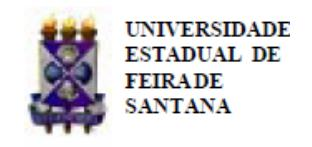
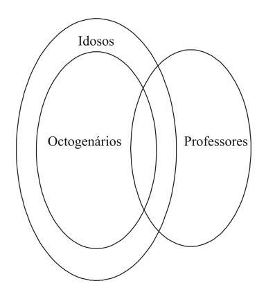
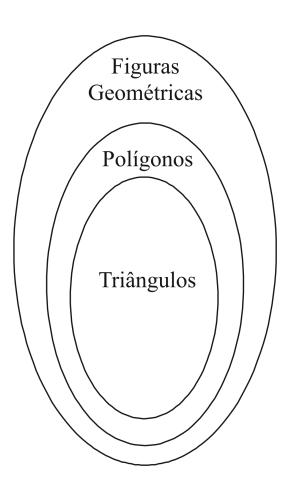
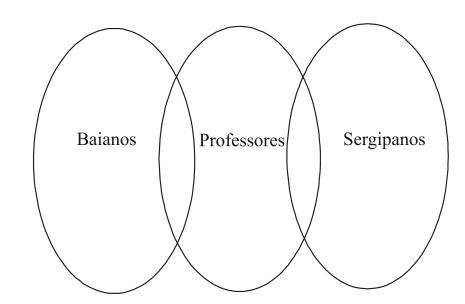
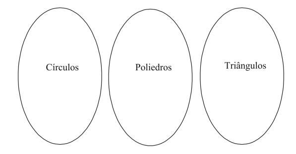
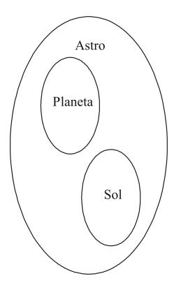
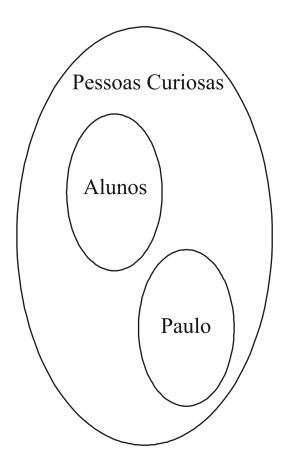
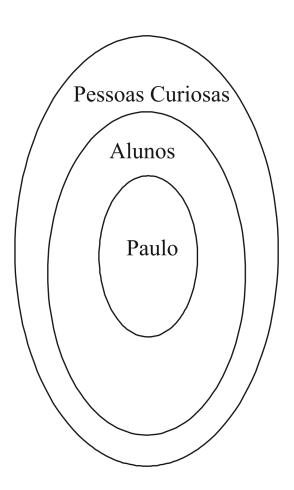
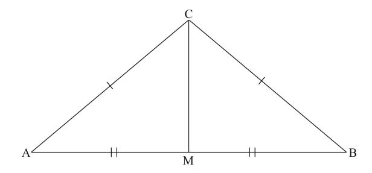

Folhetim Educ. Mat., Feira de Santana, Ano 17, N´umero 160, maio/jun., 2011 ISSN 1415-8779

Este Folhetim ´e um ve´ıculo de divulga¸c˜ao, circula¸c˜ao de ideias e de est´ımulo ao estudo e `a curiosidade intelectual. Dirige-se a todos os interessados pelos aspectos pedag´ogicos, filos´oficos e hist´oricos da Matem´atica. Pretende construir uma ponte para unir os que est˜ao pr´oximos e os que est˜ao distantes.

Prosseguindo a transcri¸c˜ao das notas intituladas "A Matem´atica: suas origens, seu objeto e seus m´etodos - Parte I", de autoria do professor Carloman, neste n´umero, veremos mais um pouco sobre a l´ogica cl´assica. De in´ıcio, exemplos de argumentos do 3o ao 7 o tipo s˜ao apresentados, seguindo a mesma ordem presente no final do Folhetim no 159. Lembramos que exemplos do 1o e do 2o tipo encerraram aquele n´umero.

Em seguida, al´em de comentar sobre o 8 o tipo de argumento, o professor Carloman responde `a seguinte indaga¸c˜ao: "A dedu¸c˜ao matem´atica ´e a mesma que dedu¸c˜ao l´ogica?". Explica¸c˜oes sobre a rela¸c˜ao de implica¸c˜ao e o enunciado condicional tamb´em est˜ao contidas neste n´umero. Teremos a oportunidade de ver trˆes tipos de rela¸c˜ao de implica¸c˜ao, que frequentemente s˜ao utilizadas em demonstra¸c˜oes matem´aticas. Outro t´opico tratado nesta edi¸c˜ao do Folhetim ´e a fal´acia.

Carloman Carlos Borges (UEFS) - in memoriam In´acio de Sousa Fadigas (UEFS) Marcos Grilo Rosa (UEFS) Traz´ıbulo Henrique (UEFS)

A Matem´atica: suas origens, seu objeto e seus m´etodos (continua¸c˜ao)

Carloman Carlos Borges

## 2.1 L´ogica (continua¸c˜ao)

- 3) i) Todos os professores s˜ao octogen´arios.
  - ii) Alguns idosos s˜ao professores.
  - iii) Alguns idosos s˜ao octogen´arios.

- 4) i) O triˆangulo ´e uma figura geom´etrica.
  - ii) Todas as figuras geom´etricas s˜ao pol´ıgonos.
  - iii) O triˆangulo ´e um pol´ıgono.

5) i) Alguns baianos s˜ao professores.

- ii) Todos os professores s˜ao sergipanos.
- iii) Alguns baianos s˜ao sergipanos.

- 6) i) Todos os c´ırculos s˜ao poliedros.
  - ii) Um poliedro ´e um triˆangulo.
- iii) Todos os c´ırculos s˜ao triˆangulos.

- 7) i) O sol ´e um planeta.
  - ii) Todos os planetas s˜ao astros.
  - iii) O sol ´e um astro.

Observemos que dos oito tipos distintos (ver Folhetim no 159, p´agina 04), o ´unico argumento imposs´ıvel ´e o oitavo. Claramente, ´e imposs´ıvel, de um conjunto de premissas verdadeiras, atrav´es de um racioc´ınio correto, chegarmos a uma conclus˜ao falsa, pois esta, neste caso, nada mais ´e do que a pr´opria hip´otese revestida de outra forma e, pelo terceiro exclu´ıdo, n˜ao pode ser falsa.

A esta altura podemos colocar a seguinte quest˜ao: a dedu¸c˜ao matem´atica ´e a mesma que a dedu¸c˜ao l´ogica? A resposta ´e negativa pois, naquela, existe uma rela¸c˜ao tal entre premissa e conclus˜ao que esta ´e uma verdade necess´aria al´em de ser naturalmente uma consequˆencia l´ogica das premissas. H´a, portanto, uma diferen¸ca fundamental entre o silogismo e a dedu¸c˜ao matem´atica. Naquele n˜ao existe nenhuma garantia de que tanto as premissas ou a conclus˜ao sejam verdadeiras, enquanto nesta a verdade das premissas ´e assegurada pela axiom´atica empregada e a conclus˜ao ou a tese n˜ao somente ´e uma consequˆencia l´ogica das premissas como deve ser uma verdade necess´aria. Assim, toda dedu¸c˜ao matem´atica ´e uma dedu¸c˜ao l´ogica e nem toda dedu¸c˜ao l´ogica pode ser identificada como uma dedu¸c˜ao matem´atica.

N˜ao se pode confundir a rela¸c˜ao de implica¸c˜ao com o enunciado condicional, geralmente composto de dois enunciados dados, pois, este ´e uma opera¸c˜ao. A afinidade existente entre os dois ´e a seguinte: p implica q, se e somente se, o condicional p → q ´e logicamente verdadeiro. Neste contexto, propositadamente, empregamos a implica¸c˜ao como condicional, o qual pode ser lido de diversas maneiras:

- i) p ´e condi¸c˜ao suficiente para q.
- ii) q ´e condi¸c˜ao necess´aria para p.

Em alguns tipos de demonstra¸c˜oes emprega-se muito a equivalˆencia:

$$(p \Rightarrow q) \Leftrightarrow (\sim q \Rightarrow \sim p)$$

como, tamb´em, as seguintes:

$$i) [(p \land \sim q) \Rightarrow \sim p] \Leftrightarrow p \Rightarrow q$$

$$ii) [(p \land \sim q) \Rightarrow q] \Leftrightarrow p \Rightarrow q$$

$$(iii) [(p \land \sim q) \Rightarrow (r \land \sim r)] \Leftrightarrow p \Rightarrow q$$

A conjun¸c˜ao, mencionada acima, obedece `a seguin-

## NEMOC - NUCLEO DE EDUCAC¸ ´ AO MATEM ˜ ATICA OMAR CATUNDA ´

Folhetim Educ. Mat., Feira de Santana, Ano 17, N´umero 160, maio/jun. 2011 - Editores: In´acio, Grilo e Traz´ıbulo - Digita¸c˜ao: Josenildes Oliveira Venas Almeida e Manoel Aquino dos Santos - Editora¸c˜ao: Evandro Vaz e Nivaldo Assis - Impress˜ao: Imprensa Gr´afica Universit´aria - Periodicidade: bimestral - Tiragem: 1.500 exemplares - Distribui¸c˜ao gratuita - Endere¸co: Avenida Transnordestina s/n, M´odulo Prof. Carloman Carlos Borges, bairro Novo Horizonte, Feira de Santana, BA, Brasil. CEP 44.036-900. - Telefone: (75)3224-8115 - Fax: (75)3224-8086 - E-mail: nemoc@uefs.br - Home-Page: www.uefs.br/nemoc

seguinte t´abua:

| p | q | p ∧ q |
|---|---|-------------|
| V | V | V           |
| V | F | F           |
| F | V | F           |
| F | F | F           |

o que, ali´as, coincide com o seu uso di´ario na linguagem de todos n´os.

Um argumento ileg´ıtimo chama-se de fal´acia. Por exemplo:

- i) Todos os alunos s˜ao pessoas curiosas.
- ii) Paulo ´e uma pessoa curiosa.
- iii) Paulo ´e um aluno.

- i) Todos os alunos s˜ao pessoas curiosas.
- ii) Paulo ´e uma pessoa curiosa.
- iii) Paulo n˜ao ´e um aluno.

Pelo primeiro diagrama pode-se observar facilmente que ambas as premissas s˜ao mantidas, n˜ao acontecendo o mesmo com a conclus˜ao enquanto que, pelo segundo diagrama vˆe-se que Paulo sendo um aluno ´e igualmente, uma pessoa curiosa. E importante ob- ´ servar que a premissa "Paulo ´e uma pessoa curiosa", neste caso, pode significar que Paulo ´e apenas uma

pessoa curiosa sem todavia ser aluno e pode, tamb´em, significar que ´e uma pessoa curiosa e um aluno. Em um argumento v´alido, sempre que as premissas s˜ao verdadeiras ´e preciso que a conclus˜ao tamb´em o seja, pois, como j´a vimos, sendo aquelas verdadeiras, delas ningu´em poder´a corretamente extrair uma conclus˜ao falsa.

Dadas duas proposi¸c˜oes, a proposi¸c˜ao composta pode apresentar em sua tabela-verdade:

- a) todas as possibilidades s˜ao verdadeiras;
- b) todas as possibilidades s˜ao falsas;
- c) h´a possibilidades falsa(s) e verdadeira(s).

No primeiro caso estamos diante de uma proposi¸c˜ao tautol´ogica, no segundo, temos uma contradi¸c˜ao e finalmente, uma proposi¸c˜ao indeterminada. Por exemplo, ser´a que a conjun¸c˜ao

$$(p \lor q) \land \sim q$$

implica tautologicamente a q?

A tabela-verdade ´e a seguinte:

| p | q | ∼ p | ∨ p q | ∨ q)∧ ∼ r = (p p | ⇒ r q |
|---|---|--------|-------------|------------------------------|-------------|
| V | V | F      | V           | F                            | V           |
| V | F | F      | V           | F                            | V           |
| F | V | V      | V           | V                            | V           |
| F | F | V      | F           | F                            | V           |

Uma simples inspe¸c˜ao visual mostra que a conjun¸c˜ao citada implica tautologicamente a proposi¸c˜ao q. Considere, agora, outro exemplo: Mostrar que a proposi¸c˜ao p∧q implica tautologicamente a proposi¸c˜ao q. Temos:

| p | q | p ∧ q | (p ∧ q) ⇒ q |
|---|---|-------------|-------------------------|
| V | V | V           | V                       |
| V | F | F           | V                       |
| F | V | F           | V                       |
| F | F | F           | V                       |

Os dois exemplos acima ilustram muito bem a defini¸c˜ao: Uma proposi¸c˜ao p implica tautologicamente uma proposi¸c˜ao q, se e somente se, a proposi¸c˜ao condicional p → q ´e uma tautologia.

As seguintes implica¸c˜oes s˜ao tautol´ogicas e de emprego constante nas demonstra¸c˜oes matem´aticas:

a) MODUS PONENS (Regra de Separa¸c˜ao)

$$[p \land (p \Rightarrow q)] \Rightarrow q$$

b) MODUS TOLLENS

$$[\sim q \land (\sim p \Rightarrow q)] \Rightarrow p$$

# c) REGRA DE SEPARAC¸AO DE CASOS ˜

$$[(p \Rightarrow q) \land (\sim p \Rightarrow q)] \Rightarrow q$$

Sobre o Modus Ponens, considere a seguinte quest˜ao: "A implica¸c˜ao p ⇒ q ´e verdadeira e a proposi¸c˜ao p tamb´em ´e verdadeira: que se pode afirmar sobre a veracidade da proposi¸c˜ao q?". Pela tabela-verdade da implica¸c˜ao (ver Folhetim no 158) estamos certos de que a proposi¸c˜ao q ´e verdadeira. O Modus Ponens confirma o que est´a contido na tabela citada e, muitas vezes n´os o empregamos em diversas demonstra¸c˜oes matem´aticas. Por exemplo, seja o teorema: "Se o triˆangulo ABC possui dois lados congruentes ent˜ao os ˆangulos da base s˜ao congruentes". Para mostrar que a implica¸c˜ao p ⇒ q ´e verdadeira, basta tra¸car do v´ertice C a mediana relativa `a base AB, com o que o triˆangulo dado ABC fica decomposto em dois outros, ambos congruentes entre si, o que implica a congruˆencia entre os ˆangulos correspondentes.

Vimos, assim que a proposi¸c˜ao AC = BC implica logicamente a proposi¸c˜ao q: "os ˆangulos da base s˜ao congruentes", donde se conclui que a implica¸c˜ao p ⇒ q ´e verdadeira, por´em, a simples veracidade de uma implica¸c˜ao n˜ao assegura a veracidade das proposi¸c˜oes, suas componentes. Neste exemplo, sabemos que p ´e verdadeira e, como a implica¸c˜ao tamb´em ´e verdadeira, conclu´ımos pela veracidade de q. Esta ´e a Regra do Modus Ponens ou Regra da Separa¸c˜ao, muitas vezes empregada por n´os de maneira quase inconsciente. Seja outro exemplo:

$$p:5=4$$

Subtraindo de ambos os membros 2 unidades, temos:

$$3 = 2$$

Adicionando membro a membro, vem a proposi¸c˜ao

$$q: 8 = 6$$

A implica¸c˜ao p ⇒ q ´e correta, por´em, como p ´e falsa, nada podemos saber sobre o valor l´ogico da proposi¸c˜ao q, somente baseados nesta implica¸c˜ao; nosso conhecimento da falsidade da proposi¸c˜ao q n˜ao prov´em da veracidade da implica¸c˜ao em estudo mas, sim, de outras fontes.

Considere o problema seguinte: "Se um n´umero ´e ´ımpar, ent˜ao o seu quadrado ´e ´ımpar; x 2 representa um n´umero par". Pergunta-se: que se pode afirmar sobre o n´umero x? ele ´e par ou ´ımpar? Pela Regra de Modus Tollends, podemos afirmar que x ´e um n´umero par, pois, a proposi¸c˜ao composta: "Se um n´umero ´e ´ımpar ent˜ao seu quadrado ´e ´ımpar" ´e uma proposi¸c˜ao verdadeira (sua veracidade ´e facilmente demonstr´avel) e a proposi¸c˜ao "x 2 representa um n´umero par" ´e aceita como verdadeira.

A Matem´atica: suas origens, seu objeto e seus m´etodos. (Continua¸c˜ao)

## CEEM

No mˆes de mar¸co deste ano o Curso de Especializa¸c˜ao em Educa¸c˜ao Matem´atica - CEEM, oferecido pelo NEMOC, concluiu a sua nona turma. Com isto, atingimos a marca de 70 especialistas formados. Al´em disso, o NEMOC e o NIS (N´ucleo de Inform´atica e Sociedade / DEXA / UEFS) j´a submeteram `as instˆancias competentes da UEFS o projeto do CEEM semi-presencial. A estrutura do curso basicamente ´e a mesma do presencial, diferenciando-se, essencialmente, a modalidade. Ao t´ermino dos devidos trˆamites legais e burocr´aticos, divulgaremos, oportunamente, o edital para sele¸c˜ao de uma nova turma.

## Col´oquio Brasileiro de Matem´atica

No per´ıodo de 18 a 29 de julho de 2011 acontecer´a no IMPA a 28a edi¸c˜ao do Col´oquio Brasileiro de Matem´atica. Para maiores informa¸c˜oes, acesse o site: www.impa.br

Envie para cada folhetim um selo de postagem nacional de 1o porte. Dentro de no m´aximo quatro semanas, contadas a partir da data de recebimento do seu pedido, vocˆe receber´a os folhetins solicitados. OBS.: E permitida a reprodu¸c˜ao total ou parcial deste folhe- ´ tim, desde que citada a fonte.