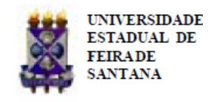

Folhetim Educ. Mat., Feira de Santana, Ano 17, N´umero 161, jul./ago., 2011 ISSN 1415-8779

Este Folhetim ´e um ve´ıculo de divulga¸c˜ao, circula¸c˜ao de ideias e de est´ımulo ao estudo e `a curiosidade intelectual. Dirige-se a todos os interessados pelos aspectos pedag´ogicos, filos´oficos e hist´oricos da Matem´atica. Pretende construir uma ponte para unir os que est˜ao pr´oximos e os que est˜ao distantes.

Dando continuidade `a transcri¸c˜ao das notas intituladas "A Matem´atica: suas origens, seu objeto e seus m´etodos - Parte I", de autoria do professor Carloman, neste n´umero, veremos mais considera¸c˜oes sobre a fal´acia. Outro assunto abordado ´e o m´etodo de exaust˜ao que encerra a se¸c˜ao sobre a L´ogica Cl´assica. No problema da quadratura do c´ırculo, apenas r´egua (sem escalas) e compasso s˜ao permitidos nas constru¸c˜oes geom´etricas. A r´egua ´e usada somente para tra¸car segmentos que passam por dois pontos distintos dados t˜ao longos quanto se queira. O compasso ´e usado apenas para tra¸car circunferˆencias de centro num ponto dado e que passam por um segundo ponto qualquer dado.

Em seguida, nosso mestre trata de um t´opico j´a falado anteriormente e agora abordado de forma mais espec´ıfica: a axiom´atica. Nesta edi¸c˜ao do Folhetim, veremos trˆes exemplos: a Axiom´atica de Peano; a Axiom´atica da Geometria Plana de Euclides e a Axiom´atica da Est´atica.

Carloman Carlos Borges (UEFS) - in memoriam In´acio de Sousa Fadigas (UEFS) Marcos Grilo Rosa (UEFS) Traz´ıbulo Henrique (UEFS)

A Matem´atica: suas origens, seu objeto e seus m´etodos (continua¸c˜ao)

Carloman Carlos Borges

# 2.1 L´ogica (continua¸c˜ao)

Analisemos a fal´acia abaixo: seja a s´erie:

$$1-1+1-1+1-1+1-1+\dots$$
(a)

Reagrupando seus termos:

$$(1-1) + (1-1) + (1-1) + (1-1) + \dots$$
(b)

Reagrupando de outra forma:

$$1 - (1 - 1) - (1 - 1) - (1 - 1) - (1 - 1) - \dots$$
(c)

Em (b) temos a "soma" de parˆenteses iguais a zero, pelo que a sua "soma" ´e igual a zero e, em (c), pela mesma raz˜ao, temos a "soma" igual a 1; como (b) e (c) representam a mesma s´erie original (a), chegamos `a conclus˜ao falsa:

$$0 = 1$$

Conta a hist´oria que matem´aticos como Leibniz e alguns dos Bernoulli ficaram surpresos com este resultado e que alguns, como Guido Grande (nasceu em Cremona, em 1671 e morreu em Pisa, em 1742; suas obras principais: Quadratura Circuli et Hiperboe e De Infinitis Infinitorum) acreditava ser este paradoxo a demonstra¸c˜ao de que do nada se pode criar qualquer coisa desde que exista uma for¸ca infinita.

A fal´acia mencionada mostra apenas que a passagem do finito para o infinito implica certas mudan¸cas no comportamento mental do homem; a "in´ercia mental" o leva, muitas vezes, a encarar situa¸c˜oes novas como a continua¸c˜ao natural daquelas velhas nas quais se encontra mergulhado. Podendo efetuar somas finitas, colocando-as em qualquer ordem, n˜ao viu que a extens˜ao desse princ´ıpio para "somas infinitas" teria de ser cercada de certas restri¸c˜oes; no caso, tal extens˜ao s´o ´e v´alida para s´eries absolutamente convergentes.

Situa¸c˜ao semelhante observamos no comportamento dos primeiros geˆometras que viveram no s´eculo V a.C. Eles observaram que, dado um c´ırculo C de raio r, a ´area de C poderia ser aproximada pelas ´areas dos pol´ıgonos regulares Pn, inscritos em C, e P 0 n , circunscritos a C. Esta aproxima¸c˜ao dependia de n, o n´umero de lados do pol´ıgono. Este m´etodo, empregado tamb´em por Arquimedes (287 a. C.), era chamado "m´etodo de exaust˜ao" e, cont´em, obviamente, os germens do C´alculo Integral, descoberta feita simultaneamente por Leibniz e Newton s´o no s´eculo XVII. No caso em apre¸co, temos um processo-limite e a ´area do c´ırculo, que pode ser obtida na passagem do limite n˜ao deve ser confundida com a ´area de um quadrado, pois nem toda propriedade ´e conservada nessa passagem. Desta inobservˆancia nasceu o famoso problema da "quadratura do c´ırculo", o qual consiste no seguinte: dado um c´ırculo de raio r, construir um quadrado de ´area igual `a ´area deste c´ırculo. Considerando o raio do c´ırculo unit´ario, este quadrado dever´a ter como lado um segmento de comprimento igual a raiz quadrada de π. A constru¸c˜ao de um segmento com esse comprimento ´e poss´ıvel se e somente se o n´umero π estiver contido em um corpo que possa ser deduzido do corpo dos n´umeros racionais. Em resumo, o n´umero π tem de ser solu¸c˜ao de alguma equa¸c˜ao alg´ebrica de coeficientes inteiros, isto ´e, tem de ser um n´umero alg´ebrico; por´em, os matem´aticos Charles Hermite (1822-1905) e Ferdinand Lindermann (1852-1939) demonstraram que este n´umero n˜ao ´e alg´ebrico, ou seja, ´e um n´umero transcendente, ficando, assim, resolvido negativamente, o problema da "quadratura do c´ırculo".

Aqui vale a pena citar Bento de Jesus Cara¸ca, Conceitos Fundamentais da Matem´atica: "esta suposi¸c˜ao de que toda a propriedade se conserva numa passagem ao limite era t˜ao natural, estava t˜ao arreigada no esp´ırito dos matem´aticos, que ainda no final do s´ec. XVIII encontramos numa obra de Simon L'Huilier, Exposition ´el´ementaire des principes des calculs sup´erieurs esta passagem:

Se uma quantidade vari´avel, suscept´ıvel de limite, goza constantemente duma certa propriedade, o seu limite goza constantemente da mesma propriedade."

E continua Bento de Jesus Cara¸ca: "E nota que n˜ao se trata de um qualquer. L'Huilier ganhou com essa obra um concurso aberto pela Academia de Berlim em 1784 para se obter 'uma teoria clara e precisa daquilo que se chama infinito em Matem´atica'."

### 2.2 Axiom´atica

Nas p´aginas (Folhetins) anteriores falamos algo sobre a axiom´atica. O desenvolvimento de uma determinada teoria T ´e axiom´atico quando parte de um conjunto formado de termos primitivos, axiomas e postulados e algumas defini¸c˜oes. Os demais enunciados, isto ´e, aqueles n˜ao pertencentes ao conjunto acima citado, s´o podem ser aceitos na teoria T, se forem provados. Aos enunciados provados, d´ase o nome de teoremas. Vejamos algumas axiom´aticas:

### i) Axiom´atica de Peano

Giuseppe Peano (1858 − 1932), matem´atico e l´ogico italiano, considerou como termos primitivos os seguintes: 1 (um); um conjunto N, cujos elementos s˜ao chamados n´umeros naturais; sucessor.

Os cinco axiomas s˜ao:

- a) 1 ´e um n´umero.
- b) O sucessor de qualquer n´umero ´e um n´umero.
- c) N˜ao h´a dois n´umeros com um mesmo sucessor.
- d) 1 n˜ao ´e sucessor de nenhum n´umero.
- e) Se X ⊂ N ´e um subconjunto tal que 1 ∈ X e, para todo n ∈ X tem-se tamb´em s(n) ∈ X, ent˜ao X = N. (Este ´e o Princ´ıpio da Indu¸c˜ao Completa).

O n´umero s(n) ´e chamado sucessor de n, no seguinte sentido: s(2) = 3, s(1) = 2, etc. Vˆe-se, assim, que se poderia considerar uma fun¸c˜ao s : N → N, injetora, isto ´e, dados m, n ∈ N, s(m) = s(n) ⇒ m = n.

A axiom´atica de Peano, embora bastante simples, permite o desenvolvimento de toda a teoria dos N´umeros Naturais.

## NEMOC - NUCLEO DE EDUCAC¸ ´ AO MATEM ˜ ATICA OMAR CATUNDA ´

Folhetim Educ. Mat., Feira de Santana, Ano 17, N´umero 161, jul./ago. 2011 - Editores: In´acio, Grilo e Traz´ıbulo - Digita¸c˜ao: Josenildes Oliveira Venas Almeida e Manoel Aquino dos Santos - Editora¸c˜ao: Evandro Vaz e Nivaldo Assis - Impress˜ao: Imprensa Gr´afica Universit´aria - Periodicidade: bimestral - Tiragem: 1.500 exemplares - Distribui¸c˜ao gratuita - Endere¸co: Avenida Transnordestina s/n, M´odulo Prof. Carloman Carlos Borges, bairro Novo Horizonte, Feira de Santana, BA, Brasil. CEP 44.036-900. - Telefone: (75)3161-8115 - Fax: (75)3161-8086 - E-mail: nemoc@uefs.br - Home-Page: www.uefs.br/nemoc

### ii) Axiom´atica da Geometria Plana de Euclides

Conceitos primitivos: ponto, linha reta, movimento (transforma¸c˜ao de todo o plano). As seguintes no¸c˜oes tamb´em n˜ao ser˜ao definidas: o ponto a est´a sobre a reta A; o ponto b se encontra entre os pontos a e c; um movimento (de todo o plano) transforma o ponto a no ponto b, no sentido de que leva o ponto a sobre o ponto b.

Temos cinco grupos de axiomas:

### I. Axiomas de Incidˆencia

- 1. Dados dois pontos, por eles passa somente uma linha reta.
  - 2. Uma linha reta cont´em, ao menos, dois pontos.
- 3. Existem, ao menos, trˆes pontos que n˜ao se encontram sobre uma reta.

## II. Axiomas de Ordem

- 1. De cada trˆes pontos que se encontram sobre uma linha reta, existe um que se encontra entre os outros os dois.
- 2. Se a e b s˜ao dois pontos de uma linha reta, existe ao menos um ponto c sobre a reta tal que b se encontra entre a e c.
- 3. Uma linha reta divide o plano em dois semiplanos.

## III. Axiomas de Movimento

- 1. Um movimento transforma retas em retas.
- 2. Dois movimentos efetuados sucessivamente s˜ao equivalentes a um s´o movimento.
- 3. Sejam a e a 0 dois pontos, A e A0 duas semi-retas que se originam deles e α e α 0 dois semiplanos limitados pelas retas prolonga¸c˜ao de A e A0 ; existe, ent˜ao um ´unico movimento que leva a sobre a 0 , A sobre A0 e α sobre α 0 .

### IV. Axiomas de Continuidade

1. Sejam a1, a2, a3, ..., pontos situados em uma linha reta de modo que cada um deles est´a `a direita do precedente e todos eles `a esquerda de um ponto b situado tamb´em sobre a reta. Existe ent˜ao um ponto c `a direita de todos os pontos a1, a2, a3, ..., situado tamb´em na reta e tal que ao menos um ponto an est´a arbritariamente perto dele (ou seja, qualquer que seja o ponto d `a esquerda de c, existe um ponto an sobre o segmento dc).

### V. Axioma de Paralelismo

1. Por um ponto que n˜ao esteja sobre uma reta dada se pode tra¸car uma reta que n˜ao a corte.

Sendo uma axiom´atica cria¸c˜ao da raz˜ao humana, surge a pergunta: Esta cria¸c˜ao ´e arbitr´aria? Ela deve obedecer a alguns princ´ıpios? Caso afirmativo, quais s˜ao esses princ´ıpios? Qual a rela¸c˜ao entre os axiomas e a experiˆencia di´aria? Pode o homem, partindo de uma mesma situa¸c˜ao experimental criar axiom´aticas diferentes?

Falemos, inicialmente, sobre a t˜ao propalada arbitrariedade dos axiomas. A esta quest˜ao liga-se outra, qual seja, a referente `as enormes aplica¸c˜oes da Matem´atica, apesar da enorme abstra¸c˜ao de seus conceitos. Evidentemente, um sistema de axiomas do qual fosse poss´ıvel deduzir dois teoremas contradit´orios entre si, este sistema poderia constituir-se na "infraestrutura" de uma ciˆencia, cujo objetivo principal ´e iluminar a realidade atrav´es de suas verdades? Como, ent˜ao, a Matem´atica poderia servir de linguagem para outras ciˆencias? A F´ısica Moderna, por exemplo, sobreviveria, tendo como linguagem subjacente uma linguagem contradit´oria? Ainda voltaremos a falar sobre a arbitrariedade dos axiomas.

No problema das rela¸c˜oes entre a experiˆencia di´aria do homem e a constru¸c˜ao de axiom´aticas surgem diversas outras quest˜oes; uma delas, por exemplo, diz respeito `a intui¸c˜ao racional ou intelectual, a qual, segundo os filos´ofos se apresenta em dois tipos distintos: intui¸c˜ao material e intui¸c˜ao formal. A primeira servindo para nos colocar diretamente em contato com as "coisas intuidas" e esta ´ultima servindo para explicar o porquˆe de n´os intuirmos rela¸c˜oes e propriedades entre diversas entidades. Consideremos, para exemplificar, o conjunto vazio: dele podemos ter uma intui¸c˜ao material ou formal? Como este conceito nasceu e o porquˆe de seu nascimento? Alguns pensadores acham imposs´ıvel uma intui¸c˜ao material desse conceito, bem como de qualquer outra entidade abstrata. Do nosso ponto de vista, embora seja dif´ıcil, realmente, explicar o conjunto vazio atrav´es da intui¸c˜ao material, ser´a f´acil justific´a-lo o porquˆe de sua cria¸c˜ao; para isto, basta considerar as diversas opera¸c˜oes entre os conjuntos, tais como intersec¸c˜ao, reuni˜ao, etc.; ora, a fim de que essas opera¸c˜oes se operacionalizem sem exce¸c˜oes, ´e indispens´avel a existˆencia de um conjunto com as propriedades do conjunto vazio; fato inteiramente an´alogo ocorre com o zero: o processo da contagem - sempre se inicia a partir de "algo" diferente de nada e, aqui, igualmente com o que acontece com o conjunto vazio, ´e bem dif´ıcil uma intui¸c˜ao material; por´em, tudo fica mais claro quando se tenta operacionalizar os n´umeros atrav´es de suas rela¸c˜oes rec´ıprocas: a presen¸ca do zero ´e indispens´avel para que as opera¸c˜oes com os n´umeros se processem sem exce¸c˜oes maiores.

Ainda de acordo com o nosso ponto de vista, sujeito, naturalmente, a outros aprofundamentos, acreditamos que a experiˆencia di´aria do homem exerce poderosa influˆencia sobre a cria¸c˜ao de qualquer axiom´atica, quer diretamente, como acontece na Mecˆanica, quer indiretamente, como se verifica nas chamadas ciˆencias formais. Uma an´alise da axiom´atica da geometria plana, dada acima, parece confirmar nossa opini˜ao, embora, a substitui¸c˜ao do V Axioma do Paralelismo de Euclides pelo axioma criado por Lobachevski n˜ao se ajuste, `a primeira vista, ao nosso ponto de vista. Um exame mais detalhado, por´em, dessa quest˜ao confirma a nossa tese: na elabora¸c˜ao de qualquer axiom´atica - que deve servir de suporte ao desenvolvimento de uma determinada ciˆencia - a experiˆencia di´aria do homem exerce poderosa influˆencia, pelo simples fato de que ´e imposs´ıvel, ao homem, alienar-se completamente dessa experiˆencia, sob pena de colocar em risco a sua pr´opria sobrevivˆencia. Toda e qualquer cria¸c˜ao cient´ıfica ´e imposs´ıvel, naturalmente, fora das leis l´ogicas tradicionais; ora, h´a uma rela¸c˜ao bem profunda entre estas e a Geometria Euclidiana e, como sabemos, nesta, o fator principal para a sua cria¸c˜ao foi a experiˆencia di´aria do homem com os objetivos do seu contorno. Por outro lado, pode-se mostrar a analogia profunda entre a geometria de Euclides e a Mecˆanica Cl´assica, cujos axiomas s˜ao o resultado de milhares e milhares de generaliza¸c˜oes de in´umeras experiˆencias do homem com o seu meio circundante. A t´ıtulo de ilustra¸c˜ao apresentamos a Axiom´atica da Est´atica (parte da Mecˆanica aonde s˜ao estudadas as no¸c˜oes gerais de for¸cas e as condi¸c˜oes de equil´ıbrio de corpos materiais submetidos `a a¸c˜ao de for¸cas).

### iii) Axiom´atica da Est´atica

Ap´os as defini¸c˜oes de corpo (conceito primitivo), livre, sistemas de for¸cas equivalentes, for¸cas internas, ligaduras, etc., s˜ao elaborados os axiomas abaixo:

## Axioma I

Se duas for¸cas atuam sobre um corpo r´ıgido livre, este pode permanecer em equil´ıbrio somente quando os m´odulos destas for¸cas s˜ao iguais (F1 = F2) e elas est˜ao dirigidas em sentidos opostos ao largo de uma mesma linha.

### Axioma II

A a¸c˜ao de um sistema de for¸cas sobre um corpo r´ıgido n˜ao se modificar´a se lhe ´e acrescentado ou lhe ´e retirado um sistema de for¸cas em equil´ıbrio.

Axioma III (Axioma do Paralelogramo de For¸cas)

Duas for¸cas aplicadas a um corpo em um ponto tem uma resultante aplicada no mesmo ponto e representada pela diagonal do paralelogramo constru´ıdo sobre estas for¸cas como lados.

### Axioma IV

Toda a¸c˜ao de um corpo material sobre outro traz consigo, por parte deste ´ultimo, uma rea¸c˜ao de mesma magnitude, por´em, em sentido oposto.

## Axioma V (Princ´ıpio de Rigidez)

O equil´ıbrio de um corpo deform´avel que se encontra sob a a¸c˜ao de um sistema de for¸cas, se conserva se este corpo se considera solidificado.

## Axioma VI (Das Ligaduras)

Todo corpo ligado pode considerar-se como livre se suprimimos as ligaduras e substituimos suas a¸c˜oes pelas rea¸c˜oes destas ligaduras.

Deste reduzido n´umero de axiomas s˜ao deduzidos todos os teoremas e fatos relativos `a Est´atica; o leitor est´a convidado a estabelecer as correspondentes analogias entre esta axiom´atica e a experiˆencia da vida cotidiana.

A Matem´atica: suas origens, seu objeto e seus m´etodos. (Continua¸c˜ao)

### Novo N´umero

No mˆes de junho, o telefone do NEMOC mudou o prefixo, passando para (75) 3161 8115. Para envio de fax: (75) 3161 8086.

Envie para cada Folhetim um selo de postagem nacional de 1 o porte. Dentro de no m´aximo quatro semanas, contadas a partir da data de recebimento do seu pedido, vocˆe receber´a os folhetins solicitados. OBS.: E permitida a reprodu¸c˜ao ´ total ou parcial deste Folhetim, desde que citada a fonte.
