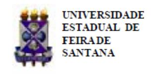
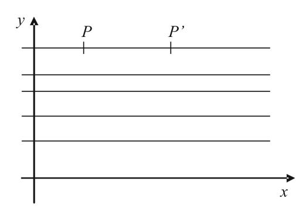
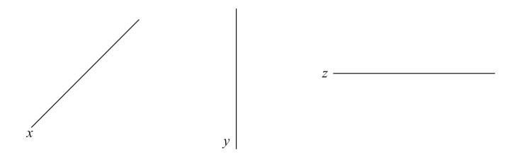

Folhetim Educ. Mat., Feira de Santana, Ano 18, N´umero 163, nov./dez., 2011 ISSN 1415-8779

Este Folhetim ´e um ve´ıculo de divulga¸c˜ao, circula¸c˜ao de ideias e de est´ımulo ao estudo e `a curiosidade intelectual. Dirige-se a todos os interessados pelos aspectos pedag´ogicos, filos´oficos e hist´oricos da Matem´atica. Pretende construir uma ponte para unir os que est˜ao pr´oximos e os que est˜ao distantes.

Prosseguimos com a transcri¸c˜ao das notas intituladas "A Matem´atica: suas origens, seu objeto e seus m´etodos - Parte I", de autoria do professor Carloman. Esta edi¸c˜ao tratar´a de defini¸c˜oes, encerrando o t´opico "A Matem´atica continua progredindo", iniciado no Folhetim 158. O subt´opico "Axiom´atica" ´e finalizado neste n´umero, trazendo considera¸c˜oes sobre o problema da verdade e o problema do rigor. Veremos uma discuss˜ao entre defini¸c˜oes reais e defini¸c˜oes usuais empregadas em Matem´atica, que s˜ao: defini¸c˜oes nominais ou expl´ıcitas; defini¸c˜oes por abstra¸c˜ao; defini¸c˜oes por recorrˆencia.

Desejamos aos nobres leitores e a seus familiares um 2012 pr´ospero e repleto de realiza¸c˜oes.

Carloman Carlos Borges (UEFS) - in memoriam

In´acio de Sousa Fadigas (UEFS)

Marcos Grilo Rosa (UEFS)

Traz´ıbulo Henrique (UEFS)

A Matem´atica: suas origens, seu objeto e seus m´etodos (continua¸c˜ao)

Carloman Carlos Borges

# 2.2 Axiom´atica (continua¸c˜ao)

Ligados a uma determinada axiom´atica temos dois outros problemas: o problema do rigor e o problema da verdade; como j´a dissemos anteriormente, a verdade matem´atica ´e relativa a uma certa teoria T, e jamais uma coisa acabada: aqui, vale o princ´ıpio da n˜ao contradi¸c˜ao. Igualmente o rigor: ele n˜ao se encontra acabado numa suposta imutabilidade. Ambos esses conceitos s˜ao hist´oricos; ambos experimentam seus refinamentos, de acordo com a evolu¸c˜ao da Matem´atica. Isto ´e perfeitamente compreens´ıvel se levarmos em considera¸c˜ao a pr´opria historicidade da raz˜ao humana. Nenhuma ciˆencia ´e formada de compartimentos estanques; mesmo entre as ciˆencias existe uma interdependˆencia, pois cada uma delas revela aspectos espec´ıficos da realidade.

## 2.3 Defini¸c˜oes

O conhecimento humano ´e conceitual; o homem conhece o mundo por interm´edio dos conceitos. E como se existisse, entre ´ a realidade objetiva e o sujeito cognoscente, um biongo formado por novas ideias. O conhecimento imediato do mundo, sem quaisquer media¸c˜oes, seria o conhecimento intuitivo, o conhecimento dos santos e dos grandes m´ısticos orientais e seus adeptos bem sucedidos. Aqui, estamos interessados no conhecimento matem´atico que ´e essencialmente conceitual. Para sobreviver o homem precisa ajustar-se `a realidade que lhe ´e circundante, conhecendo-a cada vez melhor e transformando-a com esse conhecimento. Na aquisi¸c˜ao de suas verdades, ele forma conceitos, combina-os e forma teorias. E indispens´avel, por- ´ tanto, refinar seus conceitos: tornar o biongo existente, mencionado logo acima, cada vez mais l´ımpido. O processo de refinamento conceitual ´e um processo limite, porque o processo do conhecimento, em sua totalidade, ´e um processo infinito.

O assim chamado princ´ıpio da economia do pensamento atravessa todas as ciˆencias; estamos empregando-o, por exemplo, quando procuramos definir as entidades com as quais nossa mente lida. Uma defini¸c˜ao ´e, antes de mais nada, uma conven¸c˜ao conceitual; quando, ainda exemplificando, definimos c´ırculo como "o lugar geom´etrico dos pontos do plano equidistantes de um ponto fixo desse mesmo plano", a conven¸c˜ao est´a perfeitamente clara: doravante, empregaremos o termo c´ırculo no lugar de toda essa frase entre aspas. Em defini¸c˜oes desse tipo, as mais usuais em Matem´atica, o trabalho criador da mente ´e evidente: o ser definido: c´ırculo - nasce com a sua pr´opria defini¸c˜ao e ´e claro que ele pode, em outro contexto, servir de termo primitivo, da mesma maneira como nossa defini¸c˜ao lugar geom´etrico - aparece primitivamente, isto ´e, sem defini¸c˜ao.

Quando falamos em termos primitivos, acrescentamos serem termos sem defini¸c˜ao, porquanto ´e imposs´ıvel definir-se todos os termos sem cair naquilo que ´e comumente chamado de "regress˜ao ao infinito"; todavia, os axiomas de uma determinada teoria T, estabelece rela¸c˜oes entre os termos primitivos dessa mesma teoria e, atrav´es dessas rela¸c˜oes, ficam estabelecidos os significados dos termos primitivos da teoria T. Por isso, alguns autores acham que os axiomas s˜ao defini¸c˜oes impl´ıcitas dos termos primitivos da mesma teoria, no sentido dado acima. Agora, considere a defini¸c˜ao: "O Brasil faz fronteiras com o Uruguai, a Argentina, etc". Com esta frase definimos as fronteiras do Brasil, isto ´e, algo j´a existente; esta defini¸c˜ao n˜ao introduz no vocabul´ario de T qualquer termo novo, pois apenas menciona, enumera coisas reais; defini¸c˜oes desse tipo s˜ao designadas defini¸c˜oes reais e n˜ao s˜ao empregadas em Matem´atica. As defini¸c˜oes mais usuais em Matem´atica s˜ao:

- a) defini¸c˜oes nominais ou expl´ıcitas;
- b) defini¸c˜oes por abstra¸c˜ao;
- c) defini¸c˜oes por recorrˆencia.

Todos os trˆes tipos acima possuem uma caracter´ıstica comum: introduzem no vocabul´ario da teoria T, em estudo, termos novos; a defini¸c˜ao de c´ırculo, j´a mencionada, ´e um exemplo de defini¸c˜ao nominal ou expl´ıcita, tipo bastante usual em Matem´atica. Todas as defini¸c˜oes, logo abaixo, ainda pertencem ao tipo (a):

- i) Um determinante ´e nulo se, e somente se, suas fileiras ou colunas s˜ao linearmente dependentes;
- ii) A ∩ B = o conjunto dos elementos que pertencem, simultaneamente, aos conjuntos A e B;
- iii) A ⊂ B = a intersec¸c˜ao de A e B ´e o pr´oprio A. As defini¸c˜oes por abstra¸c˜ao requerem uma pequena introdu¸c˜ao: devemos, primeiro, introduzir alguns outros termos. Assim, consideremos a t˜ao conhecida rela¸c˜ao de igualdade =. Ela goza das propriedades:
  - a) x = x (Propriedade Reflexiva);
  - b) x = y ⇒ y = x (Propriedade Sim´etrica);
  - c) x = y, y = z ⇒ x = z (Propriedade Transitiva).

Dado um conjunto A, uma rela¸c˜ao de equivalˆencia em A ´e uma rela¸c˜ao bin´aria em A que goza das trˆes propriedades mencionadas acima, destarte, a rela¸c˜ao de igualdade entre elementos de um conjunto A estabelece em A uma rela¸c˜ao de equivalˆencia. O s´ımbolo "∼" ´e comumente empregado para designar tal rela¸c˜ao; assim x ∼ y (x equivale a y) mostra que os elementos x e y do conjunto A possuem, entre si, a rela¸c˜ao definida. Um outro exemplo de rela¸c˜ao de equivalˆencia ´e dado pela rela¸c˜ao de paralelismo, no conjunto R das retas do plano euclidiano P, pois sendo a, b e c elementos de R:

i) a k a ( a ´e paralela a si mesma)

$$ii)a \parallel b \Rightarrow b \parallel a$$

$$(iii)a \parallel b$$
, $b \parallel c \Rightarrow a \parallel c$

Um conceito importante intimamente ligado ao de rela¸c˜ao de equivalˆencia, ´e o de parti¸c˜ao. Considere o conjunto A dos autom´oveis fabricados no Brasil, das marcas Fiat, Chevrolet e Volkswagen, representados, respectivamente, por F, C e V ; em A estabelecemos a rela¸c˜ao "o carro a tem a mesma marca que o carro b"; esta rela¸c˜ao ´e de equivalˆencia no conjunto A, pois desfruta das trˆes propriedades acima. De fato, seja A:

| F   | F   |     | C   |     | C   | V   | F   |     | V   | V   | F   |
| --- | --- | --- | --- | --- | --- | --- | --- | --- | --- | --- | --- |
| V   | C   | F   |     | V   | C   |     | C   | V   |     |     | F   |
|     | F   |     | V   | C   | F   | C   | V   | V   | F   | F   | C   |

## NEMOC - NUCLEO DE EDUCAC¸ ´ AO MATEM ˜ ATICA OMAR CATUNDA ´

Folhetim Educ. Mat., Feira de Santana, Ano 18, N´umero 163, nov./dez. 2011 - Editores: In´acio, Grilo e Traz´ıbulo - Digita¸c˜ao: Josenildes Oliveira Venas Almeida e Manoel Aquino dos Santos - Editora¸c˜ao: Evandro Vaz e Nivaldo Assis - Impress˜ao: Imprensa Gr´afica Universit´aria - Periodicidade: bimestral - Tiragem: 1.500 exemplares - Distribui¸c˜ao gratuita - Endere¸co: Avenida Transnordestina s/n, M´odulo Prof. Carloman Carlos Borges, bairro Novo Horizonte, Feira de Santana, BA, Brasil. CEP 44.036-900. - Telefone: (75)3161-8115 - Fax: (75)3161-8086 - E-mail: nemoc@uefs.br - Home-Page: www.uefs.br/nemoc

Em um novo quadro, ap´os dividir o conjunto A em compartimentos, coloquemos, em cada um deles os carros da mesma marca:

| V   | V   | V   | V   | C   | C   | C   | C   | F   | F   | F   | F   |
| --- | --- | --- | --- | --- | --- | --- | --- | --- | --- | --- | --- |
| V   | V   | V   | V   | C   | C   | C   | C   | F   | F   | F   | F   |
| V   |     |     |     |     |     |     |     | F   | F   |     |     |

Ao conjunto acima d´a-se o nome de conjuntoquociente (A/R) e ele representa uma parti¸c˜ao do conjunto A, isto ´e, uma decomposi¸c˜ao un´ıvoca de A em subconjuntos com as propriedades:

- i) s˜ao disjuntos dois a dois;
- ii) sua reuni˜ao ´e o pr´oprio A;
- iii) nenhum desses subconjuntos ´e vazio.

Cada um desses subconjuntos se chama classe de equivalˆencia. Sendo a um elemento de A, ent˜ao, ao subconjunto:

$$\overline{a} = \{ x \in A; x \sim a \}$$

de todos os elementos equivalentes a um dado a, chama-se classe de equivalˆencia do elemento a. Seja Π = R2 um plano real com um sistema de coordenadas retangulares cartesianas. Consideremos dois pontos P e P' pertencentes a Π e a uma mesma reta horizontal. Seja a propriedade pertencem a uma mesma reta horizontal; esta propriedade ´e uma rela¸c˜ao de equivalˆencia e as classes de equivalˆencia s˜ao determinadas por retas horizontais:

Este exemplo foi extra´ıdo do livro Introduccion al Algebra de A. I. Kostrikin, Editorial MIR. Outro exemplo importante de rela¸c˜ao de equivalˆencia ´e sugerido pela rela¸c˜ao de equipolˆencia entre segmentos orientados do plano euclidiano π. Dizemos que os dois segmentos orientados a e b pertencentes ao plano π, s˜ao equipolentes quando possuem a mesma dire¸c˜ao, o mesmo sentido e o mesmo comprimento (por enquanto, dire¸c˜ao aqui significa que dois segmentos a e b est˜ao situados em uma mesma reta ou em retas paralelas; ademais, a e b podem ser nulos). Evidentemente, saber o significado de um termo n˜ao implica que ele foi definido; na linguagem comum, o significado de um termo j´a assegura seu uso; ali´as, a maioria das palavras que usamos n´os as aprendemos baseados apenas nos seus significados. Em Matem´atica, todavia, exige-se a defini¸c˜ao daqueles termos que n˜ao s˜ao primitivos dentro de uma mesma axiom´atica. A defini¸c˜ao de dire¸c˜ao ´e o primeiro exemplo de uma defini¸c˜ao por abstra¸c˜ao.

Seja a rela¸c˜ao de paralelismo mencionada na p´agina 2; trata-se de uma rela¸c˜ao de equivalˆencia no conjunto das retas do plano euclidiano π e, ent˜ao, o seu conjunto quociente ´e uma parti¸c˜ao em R. Sabemos que, numa rela¸c˜ao de equivalˆencia, dois elementos s˜ao equivalentes se, e somente se, eles determinam a mesma classe de equivalˆencia; logo, o que duas retas paralelas tˆem de comum ´e a classe de equivalˆencia, definindose a dire¸c˜ao de uma reta x como sendo sua classe de equivalencia x em R. Assim, sejam as retas:

Em uma classe coloquemos todas as retas paralelas `a reta x; teremos ent˜ao, a primeira classe de equivalˆencia em R; em outra classe, coloquemos todas as retas paralelas `a reta dada y; teremos a segunda classe de equivalˆencia. Assim, procedendo, teremos as diversas classes de equivalˆencia da parti¸c˜ao associada `a rela¸c˜ao de paralelismo. Vejamos a visualiza¸c˜ao dessas classes:

$$\overline{x} = \left\{ \begin{array}{c} \\ \\ \end{array} \right\}$$

$$\overline{y} = \left\{ \begin{array}{c|c} & & & & \\ & & & & \\ & & & & \end{array} \right\}$$

$$\overline{z} = \left\{ \begin{array}{c} \hline \\ \hline \\ \hline \end{array} \right. \cdots$$

Observemos que a dire¸c˜ao de uma reta ´e um conjunto, o qual ´e a sua correspondente classe de equivalˆencia. Outro exemplo de uma defini¸c˜ao por abstra¸c˜ao ´e sugerido pela rela¸c˜ao de equipolˆencia. Assim, um vetor determinado por um segmento orientado a ´e o conjunto de todos os segmentos orientados do plano π que s˜ao equipolentes ao segmento orientado a, isto ´e, um vetor a ´e a classe de equivalˆencia determinada pelo segmento orientado a. Como qualquer uma das classes de equivalˆencia determinada por um segmento orientado a ´e formada de infinitos elementos, conclu´ımos: um vetor ´e um conjunto infinito de segmentos orientados. Nas diversas aplica¸c˜oes pr´aticas, por´em, empregamos um segmento orientado a para representar o vetor a, isto ´e, representamos um vetor a - que ´e um conjunto infinito de segmentos orientados, por apenas um segmento orientado a - que ´e um conjunto infinito de pontos. Os exemplos acima mostram como cada rela¸c˜ao de equipolˆencia permite definir por abstra¸c˜ao um novo conceito.

Outro tipo de defini¸c˜ao usado em Matem´atica ´e a defini¸c˜ao por recorrˆencia, a qual utiliza o V axioma de Peano; este tipo de defini¸c˜ao introduz novos conceitos ligados aos n´umeros naturais. Assim, para introduzir o conceito de soma de n´umeros naturais, define-se:

$$m + 1 = s(m)$$

$$m + s(n) = s(m+n)$$

sendo m, n n´umeros naturais dados. Lembramos que s(m) ´e o sucessor de m. Concretamente, ter´ıamos:

$$14 + 2 = 14 + s(1) = s(14 + 1) = 16$$

Para definir a n , a e n naturais, temos:

$$a^1 = a$$

$$a^{n+1} = a^n.a$$

Nesse tipo de defini¸c˜ao ´e f´acil perceber a passagem do infinito potencial ao acabado. Note-se que, na defini¸c˜ao de soma dada acima e introduzida por Peano, s˜ao empregados os termos primitivos um e sucessor; ademais, uma inspe¸c˜ao visual sobre ela pode levar-nos `a ideia de que estamos diante de uma defini¸c˜ao incorreta, uma vez que a coisa definida - o sinal + - faz parte dos dois lados da identidade; ora, se o s´ımbolo a ser definido (que ´e o sinal +) o ´e por interm´edio dele pr´oprio, encontramo-nos diante de uma defini¸c˜ao circular, t˜ao usada pelos dicion´arios. A obje¸c˜ao ´e inteligente, embora, neste caso, possa ser rebatida satisfatoriamente, pois o sinal "+" pode ser eliminado do segundo membro da identidade; para tal basta lembrar que: s(s(s(5))) = s(s(6)) = s(7) = 8 Assim, pela defini¸c˜ao:

$$5+3=5+s(2)=s(5+2)$$

que aparenta ser circular, significa:

$$5 + 3 = s(s(s(5)))$$

Para maiores detalhes, pode-se consultar Leonidas Hegenberg, Defini¸c˜oes: termos te´oricos e significado, Editora Cultrix - Editora da Universidade de S˜ao Paulo.

A Matem´atica: suas origens, seu objeto e seus m´etodos. (Continua¸c˜ao)

## CEEM Semipresencial

O N´ucleo de Inform´atica e Sociedade (NIS) e o NEMOC oferecer˜ao em 2012 o Curso de Especializa¸c˜ao em Educa¸c˜ao Matem´atica, Modalidade Semipresencial. Brevemente, ser´a lan¸cado o edital para o processo seletivo. Maiores informa¸c˜oes, no site do NEMOC: http://www.uefs.br/nemoc

## V´ıdeos do IMPA

O IMPA disponibiliza no endere¸co http://video.impa.br um reposit´orio de v´ıdeos de cursos, palestras, col´oquios, etc. Est˜ao dispon´ıveis, gratuitamente, v´ıdeos das cinco ´ultimas edi¸c˜oes do Col´oquio Brasileiro de Matem´atica, cursos do Programa de Aperfei¸coamento de Professores de Matem´atica do Ensino M´edio, aulas de disciplinas do mestrado e doutorado como, por exemplo, An´alise na Reta e Topologia das Variedades, etc. H´a uma se¸c˜ao interessante contendo entrevistas com em´eritos do IMPA: Elon Lages, Manfredo Perdig˜ao, Maur´ıcio Peixoto e Jacob Palis foram os entrevistados at´e o momento.

Envie para cada Folhetim um selo de postagem nacional de 1 o porte. Dentro de no m´aximo quatro semanas, contadas a partir da data de recebimento do seu pedido, vocˆe receber´a os folhetins solicitados. OBS.: E permitida a reprodu¸c˜ao ´ total ou parcial deste Folhetim, desde que citada a fonte.
