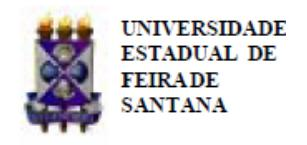
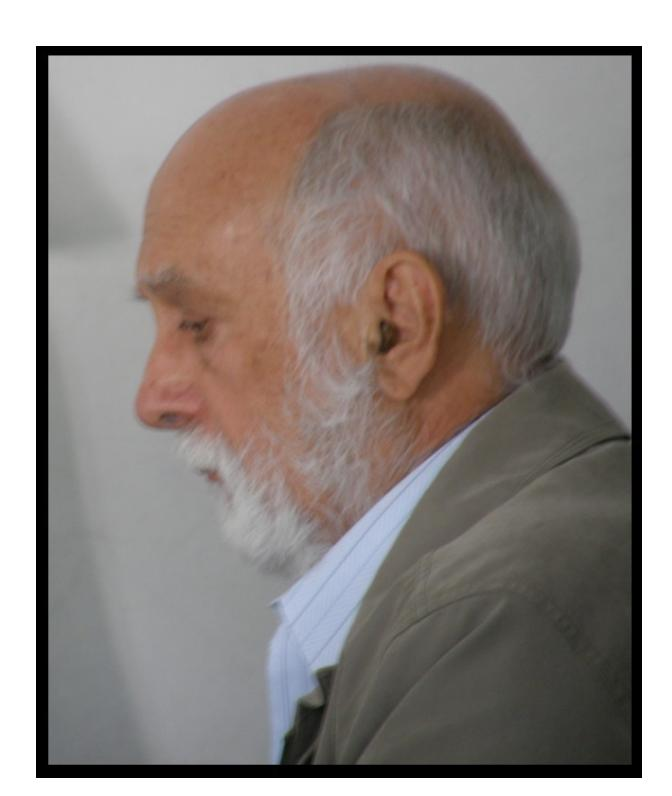

Folhetim Educ. Mat., Feira de Santana, Ano 18, N´umero 165, mar./abr., 2012 ISSN 1415-8779

Este Folhetim ´e um ve´ıculo de divulga¸c˜ao, circula¸c˜ao de ideias e de est´ımulo ao estudo e `a curiosidade intelectual. Dirige-se a todos os interessados pelos aspectos pedag´ogicos, filos´oficos e hist´oricos da Matem´atica. Pretende construir uma ponte para unir os que est˜ao pr´oximos e os que est˜ao distantes.

Dando continuidade `a transcri¸c˜ao das notas intituladas "A Matem´atica: suas origens, seu objeto e seus m´etodos - Parte I", de autoria do professor Carloman, neste n´umero, veremos o Princ´ıpio de Indu¸c˜ao Completa. Este m´etodo de demonstra¸c˜ao ´e crucial para a obten¸c˜ao de diversos resultados na Teoria dos N´umeros, como, por exemplo, o Teorema Fundamental da Aritm´etica. A importˆancia do Princ´ıpio de Indu¸c˜ao reside no fato de se provar proposi¸c˜oes matem´aticas em situa¸c˜oes que envolvem processos infinitos.

Ligado a este princ´ıpio, encontram-se as defini¸c˜oes por recorrˆencia. Elucidando, podese definir indutivamente a soma e o produto entre n´umeros inteiros positivos e da´ı, provar as propriedades comutativa, associativa, distributiva, dentre outras, utilizandose o Princ´ıpio de Indu¸c˜ao. A leitura desta edi¸c˜ao do Folhetim ´e uma excelente op¸c˜ao para o leitor que deseja debru¸car-se sobre o t´opico em quest˜ao.

Carloman Carlos Borges (UEFS) - in memoriam In´acio de Sousa Fadigas (UEFS) Marcos Grilo Rosa (UEFS) Traz´ıbulo Henrique (UEFS)

O professor Artibano Micali, da Universidade de Montpellier, faleceu em 26 de dezembro de 2011. O professor Micali foi um dos primeiros bolsistas do IMPA, em 1958, frequentando os semin´arios de Algebra. Em 1963, terminou o ´ doutoramento, em Paris, orientado por Pierre Samuel na ´area de Algebra. A men¸c˜ao dada `a tese foi "Tr`es Honorable". ´ Artibano foi um pioneiro em Algebras de Clifford e tamb´em ´ um matem´atico muito conhecido em outras ´areas. Deu aulas no departamento de Matem´atica da FFLC da USP (que deu origem ao IME-USP) e, em 1966, foi para a Universidade de Montpellier. Micali foi o orientador de doutorado do professor Carloman. A Academia de Ciˆencias Tel´esio-Galileo far´a uma homenagem na cerimˆonia de premia¸c˜ao programada para o dia 20 de mar¸co, em Toulouse. No seguinte endere¸co encontrase uma homenagem ao professor Micali: http://www.telesiogalilei.com/tg/index.php/academy-news

Artibano Micali

A Matem´atica: suas origens, seu objeto e seus m´etodos (continua¸c˜ao) Carloman Carlos Borges

# 3.1 Indu¸c˜ao Completa (continua¸c˜ao)

Um tipo de indu¸c˜ao muito mais fecundo que a indu¸c˜ao formal ´e a chamada indu¸c˜ao cient´ıfica, a qual foi desenvolvida pelo fil´osofo inglˆes Francis Bacon (1561−1626), o qual, desta forma, introduz nas ciˆencias naturais uma metodologia cient´ıfica. Na indu¸c˜ao cient´ıfica a generaliza¸c˜ao n˜ao precisa proceder da observa¸c˜ao de todos os casos particulares, o que a torna fecunda e muito mais pujante que a indu¸c˜ao formal. Consideremos, por exemplo, uma progress˜ao geom´etrica de n termos e de raz˜ao igual a q; observemos, inicialmente, o seguinte:

$$a_{2} = a_{1}q$$

$$a_{3} = a_{2}q$$

$$a_{4} = a_{3}q \qquad (1)$$

$$\dots$$

$$a_{n} = a_{n-1}q$$

Repare que cada termo ´e igual ao anterior vezes a raz˜ao; em seguida, notamos que os mesmos termos acima podem ser escritos desta maneira:

$$a_{2} = a_{1}q$$

$$a_{3} = a_{1}q^{2}$$

$$a_{4} = a_{1}q^{3}$$

$$\dots$$

$$a_{n} = a_{1}q^{n-1}$$
(2)

Para alcan¸car a f´ormula an = a1q n−1 , o pensamento parece dar um grande salto, "o salto sobre o abismo"; observemos que a generaliza¸c˜ao desta f´ormula procede da observa¸c˜ao de alguns particulares casos. Esta indu¸c˜ao cient´ıfica tamb´em ´e designada por indu¸c˜ao emp´ırica ou experimental e ´e de largo emprego nas ciˆencias naturais. Para a Matem´atica, este m´etodo l´ogico de aquisi¸c˜ao de conhecimento tem grande importˆancia no sentido de que "fabrica" f´ormulas; se compararmos (1) com (2) notamos que, neste ´ultimo desenvolvimento, em cada termo, h´a repeti¸c˜ao de apenas duas constantes: o primeiro termo e a raz˜ao, enquanto que, em (1), o desenvolvimento apresenta, em cada termo, unicamente uma constante, representada pela raz˜ao q. A presen¸ca, em (2), de um maior n´umero de constantes, comparando-se com (1), torna (2) mais operacional do que (1).

Em Matem´atica, contudo, tal processo indutivo ´e, t˜ao somente, um primeiro grau de conhecimento e ele ´e recebido pelos matem´aticos com as devidas cautelas; a fim de evitar surpresas desagrad´aveis que podem advir da indu¸c˜ao experimental os matem´aticos criaram a indu¸c˜ao matem´atica, a qual j´a aparece na axiom´atica de Peano como o seu V Axioma.

A indu¸c˜ao matem´atica ´e a caracter´ıstica principal dos n´umeros inteiros positivos - o que significa afirmar: a ideia subjacente a esse princ´ıpio ´e a ideia do infinito, justamente o primeiro tipo de infinito a entrar na Matem´atica, atrav´es dos gregos. Assim, ligado a esse m´etodo, existe uma opera¸c˜ao que pode ser repetida ilimitadamente.

O Princ´ıpio da Indu¸c˜ao Matem´atica se reveste de v´arias formas; uma delas j´a vimos por interm´edio do V Axioma de Peano; outra, diz o seguinte: "Seja uma proposi¸c˜ao P(n) referente aos n´umeros naturais; suponhamos que P(1) ´e verdadeira; se, da verdade suposta de P(n) for poss´ıvel concluir a verdade de P(n + 1), ent˜ao a proposi¸c˜ao P(n) ´e verdadeira para qualquer n´umero natural n".

A ideia da indu¸c˜ao pode ser ilustrada atrav´es de v´arios exemplos n˜ao matem´aticos. Imaginemos uma

## NEMOC - NUCLEO DE EDUCAC¸ ´ AO MATEM ˜ ATICA OMAR CATUNDA ´

Folhetim Educ. Mat., Feira de Santana, Ano 18, N´umero 165, mar./abr. 2012 - Editores: In´acio, Grilo e Traz´ıbulo - Digita¸c˜ao: Josenildes Oliveira Venas Almeida e Manoel Aquino dos Santos - Editora¸c˜ao: Evandro Vaz e Nivaldo Assis - Impress˜ao: Imprensa Gr´afica Universit´aria - Periodicidade: bimestral - Tiragem: 1.500 exemplares - Distribui¸c˜ao gratuita - Endere¸co: Avenida Transnordestina s/n, M´odulo Prof. Carloman Carlos Borges, bairro Novo Horizonte, Feira de Santana, BA, Brasil. CEP 44.036-900. - Telefone: (75)3161-8115 - Fax: (75)3161-8086 - E-mail: nemoc@uefs.br - Home-Page: www.uefs.br/nemoc

fileira de cartas de baralho (ou domin´o) todas estas postas verticalmente, guardando entre si a mesma distˆancia de tal maneira que, caindo a primeira, esta derruba a segunda e, caindo a n-´esima, esta derruba a imediatamente seguinte. Pelo princ´ıpio de indu¸c˜ao, podemos ter a certeza de que todas as cartas cair˜ao.

Observemos que este princ´ıpio consiste de dois passos:

- (a) P(1) ´e verdadeira; a veracidade de P(1) ´e verificada mais facilmente;
- (b) h´a uma maneira de mostrar que, da veracidade de P(n) se conclui a veracidade de P(n + 1).

Desnecess´ario ser´a acrescentar que esse princ´ıpio somente ´e v´alido com a verifica¸c˜ao dos passos (a) e (b), os quais estabelecem as condi¸c˜oes suficientes para a veracidade de todas as proposi¸c˜oes P(1), P(2), P(3), .... Como j´a vimos, uma de suas caracter´ısticas ´e a possibilidade de repeti¸c˜ao, infinitas vezes, de uma mesma opera¸c˜ao; logo, a ideia de infinito potencial est´a subjacente a esse princ´ıpio; por outro lado, a afirma¸c˜ao de que a proposi¸c˜ao P(n) ´e verdadeira para qualquer n´umero natural j´a traz, em si, a ideia de infinito acabado; este admitido, implicitamente, nesta conclus˜ao final; desta forma, o racioc´ınio em quest˜ao nos permite passar do infinito potencial ao infinito acabado.

Ligado a esse m´etodo de demonstra¸c˜ao se encontram as defini¸c˜oes por recorrˆencia, bem como alguns outros problemas interessantes. Examinemos alguns deles. Inicialmente, vejamos as obje¸c˜oes do fil´osofo inglˆes contemporˆaneo Bertrand Russell (1872 −1970): "E falso afirmar que a indu¸c˜ao completa permite de ´ passar do particular para o geral - como o faz, em um sentido menos estrito, a indu¸c˜ao experimental visto que a classe condicional da indu¸c˜ao (se qualquer que seja n, n tem a propriedade P) ´e, j´a geral por ela mesma. Enfim, a potˆencia do esp´ırito ´e uma faculdade bem obscura para nela atar o racioc´ınio por indu¸c˜ao completa, com o que se corre o risco de fazer repousar as certezas matem´aticas sobre as considera¸c˜oes incertas da psicologia". Em resposta, escreveu Poincar´e: "B. Russell fala, inicialmente, da aritm´etica e do princ´ıpio de indu¸c˜ao completa. Para ele, esse princ´ıpio n˜ao ´e sen˜ao a defini¸c˜ao do n´umero inteiro. Eu acabo de escrever a esse respeito um artigo que dever´a ser publicado na Revue de M´etaphysiqyue et de Morale (Les Math´ematiques et la Logique). Eu me contentarei de voltar a esse artigo e explicar em uma palavra, que o princ´ıpio da indu¸c˜ao completa n˜ao significa - conforme cren¸ca de B. Russell - que todo n´umero inteiro pode ser obtido por recorrˆencias sucessivas, isto ´e, pode ser definido por recorrˆencia. Significa que todo n´umero pode ser definido por recorrˆencia. O autor acrescenta que na indu¸c˜ao matem´atica n˜ao se passa do particular para ao geral, decidido que o princ´ıpio de indu¸c˜ao ´e mais geral que a proposi¸c˜ao a demonstrar; por´em, a considerar tal coisa se poder´a afirmar que as ciˆencias f´ısicas procedem do geral ao particular, decidido que o princ´ıpio da indu¸c˜ao f´ısica ´e mais geral do que qualquer lei f´ısica". Em sua obra Ciˆencia e Hip´otese, Poincar´e compara as inferˆencias l´ogicas da indu¸c˜ao a uma cascata. Assim, se um teorema tiver de ser demonstrado para o n´umero 20, a cascata deve comportar 19 inferˆencias. Como devemos demonstrar para todos os n´umeros naturais e n˜ao apenas para 10 ou 20 n´umeros, a aplica¸c˜ao do racioc´ınio por recorrˆencia dentro da l´ogica necessitaria de infinitos silogismos. Ter´ıamos, destarte, um processo l´ogico infinito, o que ´e imposs´ıvel. Desta impossibilidade, Poincar´e deduz que o princ´ıpio da indu¸c˜ao ´e um princ´ıpio extral´ogico. Ainda voltaremos a falar sobre esse assunto, o qual est´a muito ligado `a natureza do racioc´ınio matem´atico. Ilustraremos o princ´ıpio da indu¸c˜ao com os seguintes exemplos.

Exemplo 1. Para todo inteiro n ≥ 2 e dados b1, ..., bn n´umeros reais, prove que:

$$P(n): a(b_1 + ... + b_n) = ab_1 + ... + ab_n$$

- i) Para n = 2, a(b1 + b2) = ab1 + ab2 ´e verdadeira devido `a lei distributiva. Logo, P(2) ´e verdadeira.
- ii) Suponhamos que P(n) ´e verdadeira para n ≥ 2; mostremos que, desta hip´otese, podemos concluir a verdade de:

$$P(n+1): a(b_1+...+b_n+b_{n+1}) = ab_1+...+ab_n+ab_{n+1}$$

Prova: Sabemos que, por defini¸c˜ao:

$$b_1 + \dots + b_n + b_{n+1} = (b_1 + \dots + b_n) + b_{n+1}$$

Logo:

$$a[b_1 + \dots + b_n + b_{n+1}] = a[(b_1 + \dots + b_n) + b_{n+1}] =$$
  
=  $a(b_1 + \dots + b_n) + ab_{n+1}$ 

Na ´ultima igualdade, usamos a lei distributiva. Por hip´otese de indu¸c˜ao:

$$a(b_1 + \dots + b_n) = ab_1 + \dots + ab_n$$

Donde:

$$a[b_1 + \dots + b_n + b_{n+1}] = a[b_1 + \dots + b_n] + ab_{n+1} =$$
  
=  $ab_1 + \dots + ab_n + ab_{n+1}$ 

Logo, P(n) ´e verdadeira para todo inteiro n ≥ 2.

Exemplo 2. Para todo inteiro n ≥ 2, prove que:

$$P(n): 1.2 + 2.3 + 3.4 + \dots + (n-1)n = \frac{(n-1)n(n+1)}{3}$$

- i) Para n = 2, temos que 1.2 = 1.2.3 3 . Logo, P(2) ´e verdadeira.
- ii) Suponhamos que P(n) ´e verdadeira para n ≥ 2; mostremos que, desta hip´otese, podemos concluir a verdade de:

$$P(n+1): 1.2 + 2.3 + \dots + (n-1)n + n(n+1) =$$

$$= \frac{n(n+1)(n+2)}{3}$$

Prova: Temos:

$$1.2 + 2.3 + \dots + (n-1)n + n(n+1) =$$

$$=\frac{(n-1)n(n+1)}{3}+n(n+1)=\frac{n(n+1)(n+2)}{3}$$

Logo, P(n) ´e verdadeira para todo inteiro n ≥ 2.

Exemplo 3. Sabemos que, para a e b n´umeros reais quaisquer, tem-se a chamada desigualdade triangular:

$$|a+b| \le |a| + |b|$$

Esta desigualdade pode ser generalizada como segue: para os n´umeros reais arbitr´arios a1, a2, ..., ak, vem:

$$P(n): |\sum_{k=1}^{n} a_k| \le \sum_{k=1}^{n} |a_k|$$

- i) Para n = 1, tem-se o caso trivial e para n = 2, ela se reduz `a desigualdade triangular.
- ii) Suponhamos que P(n) ´e verdadeira para n ≥ 1; mostremos que, desta hip´otese, ´e poss´ıvel provar a verdade de:

$$P(n+1): |\sum_{k=1}^{n+1} a_k| \le \sum_{k=1}^{n+1} |a_k|$$

Prova: Temos:

$$\left|\sum_{k=1}^{n+1} a_k\right| = \left|\sum_{k=1}^{n} a_k + a_{n+1}\right| \le \left|\sum_{k=1}^{n} a_k\right| + \left|a_{n+1}\right| \le$$

$$\leq \sum_{k=1}^{n} |a_k| + |a_{n+1}| = \sum_{k=1}^{n+1} |a_k|$$

Donde, concluimos que P(n) ´e verdadeira para qualquer n´umero natural n.

Exemplo 4. Para qualquer inteiro n ≥ 4, mostre que n! > 2 n ´e verdadeira para todo n natural.

Seja, P(n) : n! > 2 n . Temos:

- i) Para n = 4, 4! > 2 4 , donde P(4) ´e verdadeira.
- ii) Suponhamos que P(n) ´e verdadeira para n ≥ 4 e mostremos que, dessa suposi¸c˜ao, podemos concluir a verdade de P(n + 1), isto ´e:

$$P(n+1): (n+1)! > 2^{n+1}$$

Prova: Multiplicando ambos os membros da hip´otese por 2, vem:

$$2n! > 2^{n+1} \qquad (a)$$

Observemos que o segundo membro de (a) j´a est´a igual ao segundo membro de P(n + 1); assim, para completar a demonstra¸c˜ao, basta mostrar que (n + 1)! > 2n!; mas, isto ´e evidente, pois n ≥ 4 implica n + 1 > 2 que, por sua vez, implica (n + 1)! > 2n!.

Observa¸c˜ao: Esta ´ultima demonstra¸c˜ao poderia ser feita por meio do seguinte caminho: da hip´otese, temos:

$$n! > 2^n$$

$$n+1 > 4$$

Multiplicando membro a membro as desigualdades acima, encontramos: n!(n + 1) > 2 n .4 > 2 n+1 .

A Matem´atica: suas origens, seu objeto e seus m´etodos. (Continua¸c˜ao)

## CEEM Semipresencial

O N´ucleo de Inform´atica e Sociedade (NIS) e o NEMOC oferecer˜ao em 2012 o Curso de Especializa¸c˜ao em Educa¸c˜ao Matem´atica, Modalidade Semipresencial. Brevemente, ser´a lan¸cado o edital para o processo seletivo. Maiores informa¸c˜oes, no site do NEMOC: http://www.uefs.br/nemoc

Envie para cada Folhetim um selo de postagem nacional de 1o porte. Dentro de no m´aximo quatro semanas, contadas a partir da data de recebimento do seu pedido, vocˆe receber´a os folhetins solicitados. OBS.: E permitida a reprodu¸c˜ao total ou parcial deste Fo- ´ lhetim, desde que citada a fonte.