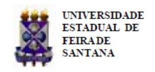
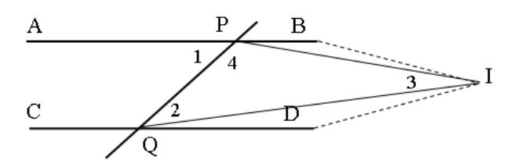

Folhetim Educ. Mat., Feira de Santana, Ano 19, Número 168, set./out., 2012 ISSN 1415-8779

Este Folhetim é um veículo de divulgação, circulação de ideias e de estímulo ao estudo e à curiosidade intelectual. Dirige-se a todos os interessados pelos aspectos pedagógicos, filosóficos e históricos da Matemática. Pretende construir uma ponte para unir os que estão próximos e os que estão distantes.

Dando continuidade à transcrição das notas intituladas "A Matemática: suas origens, seu objeto e seus métodos - Parte I", de autoria do professor Carloman, neste número, veremos as Demonstrações Indiretas. O texto basicamente é apresentado por meio de exemplos de aplicação da tautologia que estabelece a equivalência entre a implicação da hipótese para a tese e a falsidade da conjunção entre a hipótese e a negação da tese. Os exemplos são ricos e abrangentes, e vão desde propriedades dos números racionais e irracionais, passando por propriedades dos números primos. Outra equivalência lógica, a contrapositiva da condicional, também é ilustrada com vários exemplos da teoria dos números, conjuntos e geometria.

Carloman Carlos Borges (UEFS) - in memoriam Inácio de Sousa Fadigas (UEFS) Marcos Grilo Rosa (UEFS) Trazíbulo Henrique (UEFS)

A Matemática: suas origens, seu objeto e seus métodos (continuação)

Carloman Carlos Borges

### 4. Demonstrações indiretas

Algumas das demonstrações indiretas podem ser justificadas pela tautologia:

(H ⇒ T) ⇔ [( H∧ ∼ T) ⇒ f] cuja tabela-verdade damos abaixo:

| H   | T   | H ⇒ T | ∼ T | H∧ ∼ T | f   | (H∧ ∼ T) ⇒ f | (H ⇒ T) ⇔      |
| --- | --- | ----- | --- | ------ | --- | ------------ | -------------- |
|     |     |       |     |        |     |              | [(H∧ ∼ T) ⇒ f] |
| V   | V   | V     | F   | F      | F   | V            | V              |
| V   | F   | F     | V   | V      | F   | F            | V              |
| F   | V   | V     | F   | F      | F   | V            | V              |
| F   | F   | V     | V   | F      | F   | V            | V              |

Alguns exemplos servirão para ilustrar o emprego dessa importante tautologia.

Exemplo 1. Sendo a um número racional e b um número irracional, mostre que:

i) a + b é irracional

ii) a · b é irracional (a 6= 0)

Para (i), temos,

$$H \left\{ \begin{array}{ll} a, & \text{racional} \\ b, & \text{irracional} \end{array} \right.$$

T: a + b é irracional ∼ T: a + b é racional

Consideremos, ainda:

H' : H ∧ ∼ T T': f

Demonstração: N = a + b (um número racional, conforme H'), donde concluímos N - a = b; ora, como N é racional e a, igualmente, N - a é um número racional (a diferença entre dois racionais é um racional); logo, N - a=b representa uma contradição pois, no primeiro membro temos um número racional, N - a, enquanto no segundo membro temos b, que é irracional. Conforme a tautologia em estudo, concluímos definitivamente: a+b é um número irracional. A demonstração de (ii) é inteiramente análoga.

**Exemplo 2.** Mostre que $\sqrt{n}$ é um número irracional, toda vez que o número n não seja o quadrado de outro número natural. Temos:

$$H\left\{ \begin{array}{ll} n \neq m^2, & m \quad \text{um número natural} \\ x = \sqrt{n} \end{array} \right.$$

$T: x \text{ \'e irracional} \sim T: x \text{ \'e racional}$

Consideremos, ainda:

$$H': H \wedge \sim T$$
$T': f$

Demonstração: $x=\sqrt{n}=\frac{p}{q}$ é racional (conforme H'; aqui, p e q são dois números inteiros, primos entre si). Elevando ambos os membros ao quadrado e transpondo $q^2$ ao primeiro membro, obtemos $nq^2=p^2$ .

Mostremos, agora, que $nq^2 = p^2$ , que é o nosso T' representa uma contradição. Realmente, devido ao sinal de igualdade, os dois números $nq^2$ e $p^2$ quando decompostos em fatores primos deverão coincidir, isto é, a representação de $nq^2$ como produto de fatores primos deverá apresentar os mesmos fatores primos da representação de $p^2$ quando escrito como produto de fatores primos. Cada número primo deve aparecer um número par de vezes na decomposição tanto de $p^2$ como de $q^2$ (pois ambos os números $p \in q$ estão ao quadrado) e isto significa que a mesma coisa deverá ocorrer na decomposição de n, o que implica ser n um quadrado perfeito, contrariando, portanto H. Logo, de acordo com a tautologia, $\sqrt{n}$ é um número irracional toda vez que n não for um quadrado perfeito. Observação: na demonstração acima empregamos

o chamado " Teorema Fundamental da Aritmética": " Todo número inteiro N maior do que 1, pode ser decomposto em um produto de fatores primos, e esta decomposição é única, a menos da ordem dos fatores".

**Exemplo 3.** Mostre que $\sqrt{2} + \sqrt{5}$ é um número irracional. Temos:

$$H: x = \sqrt{2} + \sqrt{5};$$

T: x é irracional $\sim T$ : x é racional

Seja ainda:

$$H': H \wedge \sim T$$
$T': f$

Demonstração: seja

$x = \sqrt{2} + \sqrt{5}$ um número racional (conforme H'). $x^2 = 7 + 2\sqrt{10}$ (elevando ao quadrado)

Ora, $x^2 = 7 + 2\sqrt{10}$ representa uma contradição pois, $x^2$ é racional (o quadrado de todo número racional é um número racional), enquanto $7 + 2\sqrt{10}$ é um número irracional conforme exemplos 1 e 2, logo acima. Assim, a demonstração está terminada.

**Exemplo 4.** Mostre que existem infinitos números primos. Temos:

H: seja C o conjunto dos números primos $p_1$ , $p_2$ , $p_3$ , etc.;

$T: C \neq \text{ um conjunto infinito } \sim T: C \neq \text{ finito}$

Consideremos, ainda:

$$H': H \wedge \sim T$$
$T': f$

Demonstração: conforme H', C é um conjunto finito de números primos, isto é, C é um conjunto formado dos únicos números primos $p_1, p_2, \ldots p_n$ ; então, há sentido formar-se o número $N = (p_1 \cdot p_2 \cdot \ldots \cdot p_n) + 1$ ; a análise de N nos leva a uma contradição, senão vejamos:

### NEMOC - NÚCLEO DE EDUCAÇÃO MATEMÁTICA OMAR CATUNDA

Folhetim Educ. Mat., Feira de Santana, Ano 19, Número 168, set./out. 2012 - Editores: Inácio, Grilo e Trazíbulo - Digitação: Josenildes Oliveira Venas Almeida e Manoel Aquino dos Santos - Editoração: Evandro Vaz e Nivaldo Assis - Impressão: Imprensa Gráfica Universitária - Periodicidade: bimestral - Tiragem: 1.500 exemplares - Distribuição gratuita - Endereço: Avenida Transnordestina s/n, Módulo Prof. Carloman Carlos Borges, bairro Novo Horizonte, Feira de Santana, BA, Brasil. CEP 44.036-900. - Telefone: (75)3161-8115 - Fax: (75)3161-8086 - E-mail: nemoc@uefs.br - Home-Page: www.uefs.br/nemoc

- a) N é, claramente, maior que 1 (estamos considerando apenas os números primos positivos);
  - b) N é maior que cada um dos pi ;
- c) N não é um número primo, pois ele é diferente e maior do que cada um dos pi existentes;
- d) N não sendo um número primo, pode ser decomposto num produto de fatores primos, conforme Teorema Fundamental da Aritmética;
- e) Como N 1 é divisível por cada um dos pi , isto significa que N não o é e, conforme (d), na decomposição de N há de aparecer um número primo diferente de cada um dos pi .

Esta contradição demonstra o teorema de que existem infinitos números primos.

Exemplo 5. Aqui, empregamos a equivalência:

$$(H \Rightarrow T) \Longleftrightarrow (\sim T \Rightarrow \sim H)$$

Considere o teorema: " Se x 2 é divisível por 5 então, x também o é". Temos:

H: x 2 é divisível por 5;

T: x é divisível por 5;

∼ T: x não é divisível por 5;

∼ H: x 2 não é divisível por 5.

Podemos, pois, escrever a equivalência:

2 é divisível por 5, então, x também o é".

" Se
$$x^2$$
é divisível por 5, então, $x$ também o é" $\updownarrow$

" Se x não é divisível por 5, então, x 2 também não o é".

Neste caso, temos:

$$\sim T \left\{ \begin{array}{l} x = 5n+1 \\ x = 5n+2 \\ x = 5n+3 \\ x = 5n+4 \end{array} \right. \sim H \left\{ \begin{array}{l} x^2 = 5p+1 \\ x^2 = 5p+2 \\ x^2 = 5p+3 \\ x^2 = 5p+4 \end{array} \right.$$

n e p são números naturais.

Demonstração: temos que considerar, separadamente, cada um dos quatro tipos da hipótese (∼ T) e verificar se, partindo daí, chegamos a um dos tipos representados pela tese (no caso ∼ H). Assim, de x = 5n + 1, vem:

$$x^2 = 25n^2 + 10n + 1 = 5(5n^2 + 2n) + 1 = 5p + 1$$
(fazendo $5n^2 + 2n = p$ )

De
$$x = 5n + 2$$
, vem:

$$x^2 = 25n^2 + 20n + 4 = 5(5n^2 + 4n) + 4 = 5p + 4$$

De
$$x = 5n + 3$$
, vem:

$$x^{2} = 25n^{2} + 30n + 9 = 5(5n^{2} + 6n + 1) + 4 = 5p + 4$$

Finalmente, de x = 5n + 4, tem-se:

$$x^{2} = 25n^{2} + 40n + 16 = 5(5n^{2} + 8n + 3) + 1 = 5p + 1$$

e a demonstração está terminada.

Exemplo 6. Considere a definição: " no plano euclidiano, duas retas AB e CD são paralelas se, e somente se, sua interseção é vazia". Consideremos a figura abaixo:

Seja a hipótese: " os ângulos 1 e 2 são iguais entre si"; tese: " as retas AB e CD são paralelas". Temos:

∼ T: AB e CD se intersectam em I;

∼ H: os ângulos 1 e 2 são diferentes entre si.

Demonstração: no triângulo PQI, o ângulo 2 é interno, enquanto que o ângulo 1 é exterior; logo, a medida de 1, isto é, m(1) é maior que m(2) pois " a medida do ângulo externo de um triângulo é igual à soma das medidas dos dois ângulos internos não adjacentes" (prove este teorema); esta contradição prova o teorema, conforme a equivalência usada no exemplo 5.

Exemplo 7. Sejam A, B e C três conjuntos, f uma aplicação de A dentro de B e g uma aplicação de B dentro de C. Demonstre: se gof é injetora então f é injetora.

No teorema direto temos:

H: gof é injetora;

T: f é injetora.

então, podemos escrever:

∼ T: f não é injetora;

∼ H: gof é não injetora.

Demonstração: se f não é injetora então, por definição, existem em A dois elementos a e a 0 com a mesma imagem y por f, donde se conclui que a e a 0 terão mesma imagem g(y) por gof, o que implica a função composta ser não injetora.

**Exemplo 8.** Sejam $E_1$ e $E_2$ dois espaços métricos com as distâncias respectivas $d_1$ e $d_2$ ; então, uma aplicação de $E_1$ dentro de $E_2$ é uniformemente contínua se, para todo $\varepsilon > 0$ , existe a > 0 tal que, quaisquer que sejam x e x dentro de $E_1$ , tem-se:

$$d_1(x', x'') < a \Rightarrow d_2(f(x'), f(x'')) < \varepsilon$$

Esta definição é equivalente à seguinte: seja f uma função real (pode ser complexa também) definida sobre um intervalo I. A função f é uniformemente contínua dentro de I se, para $\varepsilon>0$ , existe a>0, tal que

$$|x - x'| < a, \quad x, x' \in I \quad \Rightarrow |f(x) - f(x')| < \varepsilon$$

É evidente que uma função uniformemente contínua dentro de $E_1$ é contínua em todo ponto de $E_1$ , porém, a recíproca é falsa. Por exemplo: seja a função $f(x) = x^2$ , a qual é contínua para qualquer x real, porém, esta função não é uniformemente contínua dentro de $\mathbb{R}$ . Temos:

H: f é contínua para qualquer x real;

T: f não é uniformemente contínua para qualquer x real;

$\sim T$ : f é uniformemente contínua;

$\sim H$ : f não é contínua.

Demonstração: na definição acima basta fazer $\varepsilon = 1$ ; existirá, então, um número a > 0 tal que:

$$|x-x'| < a$$
, $x, x' \in \mathbb{R}$ , $\Rightarrow |x^2 - x'^2| > 1$

Façamos
$$x=\frac{1}{a}, x'=\frac{1}{a}+\frac{a}{2}.$$
Tem-se: $|x-x'|=\frac{a}{2}< a,$ e $|x^2-x'^2|=|\frac{1}{a^2}-(\frac{1}{a^2}+\frac{a^2}{4}+1)|=1+\frac{a^2}{4}>1.$

**Exemplo 9.** A propriedade mais importante dos números reais provavelmente é a seguinte: " Se C é um conjunto não vazio de números reais e C está acotado superiormente, então, C tem uma cota superior mínima".

**Teorema:** Seja $\mathbb N$ o conjunto dos números naturais. Mostrar que $\mathbb N$ não está acotado superiormente. Temos:

H: seja $\mathbb{N}$ o conjunto dos números naturais;

T: N não está cotado superiormente;

$\sim T$ : N está acotado superiormente. Façamos:

H': $(H \land \sim T)$ T': f

Demonstração: admitamos que $\mathbb{N}$ esteja acotado superiormente; como $\mathbb{N}$ é diferente do conjunto vazio, ele possui uma cota superior mínima a. Logo,

$a \ge n$ , para qualquer n pertencente a $\mathbb{N}$ (definição de cota superior mínima ou supremo – sup);

$a \geq n+1$ , (igualmente, consequência do item anterior).

Ora, seja $a \ge n+1$ para qualquer n natural e como n+1 pertence a $\mathbb{N}$ , podemos escrever: $a-1 \ge n$ para qualquer n natural, o que mostra ser o número a-1 também, uma cota superior de $\mathbb{N}$ , o que entra em contradição com o fato admitido de ser a a cota superior mínima.

**Exemplo 10.** Para quaisquer a e b reais positivos, existe um número inteiro natural n pertencente a $\mathbb N$ , tal que an>b. Temos:

$H: a \in b \text{ reais positivos}, n \in \mathbb{N};$

$T: an > b \sim T: an < b$

Façamos:

H': $(H \land \sim T)$ T': f

Demonstração: consideremos o conjunto A dos " múltiplos positivos" de a, isto é:

$\mathbf{A}=\{na\};$ ora, da hipótese (isto é, de $\sim T),$ concluímos ser A majorado por b, donde existe $s=\sup \mathbf{A}.$

Podemos, pois, escrever:

$(\forall n \in \mathbb{N}), (n+1) \ a \leq s \Rightarrow na \leq s-a, \text{ o contradiz}$ o fato de ser $s = \sup A$ .

# PRÓXIMO NÚMERO

A Matemática: suas origens, seu objeto e seus métodos. (Continuação)

## NOTÍCIAS

# Simpósio Nacional da Formação do Professor de Matemática

No período de 27 a 29 de setembro de 2013, a SBM e o PROFMAT realizarão em Brasília-DF, o 1º Simpósio Nacional da Formação do Professor de Matemática. O evento oferecerá um programa diversificado de atividades voltadas para a formação e atualização do professor de Matemática na Escola Básica, incluindo Conferências, Minicursos, Oficinas e Comunicações. O Simpósio propiciará, igualmente, um fórum para discussão de temas atuais e relevantes para a comunidade da Escola Básica. Maiores informações no endereço http://simposio.profmat-sbm.org.br.

# **NÚMEROS ATRASADOS**

Envie para cada Folhetim um selo de postagem nacional de 1º porte. Dentro de no máximo quatro semanas, contadas a partir da data de recebimento do seu pedido, você receberá os folhetins solicitados. OBS.: É permitida a reprodução total ou parcial deste Folhetim, desde que citada a fonte.
