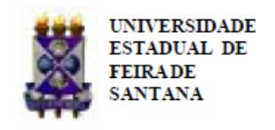

Folhetim Educ. Mat., Feira de Santana, Ano 19, Número 170, jan./fev., 2013 ISSN 1415-8779

Este Folhetim é um veículo de divulgação, circulação de ideias e de estímulo ao estudo e à curiosidade intelectual. Dirige-se a todos os interessados pelos aspectos pedagógicos, filosóficos e históricos da Matemática. Pretende construir uma ponte para unir os que estão próximos e os que estão distantes.

Dando continuidade à transcrição das notas intituladas "A Matemática: suas origens, seu objeto e seus métodos - Parte I", de autoria do professor Carloman, neste número, veremos o Princípio de Indução Completa. Este método de demonstração é crucial para a obtenção de diversos resultados na Teoria dos Números, como, por exemplo, o Teorema Fundamental da Aritmética. A importância do Princípio de Indução reside no fato de se provar proposições matemáticas em situações que envolvem processos infinitos.

Ligado a este princípio, encontram-se as definições por recorrência. Elucidando, podese definir indutivamente a soma e o produto entre números inteiros positivos e daí, provar as propriedades comutativa, associativa, distributiva, dentre outras, utilizando-se o Princípio de Indução. A leitura desta edição do Folhetim é uma excelente opção para o leitor que deseja debruçar-se sobre o tópico em questão.

Carloman Carlos Borges (UEFS) - in memoriam Inácio de Sousa Fadigas (UEFS) Marcos Grilo Rosa (UEFS) Trazíbulo Henrique (UEFS)

A Matemática: suas origens, seu objeto e seus métodos (continuação)

Carloman Carlos Borges

# 7. Natureza do Raciocínio Matemático

Qual a natureza do raciocínio matemático? Ele é simplesmente tautológico ou criador? E os recursos empregados em Matemática em suas diversas demonstrações, são puramente lógicos ou, além destes, há outros " recursos extralógicos"? Se os há, quais são eles?

Para responder se o raciocínio matemático é simplesmente tautológico ou criador, voltemos nossa atenção para a inclusão H ⊂ T, mencionada acima (Folhetim 169). Como H é a hipótese e T a tese, vemos que a hipótese é mais geral que a tese, isto é, esta se encontra dentro daquela e ao raciocínio, então, cabe apenas explicitá-la, " arrancá-la" da hipótese. Uma demonstração desse tipo é, naturalmente, tautológica no sentido de que a tese não re-vela nenhuma verdade que não esteja contida na hipótese; porém, entre a hipótese e a tese há um caminho, às vezes bastante longo, o qual somente poderá ser percorrido com muita imaginação criadora, muita intuição, etc.; nesse caminho se revela o enorme poder criador da mente e, assim, a tautologia mencionada é apenas parcial e unicamente no sentido dado acima. Por outro lado, encontramos casos nos quais T é mais geral que H ou não se encontra inteiramente contido em H; estamos, então, diante de uma demonstração não tautológica.

Como já vimos, o raciocínio por recorrência não pode ser explicado simplesmente pela lógica de Aristóteles, pois seriam precisos infinitos silogismos na demonstração de uma proposição P(n); realmente, se uma proposição é válida para um número natural 1, então podemos ampliar esta validade para o número 2, depois para o número 3, para o número 4, etc. e, em se tratando de P(n) vale para todos os naturais a partir de um deles pré-fixado, teríamos um número infinito de silogismo ou seja, estaríamos diante de um processo lógico infinito... Em La science et l'hypoth`ese, o eminente matemático francês Henri Poincaré escreveu: " E mesmo que continuássemos avançando dessa forma ilimitadamente, nunca conseguiríamos chegar a um teorema geral aplicável a todos os números, que é o objeto mesmo da ciência. Para chegar até aí seria preciso um número infinito de inferências; ter-se-ia de superar um abismo, que nunca poderia ser preenchido pela paciência de um pensador, que dispusesse apenas da lógica formal como única fonte".

Assim, segundo Poincaré, a Matemática, além de utilizar os recursos da lógica formal, utiliza outros que lhe são peculiares, recursos extralógicos como, exemplificando, a indução matemática. Claramente, há uma grande diferença entre a dedução silogística e a dedução matemática. Quando escrevemos:

- Todo triângulo é um polígono de três lados;
- ABC é um triângulo;
- ABC é um polígono (de três lados).

A conclusão já se encontra subentendida na premissa maior e a esterilidade dessa dedução é evidente. Todavia, há alguns silogismos de alguma fecundidade. Por exemplo:

- As diagonais de todo losango são perpendiculares entre si e bissetrizes dos ângulos internos.
  - ABCD é um losango;
- Logo, as diagonais de ABCD são perpendiculares entre si e bissetrizes dos ângulos internos. Outro exemplo:
  - A água é um líquido que ferve a 100◦ ;
  - Este líquido é água;
  - Logo, este líquido vai ferver a 100◦ .

Naturalmente, tais tipos de silogismos são empregados frequentemente nas ciências e possuem realmente uma certa fecundidade; porém esta, quando diz respeito à dedução matemática, é de caráter diferente. Exemplificando: pode-se demonstrar que a soma das medidas, em graus, dos ângulos internos de um polígono convexo é igual a tantas vezes 180◦ quanto são os lados menos dois. Assim, para um polígono convexo de n lados, demonstra-se que esta soma é dada pela fórmula:

$$S_i = (n-2)180^{\circ}$$

Para chegar a este resultado parte-se, basicamente, de outro mais simples: a soma das medidas dos ângulos internos de qualquer triângulo é igual a 180◦ . Observemos que o primeiro resultado (Si = (n − 2)180◦ ) é muito mais geral que o segundo, o qual, neste contexto, passa a ser um caso particular daquele. Há, portanto, uma generalização e esta traz consigo um novo conhecimento – o que mostra a fecundidade do raciocínio matemático. Tal tipo de raciocínio é geral em Matemática, desde as suas mais remotas origens, pois tal tipo de raciocínio é uma das características da razão humana. Como já vimos anteriormente, mesmo o estabelecimento de novas regras operatórias surge como uma generalização daquelas já estabelecidas anteriormente em domínios mais restritos. As próprias definições matemáticas são criadoras no sentido de que elas criam os entes definidos.

Alguns pensadores, como Goblot (1858-1935) acreditam ser a lógica uma pura criação da razão humana; igualmente, pensam com relação à Matemática e, destas duas premissas falsas deduzem falsas teorias. O Sr. Goblot – para citar apenas um desses adeptos de que o conhecimento humano é um produto puro da inteligência – menciona, como padrão de um raciocínio puramente lógico a demonstração da propriedade " a igualdade dos lados opostos". Ora, sabemos que isto é verdadeiro não somente porque deduzimos logicamente mas – e aqui está uma característica fundamental da Matemática – em virtude da axiomática empregada. Com axiomas diferentes, esta " verdade" lógica do Sr. Goblot é falsa – como demonstra Hilbert (conforme Toranzos, Introducción a la epistemologia y fundamentación de la matemática).

As diversas geometrias não euclidianas atestam suficientemente que a Matemática, além dos recursos da lógica emprega outros, qual seja, o seu próprio sistema axiomático, e isto mostra a vanidade dos logicistas na sua pretensão de reduzirem aquela a esta.

E claro que na demonstração de teoremas per- ´ tencentes à Geometria de Euclides empregamos os mesmos recursos lógicos empregados na dedução de teoremas pertencentes à Geometria de Riemann porém, a diferença aqui reside no emprego de

# NEMOC - NUCLEO DE EDUCAC¸ ´ AO MATEM ˜ ATICA OMAR CATUNDA ´

Folhetim Educ. Mat., Feira de Santana, Ano 19, Número 170, jan./fev. 2013 - Editores: Inácio, Grilo e Trazíbulo - Digitação: Josenildes Oliveira Venas Almeida e Manoel Aquino dos Santos - Editoração: Evandro Vaz e Nivaldo Assis - Impressão: Imprensa Gráfica Universitária - Periodicidade: bimestral - Tiragem: 1.500 exemplares - Distribuição gratuita - Endereço: Avenida Transnordestina s/n, Módulo Prof. Carloman Carlos Borges, bairro Novo Horizonte, Feira de Santana, BA, Brasil. CEP 44.036-900. - Telefone: (75)3161-8115 - Fax: (75)3161-8086 - E-mail: nemoc@uefs.br - Home-Page: www.uefs.br/nemoc

axiomáticas diferentes. Ao Sr. Goblot passou despercebido, por exemplo, um fato tão simples: com os mesmos recursos lógicos podemos provar estas três verdades diferentes entre si:

- a soma das medidas dos ângulos internos de qualquer triângulo é igual a 180◦ (Geometria de Euclides);
- a soma das medidas dos ângulos internos de qualquer triângulo é menor que 180◦ (Geometria de Lobachevski);
- a soma das medidas dos ângulos internos de qualquer triângulo é maior que 180◦ (Geometria de Riemann).

Teoricamente, a cada tautologia podemos fazer corresponder um tipo de demonstração em Matemática porém, a verdade dos teoremas matemáticos não repousa exclusivamente nessas tautologias.

Mesmo admitindo-se o caráter exclusivamente tautológico do raciocínio matemático (o que é apenas uma verdade parcial) isto nos leva às ponderações seguintes:

- o rigor lógico é assegurado nas deduções matemáticas pelo seu caráter tautológico;
- a aplicação de tautologias nas deduções matemáticas requer, muitas vezes, complicados artifícios, verdadeiros vôos de imaginação criadora;
- na escolha entre as numerosas sugestões de sua inteligência para a elaboração dos artifícios convenientes, o matemático necessita de uma intuição profunda e bem disciplinada.

Segundo Blanché (L'Axiomatique): " não há, para os teoremas, verdade separada e, por assim dizer, atômica: sua verdade é apenas sua integração ao sistema; e é por isso que teoremas incompatíveis podem ser igualmente verdadeiros, contanto que os relacionemos com sistemas diferentes".

Com a finalidade de evitar ao leitor desavisado algumas fantasias tão do agrado de alguns pensadores, devemos acrescentar alguns esclarecimentos partindo da seguinte questão: como explicar as aplicações, na realidade objetiva, de teoremas contraditórios? Ora, conhecemos as enormes aplicações da Geometria de Euclides e sabemos, também, que a Geometria de Riemann é empregada na Teoria da Relatividade Generalizada.

Acreditamos que todo conhecimento humano surge como produto da atividade própria ao ser humano cognoscente. Nenhuma ciência é criada para produzir apenas satisfações estéticas aos seus cultores; a força propulsora em toda ciência é o homem em suas relações com a realidade dentro da qual se encontra mergulhado e perante a qual deve sobreviver.

Esta interdependência não somente serve para assegurar a renovação da ciência dando-lhe a vitalidade necessária, como é responsável pela sua criação.

A consciência, exemplificando, de geometrias contraditórias com a realidade objetiva, ao nosso ver, prova o seguinte:

- o mundo objetivo que sempre existiu independente de nossas idéias, continua existindo mantendo essa independência e continuará eternamente independente de nós – é contraditório em sua essência;
- em todo verdadeiro conhecimento essas contradições são reveladas e dele são inseparáveis;
- as duas geometrias mencionadas são reflexos verdadeiros de aspectos da realidade objetiva pois, se não fora, assim, como explicar suas enormes aplicações práticas?

O mundo que nos cerca, contraditório por essência, é constantemente variável; a única permanência na realidade é a sua variabilidade. E justamente por in- ´ termédio de suas sucessivas generalizações que a Matemática procura refletir as impermanências da realidade objetiva.

Esta idéia de variabilidade se encontra em qualquer generalização matemática. Assim, partindo do conhecimento: a soma das medidas, em graus, dos ângulos internos de um triângulo é igual a 180◦ , chegamos ao novo conhecimento: a soma das medidas dos ângulos internos de um polígono convexo é igual a:

$$S_i = (n-2)180^{\circ}$$
(n, número de lados do polígono).

Comparemos esses dois graus de conhecimento: no primeiro, ele se refere ao triângulo, isto é, a uma figura geométrica que possui constante o número de lados (n = 3); no segundo, esta constante n se transforma em variável. Transformação de constantes em variáveis – eis a idéia central das generalizações matemáticas.

Tomemos o familiar exemplo das diversas geometrias, cujas sucessivas generalizações partiram da Geometria de Euclides; aquela na qual se fala em curvatura nula (constante); na Geometria de Lobachevski, já surge o conceito de curvatura negativa enquanto que, na Geometria de Riemann aparece o de curvatura positiva. Vemos, assim, mais uma vez, a transformação de uma constante em variável.

Evidentemente, isto não acontece apenas com as generalizações matemáticas. Na mais simples indução empírica podemos observar a mesma idéia básica. Enfim, o conhecimento científico que se enriquece através de sucessivas generalizações – é um conhecimento gradual, ampliando-se sempre de geração em geração.

Já aproximadamente no ano 530 a. C. dizia o filósofo Heráclito: " O fogo encontra seu repouso na mudança". Na atualidade, o eminente matemático francês René Thom (nascido em 1923) escreve(Stabilité structurelle et morphogén`ese): " Il donc dans l'activité mathématique, et surtout algébrique, um accent mis sur la periodicité, l'itérativité dês actions régulatoires, au détriment de la permanence du sujet".

Conceitos fundamentais da Matemática nada mais traduzem que a impermanência da realidade objetiva; isto acontece, exemplificando, com os conceitos de variável e função. A propósito, podemos mencionar Isaac Newton (1642-1727)(Tratado das Curvaturas das Curvas, citado em Conceitos Fundamentais da Matemática, Caraça): " Considero aqui as quantidades matemáticas, não formadas pela adjunção de partes mínimas, mas descritas por um movimento contínuo. As linhas descritas, e portanto geradas, não por aposição de partes, mas pelo movimento contínuo de pontos; as superfícies pelo movimento de linhas; os sólidos pelo movimento de superfícies; os ângulos pela rotação de lados; o tempo por um fluxo contínuo, e assim para outras. Estas gerações têm verdadeiramente lugar na natureza das coisas e revelam-se todos os dias no movimento dos corpos".

A lógica formal é imprescindível à dedução matemática. Em nenhuma outra ciência o pensamento é tão abstrato quanto na Matemática; aqui, após uma eliminação do conteúdo ele se apega à forma e, com a ajuda da lógica estabelece suas verdades dentro das diversas axiomáticas; esta eliminação, porém, é apenas um aspecto do pensamento, dos seus diversos movimentos. Nenhuma ciência poderia enriquecer-se e constituir-se numa razoável aproximação da realidade, se deste divorciar-se inteiramente, apegando-se exclusivamente à " pureza" das formas pois, se assim o fizesse, o domínio de suas aplicações práticas seria bastante restrito quando não nulo. E preciso não esquecer ´ que a forma é inseparável do conteúdo; qualquer separação entre uma e a outra deve ser momentânea. O apego exagerado à forma só pode conduzir à tagarelice e à alienação.

Qualquer conceito abstrato, por si mesmo, não apresenta maior interesse; a sua operacionalidade reside nas diversas relações recíprocas existentes entre ele e outros conceitos. Tomemos, por exemplo, o conceito de número. A parte a sua importância epis- ` temológica, isoladamente ele não apresenta nenhuma operacionalidade. Aqui, o interesse maior reside nas suas relações recíprocas com outros números, sendo estas traduzidas pelas leis operatórias. Mais adiante voltaremos a falar sobre o mesmo assunto.

NOTAS:

- (10) Henri Poincaré: La science et l'hypoth`ese, Paris: Flammarion, 1917
- (13) Edmond Goblot; Emile Boutroux; Eduardo Ovejero y Maury. Tratado de Lógica, Madrid: Poblet, 1929.
- (14) Fausto I. Toranzos. Introducción a la epistemologia y fundamentación de la Matematica Buenos Aires: Espasa - Calpe Argentina S. A., 1949
- (15) Robert Blanché. L'Axiomatique, Paris: Presses Universitaires de France, 1955.
- (16) René Thom: Stabilité structurelle et morphogén`ese, Paris Interéditions, 1972.
- (17) Bento de Jesus Caraça. Conceitos fundamentais da Matemátcia. Lisboa: Tipografia Matemática, 1941.Isaac Newton: Tratado das Curvaturas das Curvas, citado em Bento Caraça em Conceitos Fundamentais da Matemática.

A Matemática: suas origens, seu objeto e seus métodos. (Continuação)

## CEEM Semipresencial

O Núcleo de Informática e Sociedade (NIS) e o NE-MOC oferecerão em 2012 o Curso de Especialização em Educação Matemática, Modalidade Semipresencial. Brevemente, será lançado o edital para o processo seletivo. Maiores informações, no site do NEMOC: http://www.uefs.br/nemoc

Envie para cada Folhetim um selo de postagem nacional de 1o porte. Dentro de no máximo quatro semanas, contadas a partir da data de recebimento do seu pedido, você receberá os folhetins solicitados. OBS.: E´ permitida a reprodução total ou parcial deste Folhetim, desde que citada a fonte.
